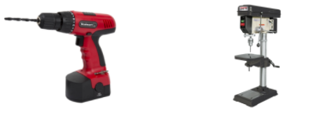
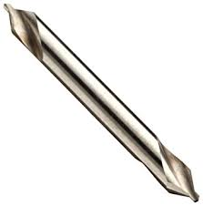

# Wheel Assembly
The wheel assembly attaches the wheels to the motors and mounts the motors to the rest of the rocker-bogie suspension system that makes up the robot chassis.

# Preface

## Features

* The flexible wheels allow for high traction as they deform around objects, improving climbing performance
* Drive motors chosen to handle the high torque that the system sees, achieving both speed and climbing performance

## Skills

* Drill Press/Hand drill

## Tools

* Drill Press or hand drill
* Allen Key set
* Imperial Wrench Set
* Optional: 3D printer

## Dependencies on Other Modules

None

## Mechanical Interface/Attachments to Rover

* Corner wheels: 1/4 clamping hub to 1/4 inch stainless steel shaft on corner steering
* Actobotics + GoBilda channels and channel connectors to rocker-bogie

## Overview

1. Drilling the wheels
2. Assembling the base wheels
3. Assembling the corner wheels

# Instructions

## Drilling the wheels

| item                              | ref | qty |                                                                 img |
| --------------------------------- | --- | --- | ------------------------------------------------------------------: |
| wheels                            | S30 | 6   |  |
| hand drill or drill press         | D3  |     |        |
| center punch or starter drill bit | D7  |     |       |
| drill bit #23                     | D6  |     |       |

Drill holes in the wheels as shown in Figure 1 using the center drill and drill \#23.

> The wheel is normally meant to be mounted using one bolt through the middle of the rim. This will not work well in our case as the rover sees very high torque at the wheel and the one-bolt system would be difficult to attach to any part of our system without the wheel slipping. To attach more firmly, we will drill two holes on either side of the original hole where we will mount the motor hub clamp as shown in Figure 1

|  |  |
| -------------------------------------- | ---------------------------------------- |
Figure 1: Drilling the wheels

The important dimension is that the two holes are as close to 0.770 inches apart as possible while remaining centered about the center of the wheel. We found that the geometry shown in Figure 1 allowed us to get the holes most easily. Normally for these through holes you would use drill \#25, but in order to give a little extra tolerance we recommend a few steps up from that, something around drill \#23. Test the holes with the 4mm Clamping Hub **S14** to make sure the holes align as shown in Figure 1. If the holes do not align, you can file them out slightly or even attempt to re-drill them depending on how close you are. Repeat this drilling process for all 6 of the wheels.

## Assembling the base wheels

Next, we will build the wheel assemblies which are divided into the middle wheels and corner wheel assemblies. We will build 6 identical base wheels and then add slightly more complexity onto 4 of those which will eventually become the corner wheels.

| item           | ref | qty | img |     | item        | ref | qty | img |
| -------------- | --- | --- | --- | --- | ----------- | --- | --- | --- |
| channel        |     |     |     |     | drive motor |     |     |     |
| 6mm D-hub      |     |     |     |     | screw1      |     |     |     |
| clamping mount |     |     |     |     | screw2      |     |     |     |
| wheels         |     |     |     |     | allen keys  |     |     |     |

## Assembling the corner wheels

