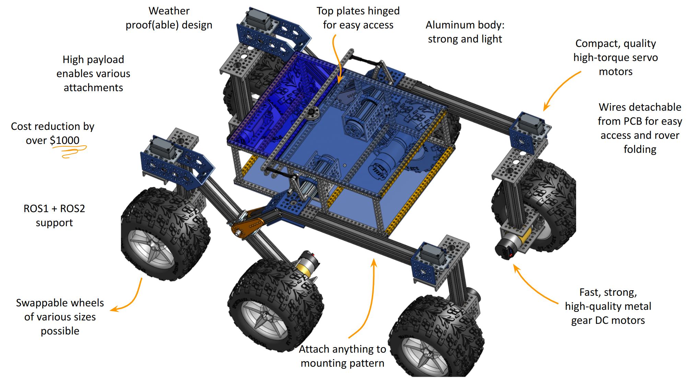
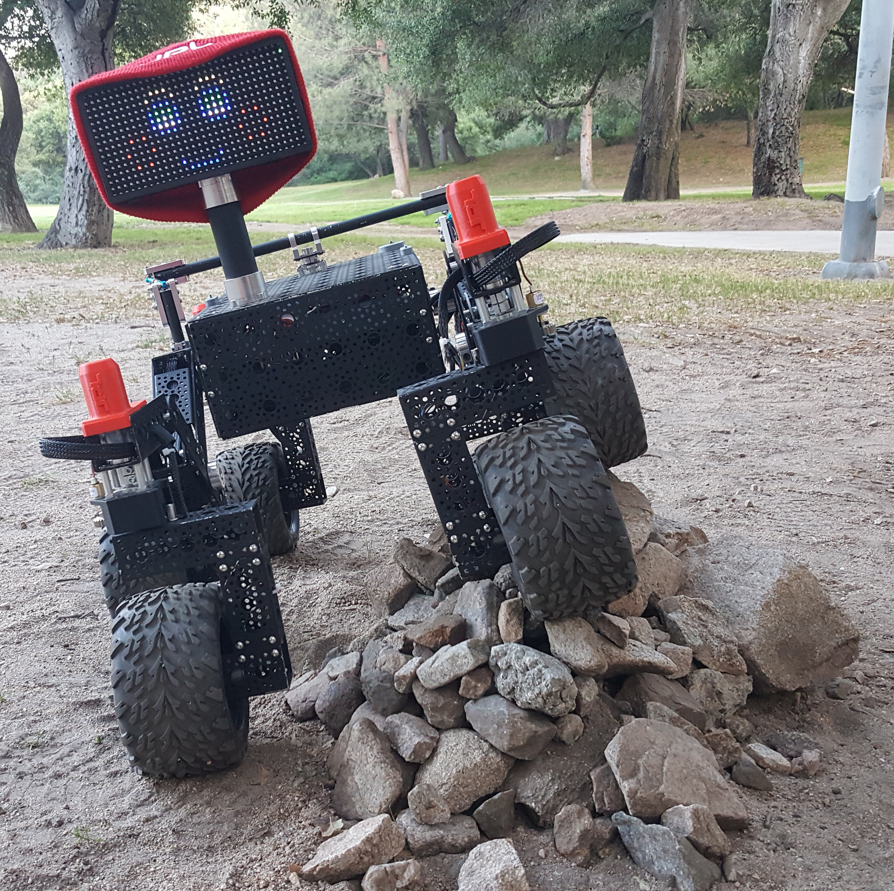
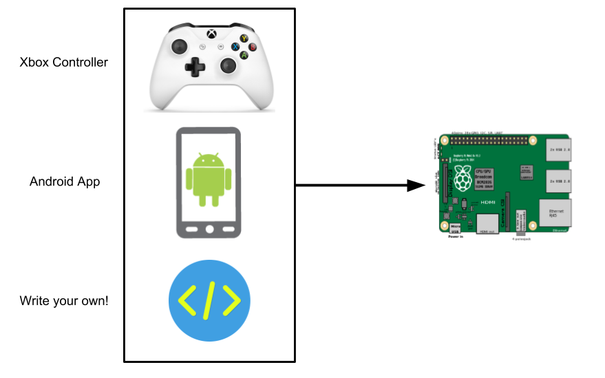
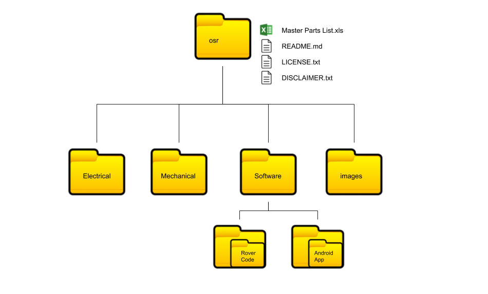
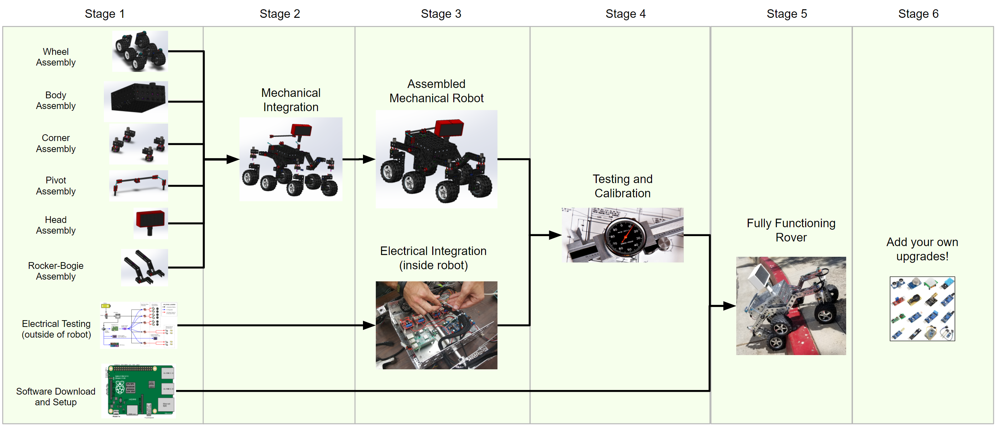

# JPL Open Source Rover Project
The JPL Open Source Rover is an open source, build it yourself, scaled down version of the 6 wheel rover design that JPL uses to explore the surface of Mars. The Open Source Rover is designed almost entirely out of consumer off the shelf (COTS) parts. This project is intended to be a teaching and learning experience for those who want to get involved in mechanical engineering, software, electronics, or robotics.

## About the Project

### Motivation
JPL is always looking to inspire the next generation of scientists, engineers, and roboticists to help us explore and learn about our solar system (and beyond!). We release the plans for this rover as a way to try and give budding enthusiasts a fun robotics project that will help teach them and get them involved in robotics sooner and at a lower cost. 

### Specifications & Technical Attributes

The specific attributes of the robot you build will depend slightly on the type of electronics and motors you buy for the system.  The numbers shown below are for the version of the robot that contains exactly the parts that we suggest in our build documents and parts list. Below, you can see which parts could be changed for which spec upgrades.

| Attribute	                                | Value [imperial]         | Value [SI]             |
| ----------                                |:-----:                   | :-------------:        |
| Weight                                    | 25 [lbs]                 | 11.34[kg]              |
| Footprint                                 | 24x14 [in]               | 60.96x30.48 [cm]       |
| Battery Capacity                          | 5200 [mAh]               | 5200 [mAh]             |
| Battery Discharge Rate                    | 8 [A]                    | 8 [A]                  |
| Nominal Current Draw                      | 1.2 [A]                  | 1.2 [A]                |
| Operating time                            | 5 [hrs] (continual use)  | 5 [hrs] (continual use)|
| Approximate Max speed                                 | 9.7 [in/s]               | 24.6 [cm/s]          |
| Maximum 90 deg vertical scale             | 12 [in]                  | 30.48 [cm]             | 
| Maximum height differential between sides | 14 [in]                  | 35.56 [cm]             |
| Communication (in this guide)             | Bluetooth app (Android only) and Xbox Controller| |
| Cost                                      | ~ $2,500                 |                        |

Again, the above statistics depend on which components you select when buying parts. One potential change is for the motors; you can, for example, select higher RPM motors (to drive your rover faster) at the sacrifice of max stall torque, which would potentially limit your rover's ability to climb. A selection of motors that would integrate easily with the rest of the suggested rover design can be found at [Motor selection sheet](https://www.pololu.com/category/115/25d-mm-metal-gearmotors), where any of the 12V motors would work easily in the robot.  Note, however, that it is important to also asses the electrical current draw and make sure that all the electronics and battery can supply the power required for any change in motors.

### Features
This rover is designed to function similarly to the 6 wheel rover designs on Mars and employs a few of the major driving mechanics that the mars rovers use to traverse rocky surfaces:
 * __Rocker-Bogie:__ The Rocker-Bogie suspension system allows all 6 wheels to continually be in contact with the ground while climbing over obstacles
 * __Differential Pivot:__ Allows weight to be mechanically offloaded from one side of the rover to the other while climbing
 * __6-Wheel Ackerman Steering:__ Driving and steering/turning mechanism that governs where the wheels point and how fast each of them will move.

We chose a Raspberry Pi to be the "brain" of this rover for its versatility, accessibility, simplicity, and ability to add and upgrade your own modifications. Any method with which you can communicate with a Raspberry Pi (bluetooth, WiFi, USB devices, etc) can be interfaced into the control system of the robot. 

In addition, here are the open communication ports and hardware on the Raspberry Pi:
 * 4 USB ports (3 if using Xbox controller)
 * RPi Camera port
 * 1 I2C Bus (0 if using LED Matrix screen)
 * 2 SPI Bus (1 if using LED Matrix screen)
 * 3.5mm Audio Jack
 * 13 GPIO pins (6 if using LED Matrix screen)

Using the above ports, you could theoretically drive the rover autonomously from the camera, via a USB dongle attached to anything (your own video game controller, a USB microphone, or many others... be creative!), or through any interface using the Pi's GPIO ports (distance sensors, accelerometers, and much more).  We've only given you two simple ways to control the rover to start... we want you to come up with even more!

For the power system of the rover, there is also ample spare power which can be used for your own addons and upgrades.  See the [Electrical subsystem documentation](Electrical/) for more specific details.

### Other Resources
In addition to this repository which holds all the documentation for this project, there are two additional websites tied to this project. One is a landing site which holds general information and an overview of the rover and how it works:

https://opensourcerover.jpl.nasa.gov

There is also a user-run forum to help facilitate discussion about the project.

**__Note: JPL and Caltech have no official affiliation with this forum; it is run by individuals of the general public.__**

On this forum, you can ask questions if you need help or clarification on any aspects of the project.  Additionally, you can post and promote any modifications or addons that you have created on this project. We highly encourage additions and modifications to be posted on the forum so that this project and community can grow.

https://www.tapatalk.com/groups/jpl_opensource_rover/

### Skills Necessary
This project has elements in mechanical assembly/fabrication, uses a host of electrical components, and has software that will run it all. In order to complete this project, you will need to have some experience in the following:
 * __Fabrication/Machining:__ Although most the parts are COTS there are a few modifications necessary to adapt them to the project. These modifications will be in the form of 
   * Metal cutting using band saw/dremel
   * Drilling using drill press/hand drill
   * Filing and sanding for part cleanup
   * General Fabrication/Machining Safety
 * __Electronics:__ This project uses components like motors, motor controllers, and batteries. It will be important to have experience with the following electrical processes.
   * Soldering
   * Electrical debugging
   * Wiring
   * Electrical Safety
 * __Software:__ The rover's brain is a Raspberry Pi.  Included in this repository is all the software ready to run the rover, but some  knowledge is required for getting everything up and ready on the Raspberry Pi:
   * Basic Linux familarity
   * Basic Python familarity

Most of the above are skills that you can learn and pick up fairly quickly from watching videos and doing research on the internet, and throughout the project we try to give supplemental information on some of these as well.  See the build documents for more information.

### Tools Necessary
This project assumes you have some standard tools to help assemble the project. If you do not have any of the optional tools, we provide examples of online services that you can use to have the parts fabricated and sent to you.

#### Mandatory tools
 * SAE Hex Key set
 * SAE Wrench set
 * Pliers
 * Wire Snips
 * Wire Strippers
 * Solder Iron
 * Solder
 * Digital Multimeter
 * Hand Drill or Drill Press
 * Dremel, Band saw, or hand saw
 * Items for operating a Raspberry Pi (Keyboard, mouse, monitor, 5V micro USB power adapter)
 
 Here is [an Amazon list of some of the tools that may be useful](http://a.co/gnoN2LW)

#### Optional Tools
 * 3D printer
 * Laser Cutter
 * Power Supply (to test without using battery)

### Expected time commitment
In our experience, this project takes no less than 200 person-hours to build, and depending on the familarity and skill level of those involved could be significantly more. Experienced builders may be able to build this project in this amount of time.  However, this project is generally meant to be a teaching and learning tool.  Throughout the documentation, we try to give supplemental information for those who might be new to this kind of project.

# Disclaimer
**Reference herein to any specific commercial product, process, or service by trade name, trademark, manufacturer, or otherwise, does not constitute or imply its endorsement by the United States Government or the Jet Propulsion Laboratory, California Institute of Technology. Government sponsorship acknowledged.**

**By downloading, cloning, or otherwise using the contents of this repository, you agree to the terms specified in the attached [DISCLAIMER.txt file](/DISCLAIMER.txt).**

## Getting Started

### Folder organization

The main /osr/ folder contains all of the documentation and information necessary for the project, broken down into the 3 main sections: Mechanical, Electrical, and Software. Each of these sections is meant to be relatively self contained and should be fairly parallelizable, meaning that they could be completed simultaneously by different groups. There is a README.md in each section to help you navigate the information in that section. 

### Ordering parts

#### Parts Lists
The [Master Parts List](master_parts_list.xlsx) contains all the parts necessary to build the entirety of the robot as it is listed in our documentation. We recognize that you may want to change, add, and redesign some sections, so each of the individual build sections also contain a parts list for that corresponding section of the project. *Note that these individual parts list recommend buying quantities necessary __only for that section__.  Be sure to assess the quantities you need for common items (particularly screws, nuts, bolts, and other common hardware) if you are changing subassemblies.*

##### Cart Share
In order to help this ordering process we have compiled a few links of a large number of these together already, if you wish to build exactly what is in our build documentation.

|[McMaster](https://www.mcmaster.com/order/rcvRtedOrd.aspx?ordid=5887891246&lnktyp=txt)|[Amazon](https://www.amazon.com/gp/registry/wishlist/3ELV1FY8J7ZYP/ref=cm_sw_em_r_z_g__wb)|[Pololu](https://www.pololu.com/wishlist/1J10953)|[Adafruit](https://www.adafruit.com/wishlists/460400)|
|---|---|---|---|

**Digikey:** 
The Bill of Materials folder contains (currently just one) Bill of materials file for a specific vendor. We are searching for better ways to help with the ordering process, however for now the easiest way is to take the [Digikey Bill of Materials](Bill%20of%20Materials%20Files/Digikey_BOM.csv) and upload it to [Digikey](https://www.digikey.com/). You can find the "BOM Manager" on their homepage and then start a new BOM, where you can upload this file.  

#### 3D printing and Laser cutting

In addition to ordering all of the parts on the parts list, we recommend that some pieces be 3D printed and laser cut. If you do not have access to a 3D printer or laser cutter, we've added some online services as examples for where you can get those manufactured and shipped to you. You'll find instructions on this in the [Body Build Doc](Mechanical/Body%20Assembly/Body%20Build%20Doc.pdf),  [Corner Steering Build Doc](Mechanical/Corner%20Steering/Corner%20Steering%20Build%20Doc.pdf), and [Head Assembly Build Doc](Mechanical/Head%20Assembly/Head%20Assembly%20Build%20Doc.pdf).

#### Printed Circuit Boards (PCBs)
There are a few single purpose circuit boards that were designed for this project. You could construct these circuits on a prototyping breadboard instead of ordering the PCBs if you wish (we have included the schematics in the Electrical section), but we have included the PCB board files as it greatly simplifies the build. You can find these files at [PCB Files](Electrical/PCB%20board%20files%20and%20schematics/Board%20files). These can be ordered at [Osh Park](https://oshpark.com/) by dropping each of the .zip files. 

### Rover Build Roadmap

Above is an example roadmap of how you can build the rover and which parts of the build are dependant on the other sections. It is broken down into 5 stages:
 * __Stage 1:__ Start getting all the parts!  
 
 * __Stage 2:__ Once you have all the parts, everything in stage 2 can be completed in parallel. It is *highly* recommended to start on the electrical testing of components outside the robot before doing any electrical work inside the completed robot body. You can also work on the software at any stage between here and the end.

 * __Stage 3:__ During stage 3, the mechanical subassemblies should all be assembled and start to be integrated together.  There should be some amount of testing done on the electrical system, as well as some progress on the software. 

 * __Stage 4:__ The rover is mechanically built and all subassemblies integrated together.  During stage 4, you begin the integration of the electrical components and the various power and data wires that run throughout the rover.

 * __Stage 5:__ Once the electronics are all powered and communicating, you need to test and calibrate all the motors in the system.

 * __Stage 6:__ After everything has been tested and calibrated and the software is up and running, the robot will be fully functioning and built!

 * __Stage 7:__ Add your own upgrades! We chose Raspberry Pi as the brain of the project so that it should be easy to add, change, and upgrade to build exciting things on top of this already cool robot.  Some upgrade ideas to get you brainstorming: sonar for collision detection, IMU for orientation / closed-loop driving / obstacle mapping, camera for object identification and tracking, sensor packages (temperature, pressure, humidity), solar panels, or even a robotic arm!

## Building the Master Parts List
Anytime parts are changed in the build docs, you must rebuild the master parts list by running the python script `build_parts_list.py`.  
To run you must have python installed, any version should work, but the newer the better. There are no libraries or dependencies to install.  
Now in the root of this repo, run the command: `python build_parts_list.py` (or `python3 build_parts_list.py` for Python3).  This script will create a new `master_parts_list_raw.csv` and `master_parts_list.xlsx`, both of which need to be commited when making changes to the parts list.

When updating the build docs, make sure all parts have a part reference number (S1, E20, etc). If you are adding a new part, be sure to also add it to the `parts_list_reference.csv`. That file is the source of truth for the name of the part, and also contains information like the price, model, manufacturer, and link to the part. In that file, you can also overide the quantity to order for the project in case the quantities in the build documents aren't representative of the total number of parts required.

## Happy building!!
If you have any questions or run into problems during your build, please search for answers and/or reach out on the [forum](https://www.tapatalk.com/groups/jpl_opensource_rover/).

 ## Project Team
 ### Project Lead:
 Michael (Mik) Cox
 ### Development Team:
 Eric Junkins and Olivia Lofaro
 ### Special Thanks To:
 Magdy Bareh, Michelle Viotti, Tom Soderstrom, Dave Gallagher, Jim Rinaldi, Molly Bittner, Christine Fuller, Billy Allen, and Charles Dandino

## Additional Projects!
We recognize that there might be a some individuals, hobbyists, and groups that might be prohobited in participating in this project because of the skills/tools necessary, or the budget. We'd like to give the information to a similar project that was designed by someone who was inspired after participating in our open source rover beta group to design one for around $500, and heavily utilizing 3D printing. We think this project would be espeically great as a hobby project, and appropriate for those just getting into some of these areas, or someone looking to spend a little less money. 

https://hackaday.io/project/158208-sawppy-the-rover

https://github.com/Roger-random/Sawppy_Rover
