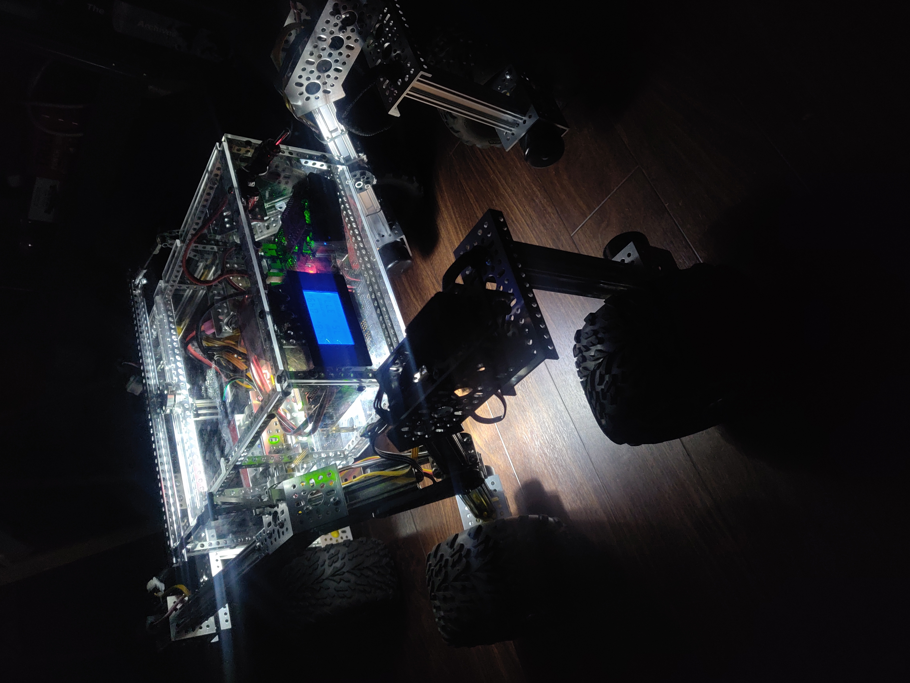
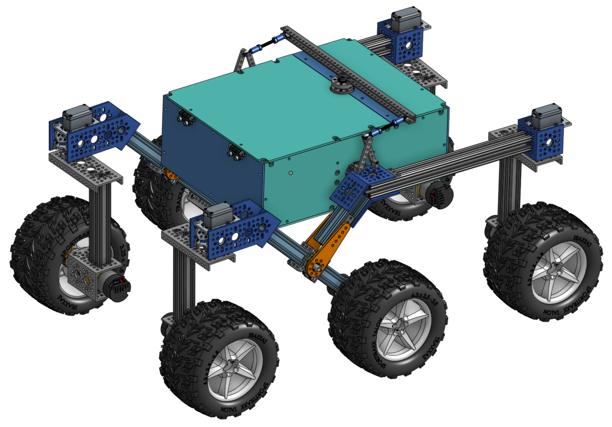
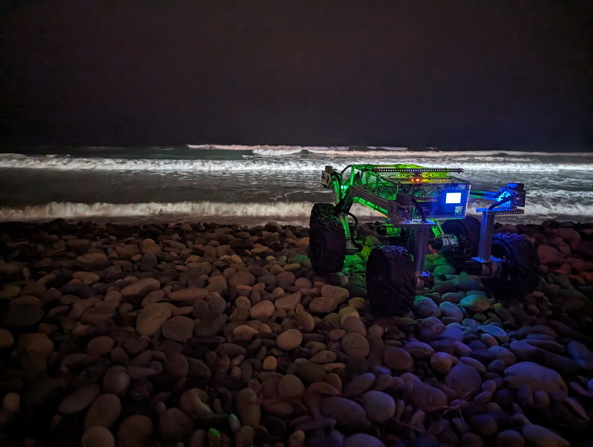

# JPL Open Source Rover Project

**NOTE**: For the previous major version of the OSR, please see [v3.1.0](https://github.com/nasa-jpl/open-source-rover/tree/v3.0.0).

|  |  |
| --------------------------- | --------------------------- |
|        |  |

The JPL Open Source Rover is an open source, build it yourself, scaled down version of the 6 wheel rover design that JPL uses to explore the surface of Mars. The Open Source Rover is designed entirely out of consumer off the shelf (COTS) parts. This project is intended to be a teaching and learning experience for those who want to get involved in mechanical engineering, software, electronics, robotics but is also an excellent research platform for rugged terrain. No prior skills or knowledge is required.

A gallery of some community builds including previous versions of the rover can be found [here](examples/README.md).

## About the OSR

### Motivation

JPL is always looking to inspire the next generation of scientists, engineers, and roboticists to help us explore and learn about our solar system (and beyond!). We release the plans for this rover as a way to try and give budding enthusiasts a fun robotics project that will help teach them and get them involved in robotics sooner and at a lower cost.

### At a glance

<!-- TODO: insert terminology into gif or image: rocker bogie, ... -->

The OSR has been around since 2017 and has undergone many iterations. It is a premium and robust robot with a unique look, high customizability, and powerful abilities. The hardware and electronics were designed with expansions like a head display and robot arm in mind.

| spec                | value                                                                   |
| ------------------- | ----------------------------------------------------------------------- |
| top speed           | ~1.6m/s (~slow running, subject to motor selection                      |
| nb motors           | 10                                                                      |
| structural material | aluminum                                                                |
| total cost          | [~$1600](parts_list/README.md) (about the cost of a TurtleBot 3 Waffle) |

The OSR mostly uses parts from [GoBilda](https://www.gobilda.com) for the mechanical assembly. For GoBilda's (international) shipping options, see [here](https://www.gobilda.com/shipping-policy/).

Other open-source, cheaper alternatives exist but are slower, less strong, and are more fragile. See [Additional Projects](#additional-projects).

### Features

This rover is designed to function similarly to the 6 wheel rover designs on Mars and employs a few of the major driving mechanics that the mars rovers use to traverse rocky surfaces:

* **Rocker-Bogie:** The Rocker-Bogie suspension system allows all 6 wheels to continually be in contact with the ground while climbing over obstacles
* **Differential Pivot:** Allows weight to be mechanically offloaded from one side of the rover to the other while climbing
* **6-Wheel Ackerman Steering:** Driving and steering/turning mechanism that governs where the wheels point and how fast each of them will move.

A Raspberry Pi acts as the "brain" of this rover for its versatility, accessibility, simplicity, and ability to add and upgrade your own modifications. Any method with which you can communicate with a Raspberry Pi (bluetooth, WiFi, USB devices, etc) can be interfaced into the control system of the robot.

For a 7.2Ah battery and with some driving on rough terrain, expect to get at least 3 hours of drive time. Below chart was recorded while driving on rocky terrain and plots voltage, current draw, and commanded velocity over time. When the voltage drops below 13-14V, the rover will power down. You can increase drive time by getting a bigger battery and/or by having the rover carry a second battery that can be swapped out.

> *WARNING*: Be careful to not discharge a LiPo battery too far as that drastically lowers the lifetime of your battery and can potentially make it hard or impossible to recharge.

## Join a community of hundreds of builders

Considering building one yourself? The best way to ask questions, reach maintainers, learn about modifications, and join the community of Open Source Rover builders is to join our Slack group:

<a href="https://join.slack.com/t/opensourcerover/shared_invite/zt-mfe0viua-FhcYsNb3S9vUra99uF3IBw">
  

</a>

**Note: JPL and Caltech have no official affiliation with this forum; it is run by individuals of the general public.** On these you can ask questions if you need help or clarification on any aspects of the project.  Additionally, you can post and promote any modifications or addons that you have created on this project. We highly encourage additions and modifications to be posted so that this project and community can grow.

### Maintenance Status

As an open-source hardware project, the rover is continuously improving. Please check [issues](https://github.com/nasa-jpl/open-source-rover/issues), [pull requests](https://github.com/nasa-jpl/open-source-rover/projects), and the Slack forum to see if any big changes are expected soon. The OSR project is proud to be Open-Source Hardware certified!

### Online 3D Model

You can view a 3D model of the latest version of the rover in your browser [at OnShape](https://cad.onshape.com/documents/e4f00b1a3d2edb1a84bbba1c/w/8ab8f394324bcc586236ef5d/e/9191e5ad2a70f387b419bc55?renderMode=0&uiState=645ede92f3a1a9205158b296).

### Skills Necessary

This project has elements in mechanical assembly/fabrication, uses a host of electrical components, and has software that will run it all. In order to complete this project, you will need to have some experience in the following:

* **Fabrication/Machining:** All parts are Consumer Off-The-Shelf (COTS) parts and **no metal machining should be required** to complete the 'base' version of the rover. However for any optional expansions, it may be useful to have access to the following skills/tools:
  * Metal cutting using band saw/dremel
  * Drilling using drill press/hand drill
  * Filing and sanding for part cleanup
  * General Fabrication/Machining Safety
* **Electronics:** This project uses components like motors, motor controllers, and batteries. While prior experience with the following skills is not required, having access to someone who can help will save a lot of time:
  * Soldering
  * Electrical debugging
  * Wiring
  * Electrical Safety
* **Software:** The rover's brain is a Raspberry Pi. All code can be found in the [osr-rover-code](https://github.com/nasa-jpl/osr-rover-code) repository along with step-by-step instructions to set it up. Basic familiarity with Linux, ROS, Git, and Python will be helpful though.

Most of the above are skills that you can learn and pick up fairly quickly from watching videos and doing research on the internet, and throughout the project we try to give supplemental information on some of these as well. See the build documents for more information.

### Tools Necessary

This project assumes you have some standard tools to help assemble the project. If you do not have any of the optional tools, we provide examples of online services that you can use to have the parts fabricated and sent to you.

#### Mandatory tools

* Metric hex keys
* Pliers
* Wire Snips
* Wire Strippers
* Solder Iron
* Solder
* Digital Multimeter
* Wire strippers, e.g. [these](https://www.amazon.com/dp/B07DWVSR41/?coliid=ISMG8XMBILGFK&colid=1IM7RHK25RIBB&psc=0&ref_=lv_vv_lig_dp_it)

#### Optional Tools

* 3D printer
* Laser Cutter (for the body plates, online services available)
* Benchtop Power Supply (to test without using battery)
* Items for operating a Raspberry Pi (Keyboard, mouse, monitor, 5V micro USB power adapter)

### Expected time commitment

In our experience, this project takes no less than 100 person-hours to build, and depending on the familiarity and skill level of those involved could be significantly more. Experienced builders may be able to build this project in this amount of time.  However, this project is generally meant to be a teaching and learning tool.  Throughout the documentation, we try to give supplemental information for those who might be new to this kind of project.

## Getting Started

### Rover Build Roadmap

* **Stage 1:** [Order parts](#ordering-parts). You'll want to get started on this ASAP!

* **Stage 2:** [Create the wiring](electrical/wiring/README.md). The cables connect the Printed Circuit Board (PCB) in the body to each motor and integrate into the rocker-bogie and corner assemblies so they need to be built first.

* **Stage 3:** [Make the electronics](electrical/pcb/README.md): Soldering the PCB and installing into the rover along with peripheral connections. We'll also use the wiring to test your PCBs.

* **Stage 4:** [Make the mechanical assemblies](mechanical/README.md): the body, the two rocker-bogies, the drive and corner motor assemblies. The instructions will guide you through how to do these step by step while integrating the cabling from Stage 2. You'll then attach them into something that will start to look like a rover!

* **Stage 5:** Setting up and configuring the operating system rover code. The [Rover Code repo](https://github.com/nasa-jpl/osr-rover-code)'s README files will walk you through all necessary steps for getting the rover software up and running on the Raspberry Pi. These steps can be completed at any point during the project, all the way up to when all the electronics and mechanical parts are completed and you are ready to start driving and controlling the robot.

* **What's next?** Add your own upgrades! We chose Raspberry Pi as the brain of the project so that it should be easy to add, change, and upgrade to build exciting things on top of this already cool robot.  Some upgrade ideas to get you brainstorming: sonar for collision detection, IMU for orientation / closed-loop driving / obstacle mapping, camera for object identification and tracking, sensor packages (temperature, pressure, humidity), solar panels, or even a robotic arm!

### Ordering parts

#### Parts Lists

The [Parts List Readme](parts_list/README.md) contains all the parts necessary to build the entirety of the robot as it is listed in our documentation.

Note that educational builders may apply for a 15% discount at GoBilda by filling out [this form](https://form.123formbuilder.com/6143945/open-source-rover-edu-form). Make sure you do this on time as processing times may vary. 

You can select higher RPM motors (to drive your rover faster) at the sacrifice of max stall torque. A selection of motors that would integrate easily with the rest of the suggested rover design can be found at [GoBilda - 5203 series](https://www.gobilda.com/yellow-jacket-planetary-gear-motors/).
The rover design and the software can accommodate different wheel sizes if you find wheels you like better.

## Additional Projects

Take a look at these alternative Mars rover replicas:

* [Sawppy Rover](https://hackaday.io/project/158208-sawppy-the-rover)
* [ESA ExoMy](https://github.com/0xD0M1M0/ExoMy)
* [3D printed and driveable Curiosity/Perseverance inspired Rover](https://github.com/jakkra/Mars-Rover)

## Star History

## Disclaimer

Reference herein to any specific commercial product, process, or service by trade name, trademark, manufacturer, or otherwise, does not constitute or imply its endorsement by the United States Government or the Jet Propulsion Laboratory, California Institute of Technology. Government sponsorship acknowledged.

Licensed under [Apache License 2.0](LICENSE.txt).

