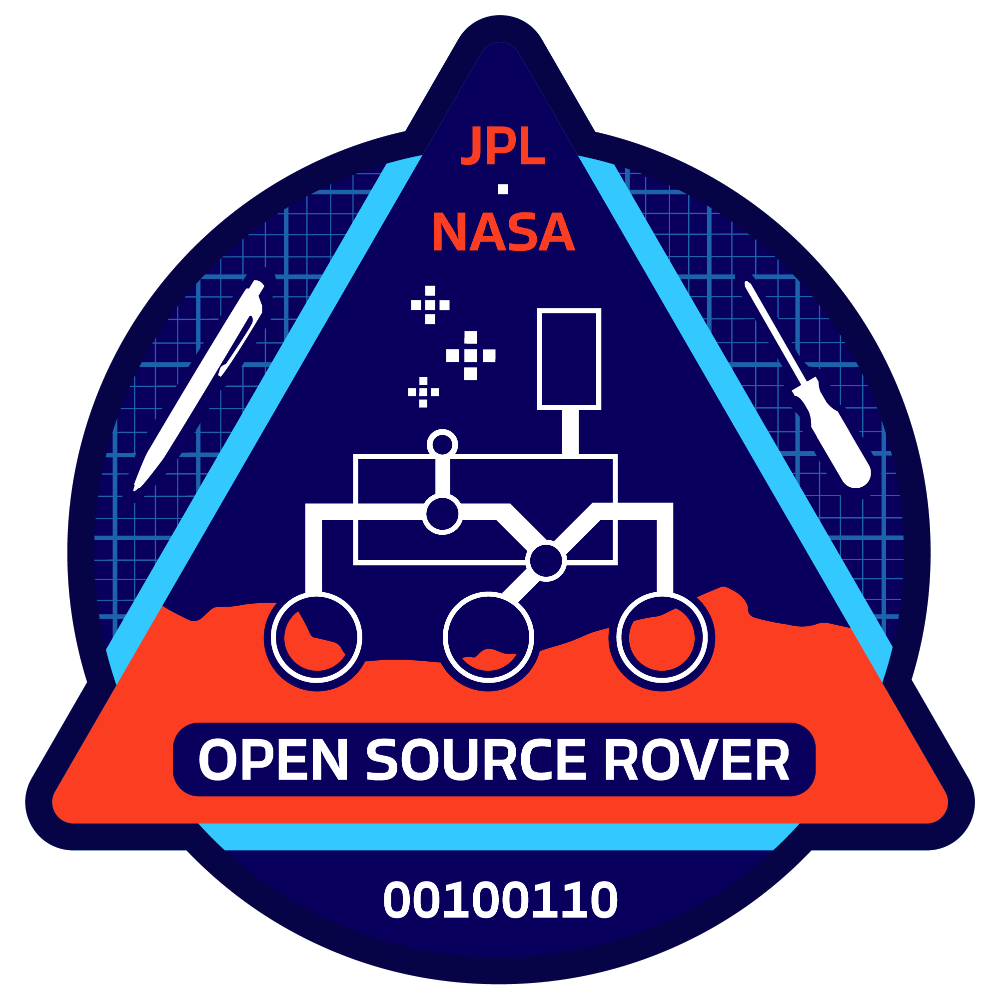
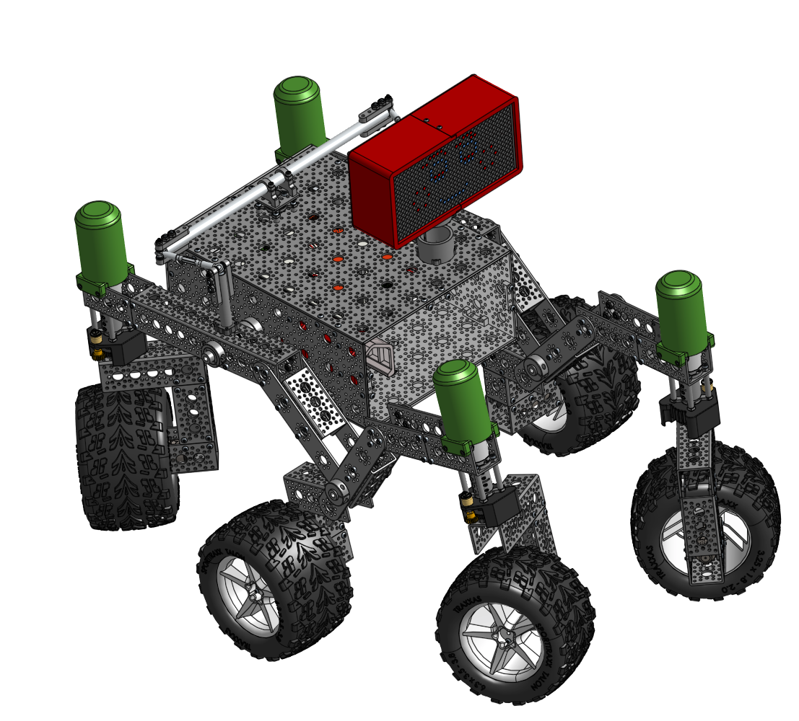
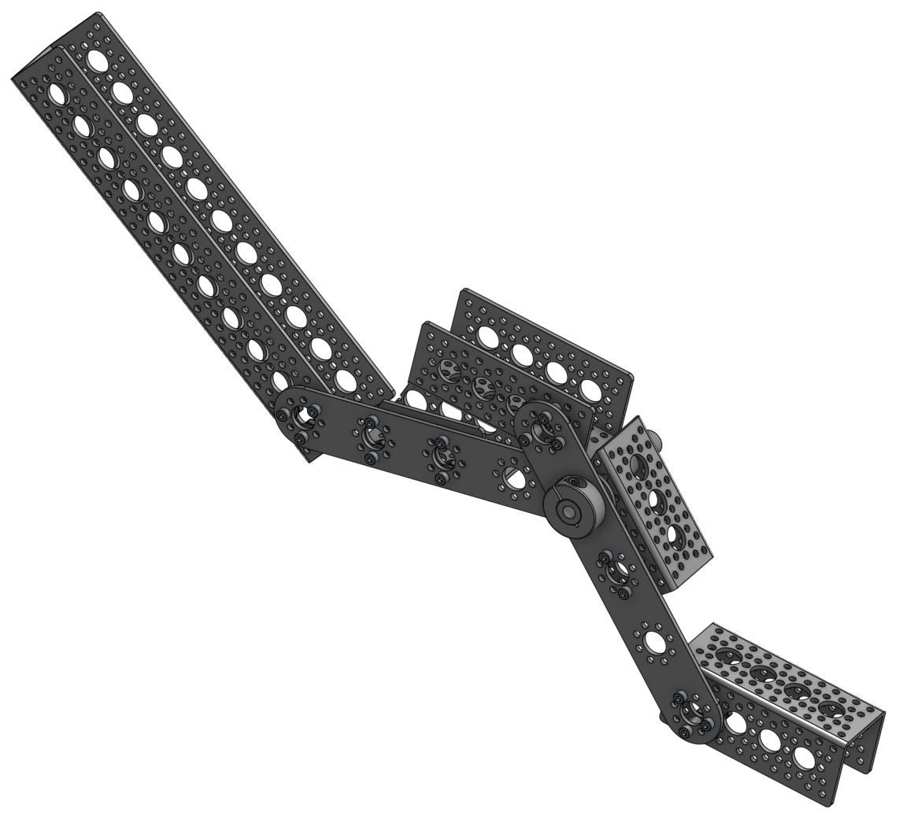
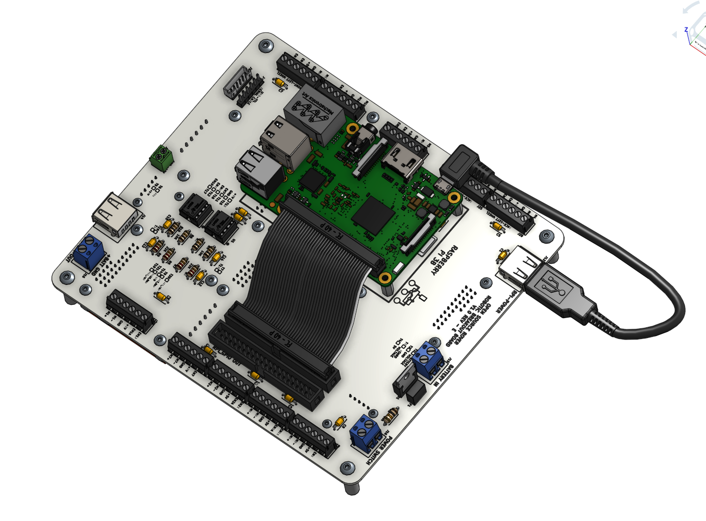

# JPL Open Source Rover Project

The JPL Open Source Rover is an open source, build it yourself, scaled down version of the 6 wheel rover design that JPL uses to explore the surface of Mars. The Open Source Rover is designed almost entirely out of consumer off the shelf (COTS) parts. This project is intended to be a teaching and learning experience for those who want to get involved in mechanical engineering, software, electronics, or robotics.

<table>
 <tr>
  <td align="center" >  </td>
  <td align="center" > 
  </td>
 </tr>
 <tr>
  <td align="center" > </td>
 <td align="center" ></td>
 </tr>
</table>

A gallery of some community builds can be found [here](examples/builders_gallery.md).

## About the Project

### Motivation

JPL is always looking to inspire the next generation of scientists, engineers, and roboticists to help us explore and learn about our solar system (and beyond!). We release the plans for this rover as a way to try and give budding enthusiasts a fun robotics project that will help teach them and get them involved in robotics sooner and at a lower cost.

---

### Specifications & Technical Attributes

The specific attributes of the robot you build will depend slightly on the type of electronics and motors you buy for the system.  The numbers shown below are for the version of the robot that contains exactly the parts that we suggest in our build documents and parts list. Below, you can see which parts could be changed for which spec upgrades.

| Attribute                                 | Value [imperial]         | Value [SI]             |
| ----------                                |:-----:                   | :-------------:        |
| Weight                                    | 28 [lbs]                 | 12.7 [kg]              |
| Footprint                                 | 24x14 [in]               | 60.96x30.48 [cm]       |
| Battery Capacity                          | 5200 [mAh]               | 5200 [mAh]             |
| Battery Discharge Rate                    | 8 [A]                    | 8 [A]                  |
| Nominal Current Draw                      | 1.2 [A]                  | 1.2 [A]                |
| Operating time                            | 5 [hrs] (continual use)  | 5 [hrs] (continual use)|
| Approximate Max speed                     | 68.8 [in/s]              | 1.75 [m/s]             |
| Maximum 90 deg vertical scale             | 12 [in]                  | 30.48 [cm]             |
| Maximum height differential between sides | 14 [in]                  | 35.56 [cm]             |
| Communication (in this guide)             | Bluetooth app (Android only) and Xbox Controller| |
| Cost (*)                                  | ~ $2,500                 |                        |

Again, the above statistics depend on which components you select when buying parts. One potential change is for the motors; you can, for example, select higher RPM motors (to drive your rover faster) at the sacrifice of max stall torque, which would potentially limit your rover's ability to climb. A selection of motors that would integrate easily with the rest of the suggested rover design can be found at [GoBilda](https://www.gobilda.com/5202-series-yellow-jacket-planetary-gear-motors/).

(*) Other open-source, cheaper alternatives exist but are slower, less strong, and are more fragile. See [Additional Projects](#additional-projects).

---

### Communication

In addition to this repository which holds all the documentation for this project, there are two additional websites tied to this project. One is a [landing site](https://opensourcerover.jpl.nasa.gov) which holds general information and an overview of the rover and how it works:

We have a few ways to connect with the team and community of Open Source Rover builders:

* [Slack](https://join.slack.com/t/opensourcerover/shared_invite/zt-mfe0viua-FhcYsNb3S9vUra99uF3IBw) (Preferred method)
* [TapaTalk - JPL Open Source Rover](https://www.tapatalk.com/groups/jpl_opensource_rover/) (Tapatalk is being monitored less since the addition of Slack, that's the easiest way to reach many of us now)
* We also use [Github Discussions](https://github.com/nasa-jpl/open-source-rover/discussions)

****Note: JPL and Caltech have no official affiliation with this forum; it is run by individuals of the general public.**** On these you can ask questions if you need help or clarification on any aspects of the project.  Additionally, you can post and promote any modifications or addons that you have created on this project. We highly encourage additions and modifications to be posted so that this project and community can grow.

---

### Features

This rover is designed to function similarly to the 6 wheel rover designs on Mars and employs a few of the major driving mechanics that the mars rovers use to traverse rocky surfaces:

* **Rocker-Bogie:** The Rocker-Bogie suspension system allows all 6 wheels to continually be in contact with the ground while climbing over obstacles
* **Differential Pivot:** Allows weight to be mechanically offloaded from one side of the rover to the other while climbing
* **6-Wheel Ackerman Steering:** Driving and steering/turning mechanism that governs where the wheels point and how fast each of them will move.

We chose a Raspberry Pi to be the "brain" of this rover for its versatility, accessibility, simplicity, and ability to add and upgrade your own modifications. Any method with which you can communicate with a Raspberry Pi (bluetooth, WiFi, USB devices, etc) can be interfaced into the control system of the robot.

In addition, here are the open communication ports and hardware on the Raspberry Pi:

* 4 USB ports (3 if using Xbox controller)
* RPi Camera port
* 1 I2C Bus (0 if using LED Matrix screen)
* 2 SPI Bus (1 if using LED Matrix screen)
* 3.5mm Audio Jack
* 13 GPIO pins (6 if using LED Matrix screen)

Using the above ports, you could theoretically drive the rover autonomously from the camera, via a USB dongle attached to anything (your own video game controller, a USB microphone, or many others... be creative!), or through any interface using the Pi's GPIO ports (distance sensors, accelerometers, and much more).  We've only given you two simple ways to control the rover to start... we want you to come up with even more!

For the power system of the rover, there is also ample spare power which can be used for your own addons and upgrades.  See the [Electrical subsystem documentation](electrical/) for more specific details.

---

### Maintenance Status

As an open-source hardware project, the rover is continuously improving. Please check ongoing [projects](https://github.com/nasa-jpl/open-source-rover/projects), [issues](https://github.com/nasa-jpl/open-source-rover/issues), [pull requests](https://github.com/nasa-jpl/open-source-rover/projects), and the forum (see below) to see if any big changes are expected soon.

### Online 3D Model

There is also an [Onshape model of the Open Source Rover](https://cad.onshape.com/documents/5c358484057fc4c01d5e5803/w/bdf583acdf29d75695be5fbc/e/e3eb7193ecdec5b0a710978b). The model includes the state of the rover at each individual step throughout our build instructions! Therefore, you should be able to reference the online 3D model in addition to the photos in the build instructions as you are building to ensure your build is going well. NOTE: The most updated model and single source of truth are the SolidWorks assemblies and the OnShape model may be out of date.

---

### Rover Mission Patch

Thank you to Lauren Schooley for creating a mission patch for the project. The patch is free for use as a team patch, for stickers, or decorating your rover. The design is released under the Creative Commons Attribution-NoDerivatives public license. A variety of file formats is available.

* [Mission Patch](https://github.com/lschooley/open-source-rover-mission-patch)

---

### Skills Necessary

This project has elements in mechanical assembly/fabrication, uses a host of electrical components, and has software that will run it all. In order to complete this project, you will need to have some experience in the following:

* **Fabrication/Machining:** Although most the parts are COTS there are a few modifications necessary to adapt them to the project. These modifications will be in the form of
  * Metal cutting using band saw/dremel
  * Drilling using drill press/hand drill
  * Filing and sanding for part cleanup
  * General Fabrication/Machining Safety
* **Electronics:** This project uses components like motors, motor controllers, and batteries. It will be important to have experience with the following electrical processes.
  * Soldering
  * Electrical debugging
  * Wiring
  * Electrical Safety
* **Software:** The rover's brain is a Raspberry Pi. All code can be found in the [osr-rover-code](https://github.com/nasa-jpl/osr-rover-code) repository along with step-by-step instructions to set it up. Basic familiarity with Linux, ROS, and Python will be helpful though.

Most of the above are skills that you can learn and pick up fairly quickly from watching videos and doing research on the internet, and throughout the project we try to give supplemental information on some of these as well.  See the build documents for more information.

---

### Tools Necessary

This project assumes you have some standard tools to help assemble the project. If you do not have any of the optional tools, we provide examples of online services that you can use to have the parts fabricated and sent to you.

#### Mandatory tools

* SAE Hex Key set
* SAE Wrench set
* Pliers
* Wire Snips
* Wire Strippers
* Solder Iron
* Solder
* Digital Multimeter
* Hand Drill or Drill Press
* Dremel, Band saw, or hand saw
* Items for operating a Raspberry Pi (Keyboard, mouse, monitor, 5V micro USB power adapter)
* Wire strippers, e.g. [these](https://www.amazon.com/dp/B07DWVSR41/?coliid=ISMG8XMBILGFK&colid=1IM7RHK25RIBB&psc=0&ref_=lv_vv_lig_dp_it)

#### Optional Tools

* 3D printer
* Laser Cutter
* Power Supply (to test without using battery)

---

### Expected time commitment

In our experience, this project takes no less than 200 person-hours to build, and depending on the familiarity and skill level of those involved could be significantly more. Experienced builders may be able to build this project in this amount of time.  However, this project is generally meant to be a teaching and learning tool.  Throughout the documentation, we try to give supplemental information for those who might be new to this kind of project.

# Disclaimer

**Reference herein to any specific commercial product, process, or service by trade name, trademark, manufacturer, or otherwise, does not constitute or imply its endorsement by the United States Government or the Jet Propulsion Laboratory, California Institute of Technology. Government sponsorship acknowledged.**

**By downloading, cloning, or otherwise using the contents of this repository, you agree to the terms specified in the attached [DISCLAIMER.txt file](/DISCLAIMER.txt).**

## Getting Started

---

### Ordering parts

#### Parts Lists

The [Master Parts List](parts_list/master_parts_list_raw.csv) contains all the parts necessary to build the entirety of the robot as it is listed in our documentation. We recognize that you may want to change, add, and redesign some sections, so each of the individual build sections also contain a parts list for that corresponding section of the project. *Note that these individual parts list recommend buying quantities necessary **only for that section**.  Be sure to assess the quantities you need for common items (particularly screws, nuts, bolts, and other common hardware) if you are changing subassemblies.*

##### Cart Share

In order to help this ordering process we have compiled a few links of a large number of these together already, if you wish to build exactly what is in our build documentation. Note that some of these parts might not be available or outdated. Please check the master parts list for the most up-to-date list of items.

|[McMaster](https://www.mcmaster.com/order/rcvRtedOrd.aspx?ordid=5887891246&lnktyp=txt)|[Amazon](https://www.amazon.com/gp/registry/wishlist/3ELV1FY8J7ZYP/ref=cm_sw_em_r_z_g__wb)|[Pololu](https://www.pololu.com/wishlist/1J10953)|[Adafruit](https://www.adafruit.com/wishlists/460400)|
|---|---|---|---|

**Electronics**

The easiest way to buy the electronics parts is to use the links (to e.g. Digikey) on the Kitspace pages:

* [control-board](https://kitspace.org/boards/github.com/nasa-jpl/open-source-rover/open-source-rover-control-board/)
* [arduino-shield](https://kitspace.org/boards/github.com/nasa-jpl/open-source-rover/open-source-rover-shield/)

Another way to order from Digikey is to upload the [Digikey Bill of Materials](bill_of_materials/Digikey_BOM.csv) at [Digikey.com](https://www.digikey.com/).

#### 3D printing and Laser cutting

In addition to ordering all of the parts on the parts list, we recommend that some pieces be 3D printed and laser cut. If you do not have access to a 3D printer or laser cutter, we've added some online services as examples for where you can get those manufactured and shipped to you. You'll find instructions on this in the [Body Build Doc](mechanical/body_assembly/README.md),  [Corner Steering Build Doc](mechanical/corner_steering/README.md), and [Head Assembly Build Doc](mechanical/head_assembly/README.md).

#### Printed Circuit Boards (PCBs)

The main electrical system of this rover relies on a custom printed circuit board (PCB) that handles the routing between the majority of the electrical components. This board greatly simplifies the build process and eliminates the need for you to route all the wires yourself. You can find the PCB board files at [PCB Files](https://github.com/nasa-jpl/open-source-rover/tree/master/electrical/pcb/).

The easiest way to order the PCBs is through the links (to e.g JLCPCB) on the Kitspace pages:

* [control-board](https://kitspace.org/boards/github.com/nasa-jpl/open-source-rover/open-source-rover-control-board/)
* [arduino-shield](https://kitspace.org/boards/github.com/nasa-jpl/open-source-rover/open-source-rover-shield/)

You can also download the "Gerber" files there (a typical file format for PCBs) and upload them to any other PCB service that doesn't have a direct link on Kitspace.

---

### Rover Build Roadmap

Above is an example roadmap of how you can build the rover and which parts of the build are dependent on the other sections. It is broken down into 5 stages:

* **Stage 1:** Start getting all the parts!  

* **Stage 2:** Once you have all the parts, everything in stage 2 can be completed in parallel. It is *highly* recommended to start on the electrical testing of components outside the robot before doing any electrical work inside the completed robot body. You can also work on the software at any stage between here and the end.

* **Stage 3:** During stage 3, the mechanical subassemblies should all be assembled and start to be integrated together.  There should be some amount of testing done on the electrical system, as well as some progress on the software.

* **Stage 4:** The rover is mechanically built and all subassemblies integrated together.  During stage 4, you begin the integration of the electrical components and the various power and data wires that run throughout the rover.

* **Stage 5:** Once the electronics are all powered and communicating, you need to test and calibrate all the motors in the system.

* **Stage 6:** After everything has been tested and calibrated and the software is up and running, the robot will be fully functioning and built!

* **Stage 7:** Add your own upgrades! We chose Raspberry Pi as the brain of the project so that it should be easy to add, change, and upgrade to build exciting things on top of this already cool robot.  Some upgrade ideas to get you brainstorming: sonar for collision detection, IMU for orientation / closed-loop driving / obstacle mapping, camera for object identification and tracking, sensor packages (temperature, pressure, humidity), solar panels, or even a robotic arm!

---

## Getting help / joining the community

If you have any questions or run into problems during your build, please search for answers and/or reach out on [Github Discussions](https://github.com/nasa-jpl/open-source-rover/discussions). Please also take a look at the list of [open issues](https://github.com/nasa-jpl/open-source-rover/issues). If you think there is an error or a part is missing, please create a new issue.

---

## Project Team

These were the original creators of this project. Now, this open-source repository is run by volunteer maintainers from the community.

### Project Lead

Michael (Mik) Cox

### Development Team

Eric Junkins and Olivia Lofaro

### Special Thanks To

Magdy Bareh, Michelle Viotti, Tom Soderstrom, Dave Gallagher, Jim Rinaldi, Molly Bittner, Christine Fuller, Billy Allen, and Charles Dandino

## Additional Projects

We recognize that there might be a some individuals, hobbyists, and groups that might be hesitant or unable to build the Open Source Rover due to skills/tools necessary, or budgetary constraints. Here are some other open-source alternatives.

* [Sawppy Rover](https://hackaday.io/project/158208-sawppy-the-rover)
* [ESA ExoMy](https://github.com/esa-prl/ExoMy)
