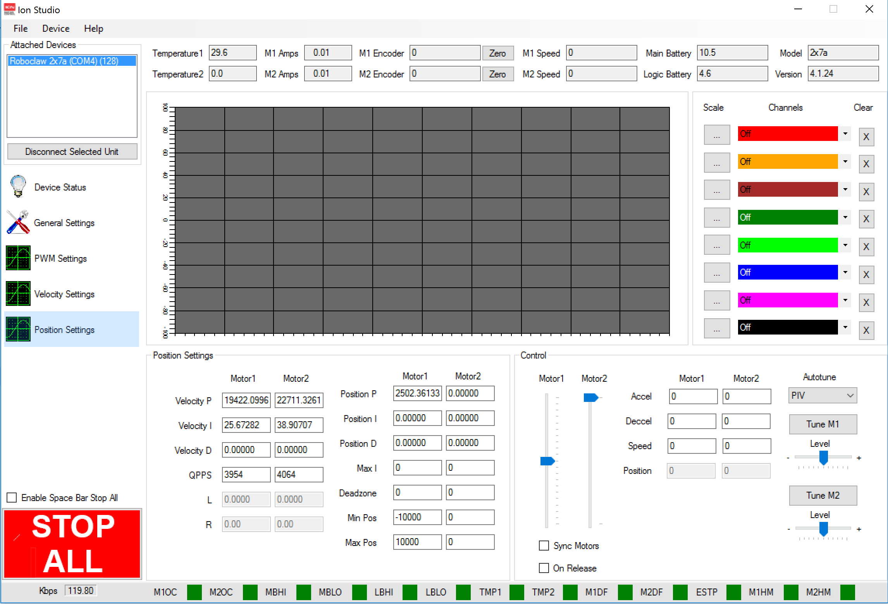

<!-- Open Source Rover: Calibration
Authors: Michael Cox, Eric Junkins, Olivia Lofaro
Reference herein to any specific commercial product, process, or service by trade name, trademark, manufacturer, or otherwise, does not constitute or imply its endorsement by the United States Government or the Jet Propulsion Laboratory, California Institute of Technology. ⃝c 2018 California Institute of Technology. Government sponsorship acknowledged.
 1
-->

# Open Source Rover: RoboClaw Calibration

# 1. Calibration

In order for the motors to all work properly and drive the rover correctly, we must calibrate the motors and encoders. We will use a program called Basic Micro Studio to assist with this. BasicMicro Motion Studio can be downloaded at

* [Motion Studio Download](http://www.basicmicro.com/downloads)

We will now go through and check the encoders and motors one at a time and perform the calibration process on each of them. First, make sure that either the robot is fully hanging such that every drive wheel is not in contact with the ground, or that you elevate each drive wheel as you attempt to spin that wheel.

## 1.1 RoboClaw Setup

1.1.1 Connect your computer (with Basic Micro Studio installed) to the RoboClaw via USB- micro USB cable

1.1.2 Open Basic Micro Studio

1.1.3 If prompted, update the RoboClaw Firmware

 **Figure 1: Ion Studio Firmware Update**

1.1.4 Click the ’Connect Selected Unit’ box in the upper left

1.1.5 Verify that all the motor control parameters are roughly nominal:

* Temperature1: 30
* M1/M2 Amps: 0.00
* M1/M2 Encoder: 0
* M1/M2 Speed: 0
* Main Battery: Between 11.5-16.7V
* Logic Battery: 5V
* Model: 2x7a

**Figure 2**

As you perform the calibration and testing outlined in this document, make sure to monitor the values above and make sure they are changing in the way that you expect they should. For instance, the temperature going much higher than 35 would indicate that something is going wrong, or if you are pulling a large amount of current you might have a short in the wiring.

1.1.6 Under the General Settings Tab, you’ll need to change the following settings for each RoboClaw:

**Figure 3**

(a) Setup:

* Control Mode: Packet Serial
  * Multi-Unit: Check Enable Multi-Unit Mode

(b) Serial:

* Set the address to 128,129,130,131,132 for each respective RoboClaw
* (Robo- Claw 1 is address 128, 2 is address 129, etc)
* Baudrate: 115200

(c) Battery:

* Max Main Battery: 17.5V
* Min Main Battery: 11.5V

(d) Motors:

* We will be updating the motor current parameters after calibration is complete.

(e) I/O:

* Encoder 1 Mode: Quadrature for addresses 128,129,130; Absolute for addresses 131 and 132
* Encoder 2 Mode: Quadrature for addresses 128,129,130; Absolute for addresses 131 and 132

**1.1.7 After changing these settings, make sure to save them! (Device − > Write Settings )**

## 1.2 Drive Motor Calibration

1.2.1 Perform the following steps for the **RoboClaw addresses 128,129, and 130**:

* Go to the PWM settings tab

 **Figure 4**

(a) Under the control pane, slowly move the slider bar up for Motor1.

**Figure 5**

(b) Verify that when the forward signal is sent to the motor (the Motor1 slider is above 0), the wheel spins in the direction that would move the rover as a whole forward (note this is different clockwise vs counterclockwise based on which wheel you are testing). **If the wheel moves backwards with respect to the rover direction, then under the General Settings tab click the checkbox labeled ’Reverse M Relative Direction based on which motor is wrong.**

(c) Now as you drive M1 motor forward (which now corresponds to the rover moving forward), verify that M1 Encoder value increases. **If the encoder value decreases go to the General tab and under I/O click the Invert checkbox for the Encoder Mode.**

(d) Repeat steps 1.2.1 b) and 1.2.1 c) for M2 motor.

1.2.2 Once both motors are spinning the correct direction and the encoders respond accordingly when commanded through the PWM Signal tab, move on to the Velocity Settings tab.

**Figure 6**

Here we’ll be tuning the motor settings. We need to do this in order to have fluid control of the motor, and it needs to be done for each individual motor as they will all differ slightly out of the box. Therefore, each motor must be be individually tuned. For more information on motor PID controls and what they do you can visit:

* [An Introduction to PID Control with DC Motor](https://medium.com/pollenrobotics/an-introduction-to-pid-control-with-dc-motor-1fa3b26ec661)
* [The Working of a PID Controller](https://www.elprocus.com/the-working-of-a-pid-controller/)

There has been significant feedback that the BasicMicro Motion Studio auto tune sometimes does not work, and so we have included a section at the end of this document about how to tune the motors yourself.

(a) Begin by entering in the QPPS (quadrature pulses per second), or the maximum number of encoder ticks per second. To find this value, drive the motor at max speed in the PWM setting and look at the box labeled ’M1/M2 Speed’.

**Figure 7**

(b) Now hit the Tune M1 button. This will populate the Velocity P, I, and D variables on the M1 side. Repeat this step for M2 motor as well.

**Figure 8**

(c) Once both motors on this motor controller have been tuned go back to the General settings tab and update the Motor Parameters to have a Max current of 15.0 Amps. Then go to Device − > Save Settings and then exit. Repeat all of steps 6 through 8 for the other drive motors.
  
## 1.3 Corner Motor Calibration

1.3.1 Perform the following for the **RoboClaw addresses 131 and 132**:

(a) Perform step 6 above for the corner motors, making sure to set the encoder type to absolute.

(b) Go to the PWM Settings tab and **slowly** drive the M1 corner forward. Verify that the encoder value goes up. If it does not, switch the motor wire leads at M1A and M1B.2

(c) Repeat step 9b for M2 motor

(d) You may need to set the absolute encoder ”zero” point in a different location. In order to avoid ”clipping” of the range of the encoder, we’ll set the mid-point of the absolute encoder to be the middle of the turning arc.

* Navigate to the PWM Settings tab to move the corner to its ”center” position, which is where the wheel is directly forward.

* Unscrew the small gear at the bottom of the absolute encoder
  * Once the absolute encoder shaft is uncoupled from the robot, spin the encoder until you determine the max value. This should be somewhere in the range of 1400-18004.

* As opposed to the drive motors, the corners use absolute encoders that are defined in one direction only, so you cannot switch the direction of the encoder.

Clipping occurs when you go past the 360 deg mark on the encoder and it starts again at 0.

If you are getting encoder values of close to 2000 and the value stays above 2000 and does not reset to 0 while the shaft is spinning, it means that the voltage divider board is not working properly. Check to make sure the resistors on the voltage divider board are the correct values.

* Spin the encoder until it reads a value of roughly half its max value and reattach the gear, coupling it back to the rover.

(e) For each motor M1 and M2, we now need to obtain what is the new min and max encoder values. Using the PWM Settings tab, move the motors until they run into the physical hard stops. Record the min and max encoder values for each, but for the min values add at least 15 and the max subtract at least 155.

(f) Navigate to the Position Settings tab.

**Figure 9**

(g) Enter your Min and Max encoder values for each M1 and M2 motor. We add a buffer of at least 5 encoder ticks to avoid driving the motors all the way into the hard stop; In other words, we’ll impose a software ’soft stop’

  
     **Figure 10**

(h) Change the Autotune type to **PD** and then tune the M1 and M2 motors by clicking the ’Tune M1’ and ’Tune M2’ buttons. We’ve found that this autotuning process is more successful if you run it with the wheels down on a smooth surface, but still supporting the weight of the robot.

**Figure 11**

(i) To verify that the corner steering motors have been calibrated, move the M1 and M2 sliders to their middle positions (halfway between min and max) and verify that the wheels all point exactly straight forwards. If they do not point straight forwards, verify that your min and max values are correct and ensure that no signal clipping is happening on the encoders.

(j) After the motors have both been tuned go to General settings and set the Motor current Max to be 15.0 Amps for each motor.

(k) Repeat Step 9 for the remaining corner motors

## 2. Manual Calibration

This section is to preform a manual tuning and calibration of the Corner motor system. This will be using the Ziegler-Nichols tuning method. For a more in depth explanation of how this process works you can visit:

* [Tuning for PID Controllers](http://faculty.mercer.edu/jenkins_he/documents/TuningforPIDControllers.pdf)

These steps assume you have already set the max/min values of the encoders in the position tab, as well as verified the encoder direction. If you have not done those follow the steps in the Corner Calibration

1. Determine the QPPS of your system. This is the quadrature pulses per second at max speed of the motor. For that run your motor at max speed using the PWM settings tab, and look at the motor speed. This value just has to be initially close, so generally you can use the same number for all of the same motor types ie. Drive vs Corner motors.
2. In the GUI under the position settings tab have it graph the Motor(x) position, and Motor(x) setpoint, where(x) is the motor you are tuning.
3. Go to the Position Tab. Set all PID gains to be zero.
4. Enter in the QPPS from step 1.
5. Increase the P value and then use the position slider to command the setpoint of the motor. Initially I started my P value at 10 for the first increment. The motor should move to this position. If it stops immediately at the value then the system is over-damped. Keep increasing the P value until the motor beings to have a stead-state oscillation which doe NOT damp out to the setpoint. This value is called Kc. I found mine to be usually between 10-20 for values of P, which I incremented in steps of 0.5 at a time.
6. Now that the system is oscillating back and forth you have to get the period of the oscillation. Do this by starting a timer and timing how long it takes to do 30 oscillations. For mine it was around 10 seconds. Divide that time by the number of oscillations, this gives you the period, which is called Pcr. I found this to be generally around 0.3s
7. The approximate gains can be found using the following equations:
    <!-- Maybe convert the equations to graphics -->

    P = 0.6Kc  
    <!-- (1)-->

    I = 0.5Pcr
    <!-- (2) -->

    D = 0.125Pcr
    <!-- (3)-->
8. Enter in these values into the GUI and use the slid bar to set the setpoint and see the motor response on the graph. More than likely what will happen is it will overshoot and do one oscillation. This means that the P value is slightly too high. Decrease the P value in small steps until you see no overshoot of the setpoint in the graph. Once that happens your corner motors will be appropriately tuned.
