# Control Board Assembly, v2.0.3

TODO: renumber images and sections as necessary

The overall Control Board consists of a Motor Board with a Brain Board mounted on top. These are the instructions to assemble these two separate pcbs and mount them together as the unified control board.

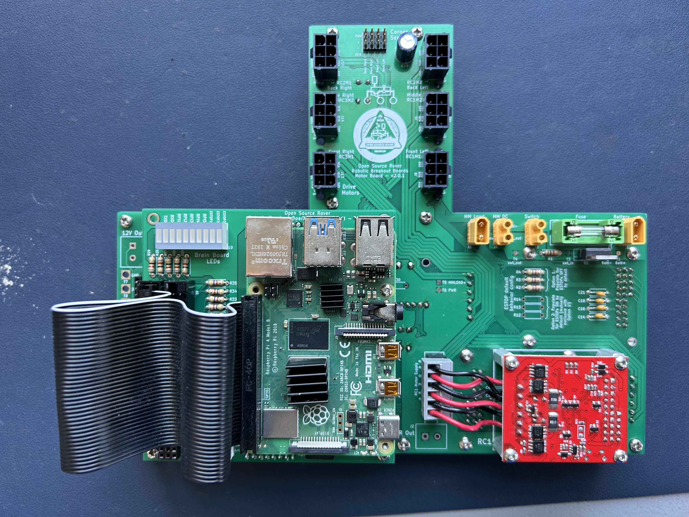

This document goes through the process of assembling and testing the custom
Printed Circuit Boards for the project. 

Note that the images in these instructions are taken from an assembly of the v2.0.1 board. There are minimal differences between v2.0.1 and v2.0.3 - such that it wasn't worth doing another photoshoot for v2.0.3. Make sure to follow the written instructions when in doubt.

## 1. Part References 

Check out the [BOM readme here](control_board/BOM/v2.0.3/readme.txt)

All parts referenced in these instructions use the schematic "reference designator" from the silk screen on the pcbs. E.g. "C1", "J2", and "R28". You should look up the details of these parts within the [v2.0.3 BOM the board ref parts spreadsheet](control_board/BOM/v2.0.3/bom_v2.0.3_board_ref_parts.csv) or the [v2.0.3 BOM other parts spreadsheet](control_board/BOM/v2.0.3/bom_v2.0.3_other_parts.csv). This will tell you the unique ID of the part that we use for ordering from Digikey + elsewhere, and will also link to pictures of the part on the relevant website.

Generally these instructions have enough images to clearly show and identify the parts, but whenever in doubt the best thing to do is to look up the reference in the BOM spreadsheet.

## 2. Schematic and Layout Documentation

todo: link to these

## 3. Motor Board Assembly

<!-- ### 3.1 Motor & RoboClaw Connectors -->

<!-- TODO update this table -->
<!-- | **Item**              | **Ref** | **Qty** | **Image**                                                                        | **Item**              | **Ref** | **Qty** | **Image**                                                           |
| --------------------- | ------- | ------- | --------------------------------------------------------------------             | --------------------- | ------- | ------- | --------------------------------------------------------------------|
| OSR Motor Board       | E1      | 1       | 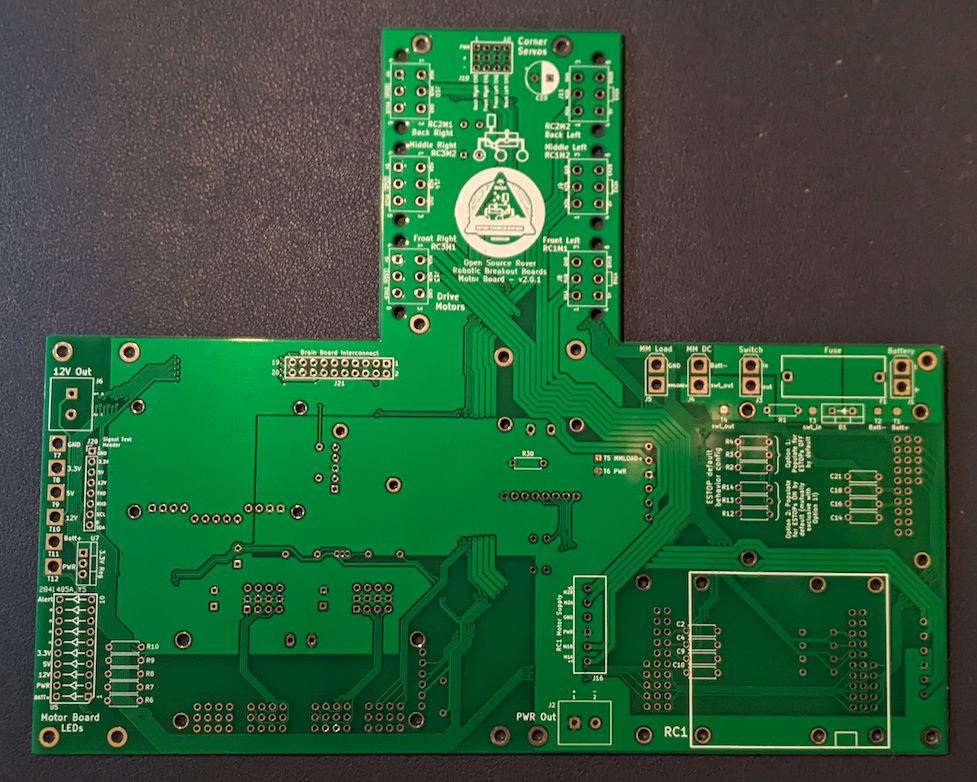 |  10 Pos Header Socket  | E5      | 5       |      |
| 6 Pos Side Term Block | E3      | 10      |                |  5 Pos Header Socket   | E6      | 5       |      |
| 6 Pos Top Term Block  | E4      | 5       |                |  Soldering Iron        | N/A     |         |                                                                    | -->

| 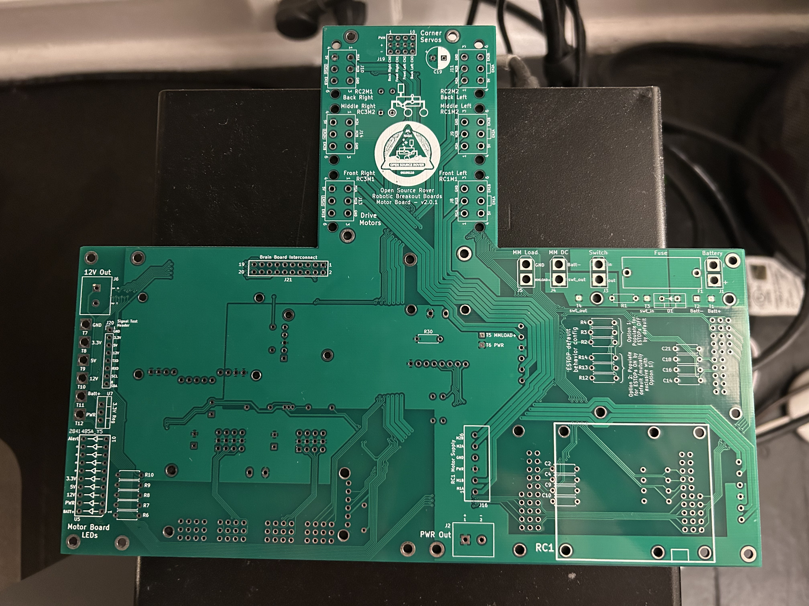  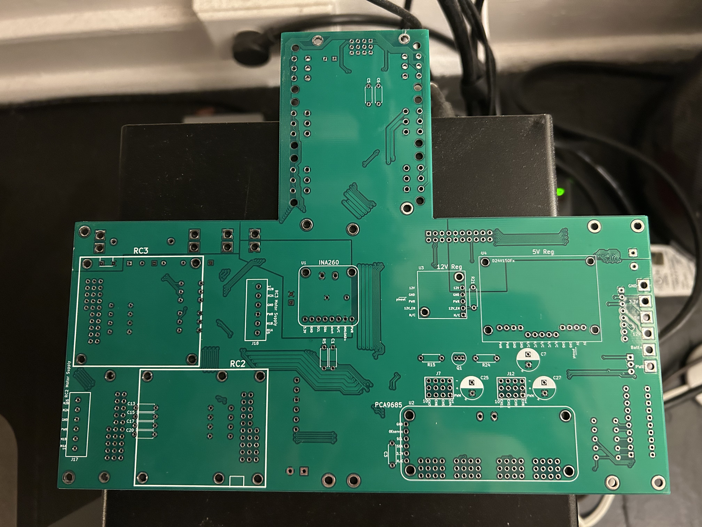 |
|:-:|
| Figure 3.0: front (left) and back (right) of motor board |

### 3.1 Attach standoffs

Attach standoffs to the bare board, for ease of future soldering work.

| 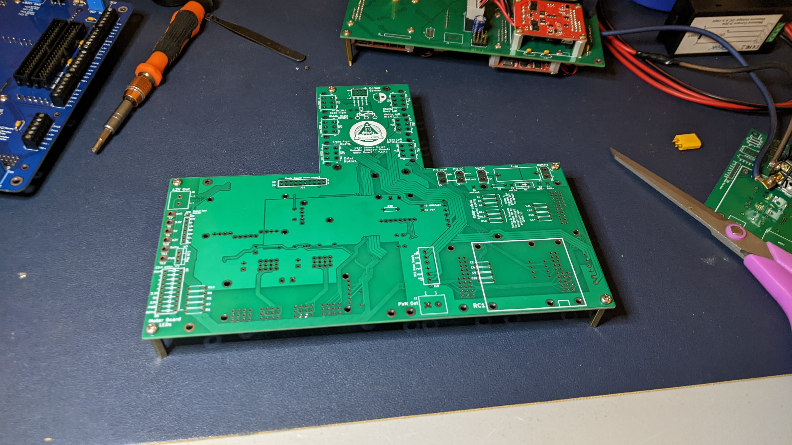 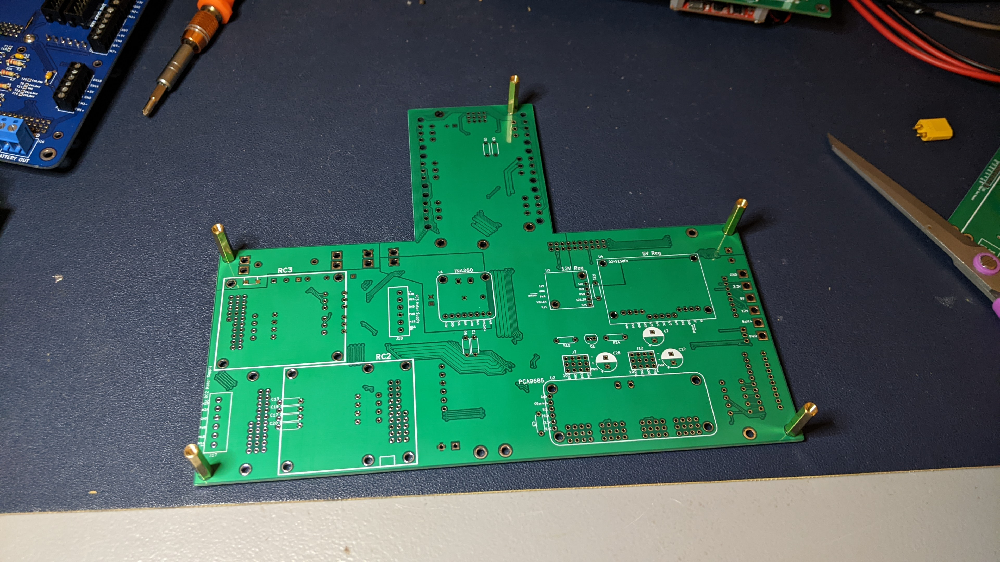 |
|:-:|
| Figure 3.1: Standoffs attached |

### 3.2 Solder on power headers and fuse holder

Solder on the XT30 headers for footprints J1, J3, J4, and J5, as well as the fuse holder F1.

Make sure to choose the proper XT30 header for the corresponding J footprint:
- J1: male
- J3: female
- J4: female
- J5: male
See the images to clarify which one is which.

The pins on the XT30 will be slightly smaller than the holes on the board - this is fine, just make sure to use a lot of solder to connect them so there's a good mechanical connection. The soldering should be fairly straightforward once you start. 

| 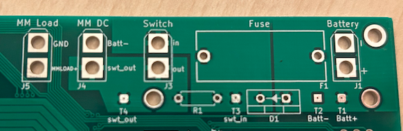 |
|:-:|
| Figure 3.2: Power headers + fuse holder footprints |

| 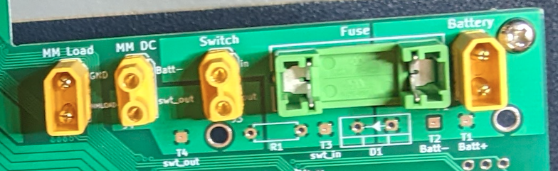 |
|:-:|
| Figure 3.3: Power headers + fuse holder attached |

|  |
|:-:|
| Figure 3.4: Power headers and fuse holder attached, zoomed out |

| 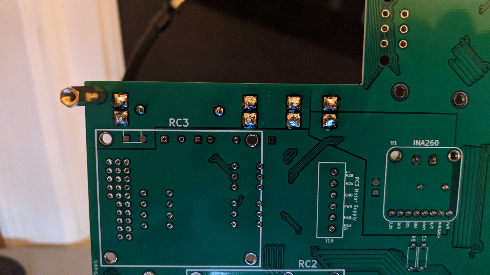 |
|:-:|
| Figure 3.5: Close up view of soldered footprints for headers |

### 3.3 Solder resistor R1 and power diode D1

Make sure to attach D1 in the correct orientation!

| 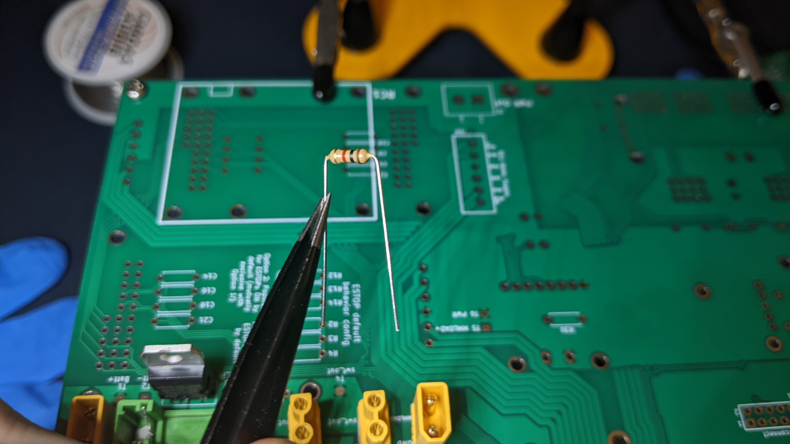 |
|:-:|
| Figure 3.6: Resistor R1 |

| 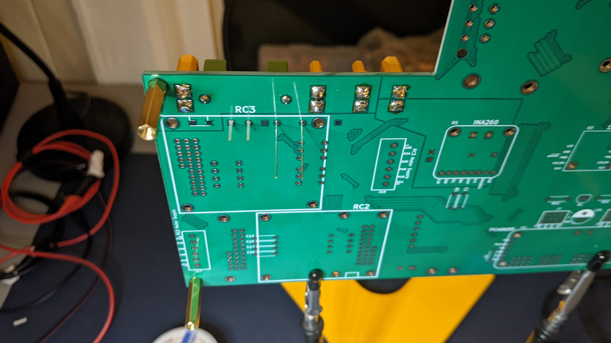 |
|:-:|
| Figure 3.7: Through hole leads for R1 and D1 |

| 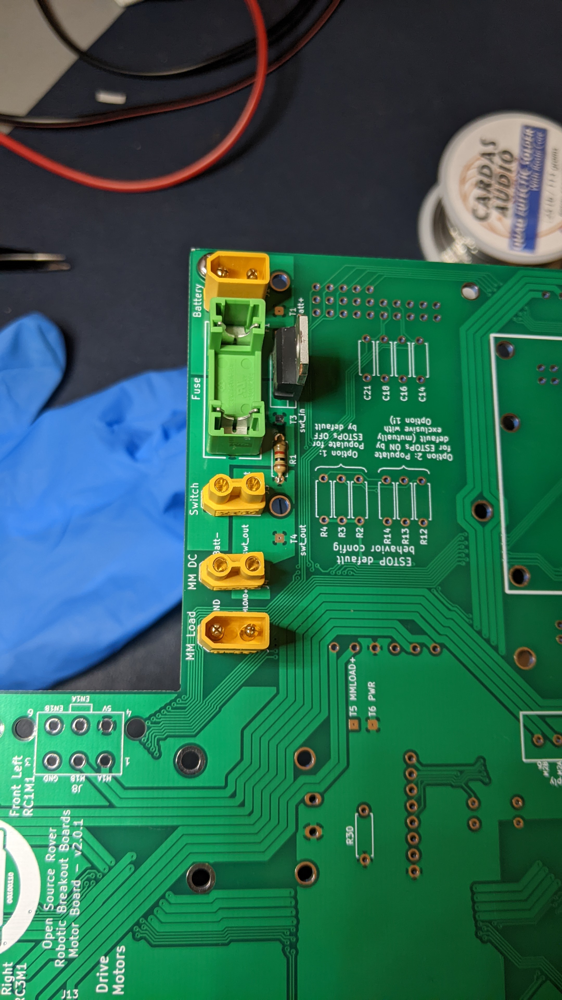 |
|:-:|
| Figure 3.8: R1 and D1 attached |

### 3.4 Test the power connectors

Insert a fuse (part# B1) into the fuse holder (as shown in Figure 3.8 below)

Using the appropriate matching XT30 connectors, connect the power headers to a power supply (or your battery), the external switch (part# B9), and the multimeter (part# B10)

Use this diagram to determine to wire things together:

TODO: add diagram of board / power supply / external switch / multimeter wiring

When testing with a power supply, provide 14.8V DC and current limit to 1.0A.

After testing, make sure to disconnect the power supply.

| 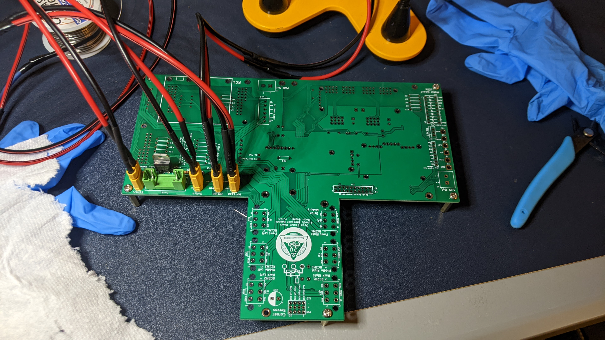 |
|:-:|
| Figure 3.6: Wires connected to power headers |

| 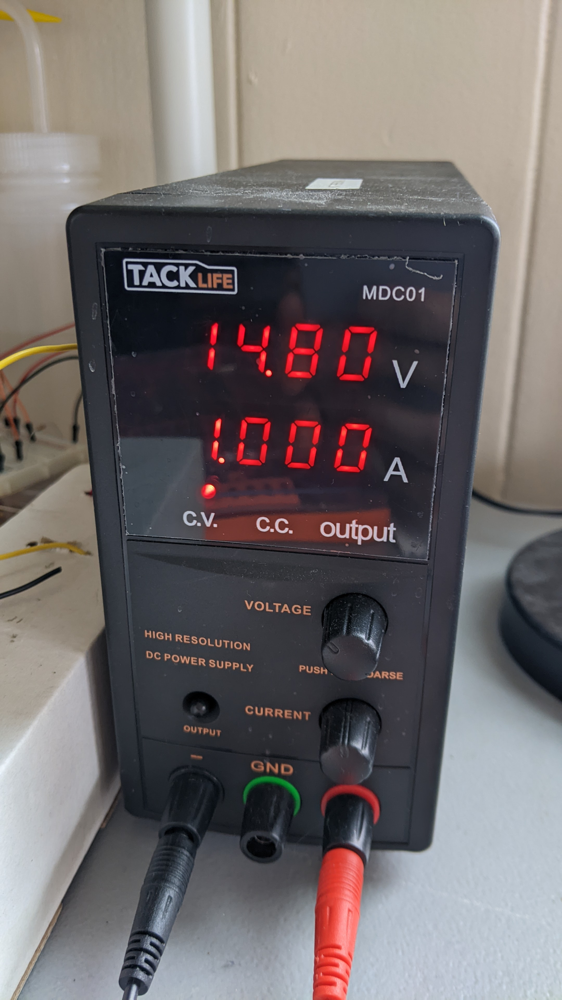 |
|:-:|
| Figure 3.7: Power supply providing 14.8V DC and current limited to 1.0A |

Use a multimeter to test the voltage between test points T4 ("swt_out") and T2 ("Batt-"). This should read the same value as input from the power supply/battery (14.8V)

| 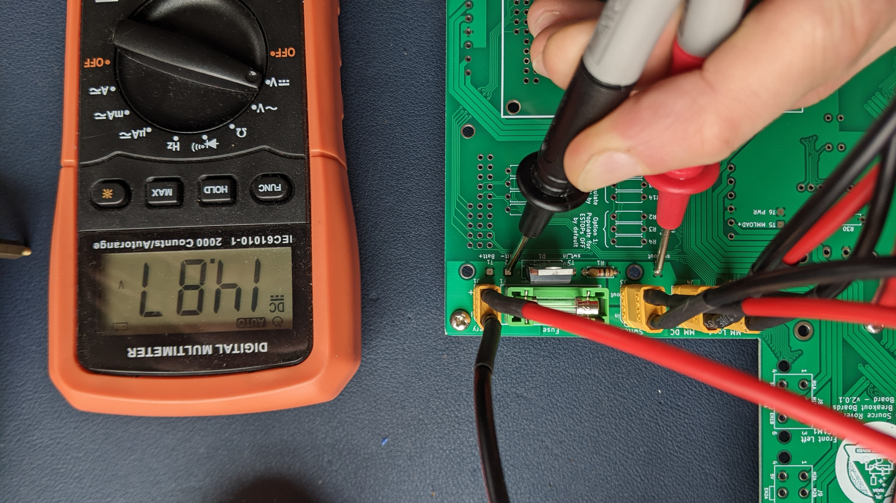 |
|:-:|
| Figure 3.8: Testing the voltage between T4 and T2 |

Also check the voltage shown by the multimeter. This should show the same voltage as well.

| 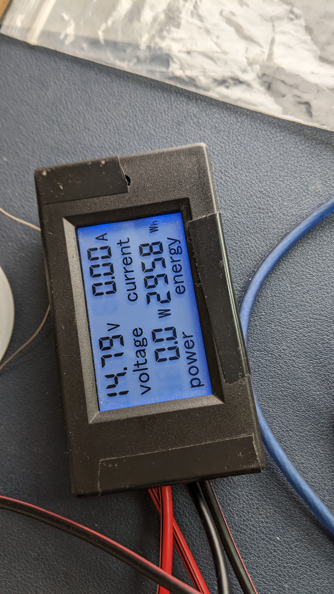 |
|:-:|
| Figure 3.9: Testing the power input to the multimeter |

### 3.5 Install the INA 260

:exclamation: Before continuing, make sure to disconnect the power supply from the previous step! You should not have the board powered on while installing components. :exclamation:

The INA260 daughter board is used for digital sensing of voltage and current, measurements that the raspberry pi can query over an I2C connection. Unfortunately, it can be hard to find these INA260 parts nowadays - if you can't find one you will need to bypass U1, because it is in the path of the battery positive side supply.

**Option 1: If you have an INA260 daughter board, you should install that in footprint U1.**

TODO: update parts here

1. Attach an 8x1 female header to the 8 pins on the bottom side of the INA260 / U1 footprint, as seen in Figure 3.10
2. Attach a 3x1 female header (cut from a longer Nx1 header) to the two pins on the top side of the INA260 / U1 footprint, as seen in Figure 3.10

| 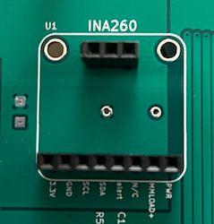 |
|:-:|
| Figure 3.10: INA260 headers installed |

| 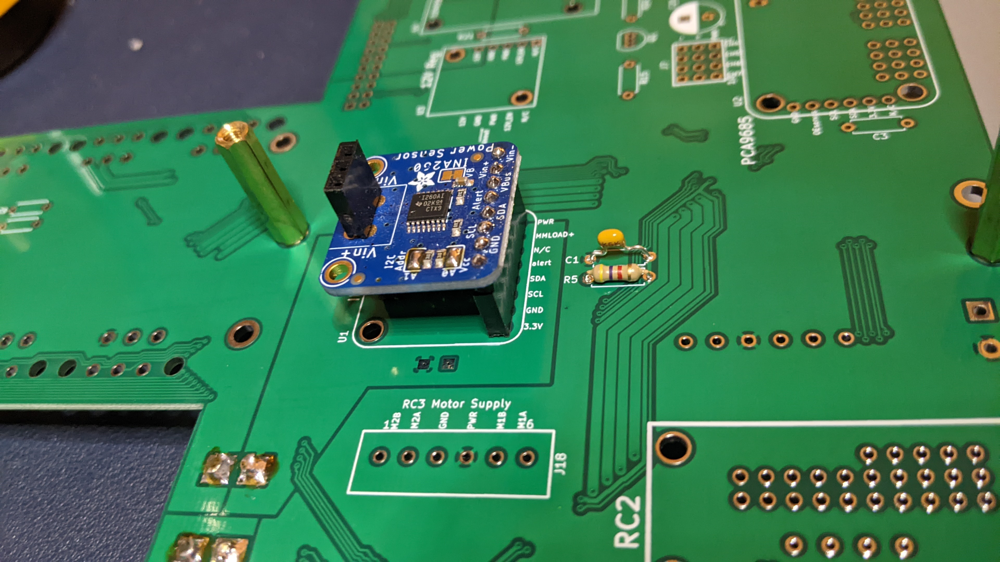 |
|:-:|
| Figure 3.11: INA260 installed |

**Option 2*: If you don't have one, you will need to bypass U1**

TODO: need to update this discussion of bypassing U1 once the layout has been updated

Install a 0 ohm resistor in footprint R30, on the top side of the board

### 3.6 Test INA260 installation

TODO

### 3.7 Install 5V bus regulator

This is the power regulator for the 5V line, which powers all the motors.

Install 3 female headers for the daughter board, into U4. You will need a two 4x1's, and a 5x1.

|  |
|:-:|
| Figure 3.12: 5V regulator headers installed |

| 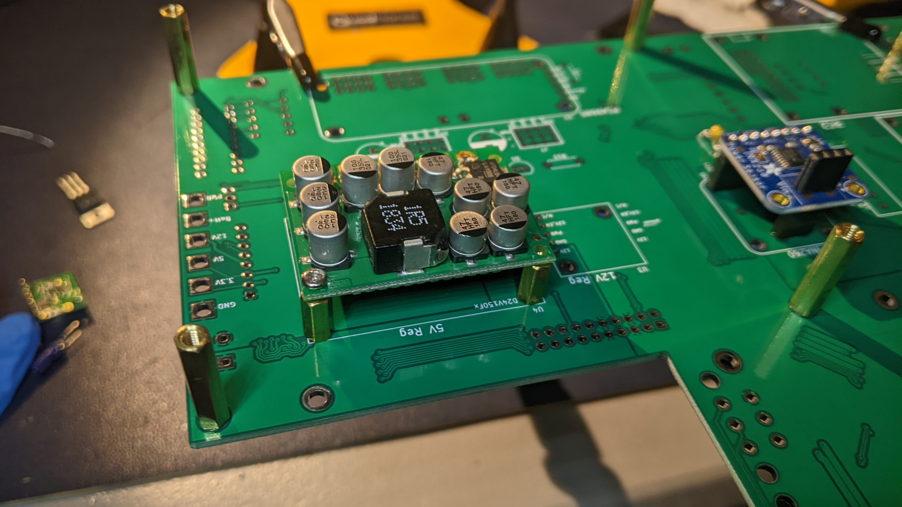 |
|:-:|
| Figure 3.13: 5V regulator installed |

### 3.8 Install 12V bus regulator U3

Solder a 5x1 female header to the U3 footprint, and attach an appropriately sized standoff

TODO: specify standoff

| 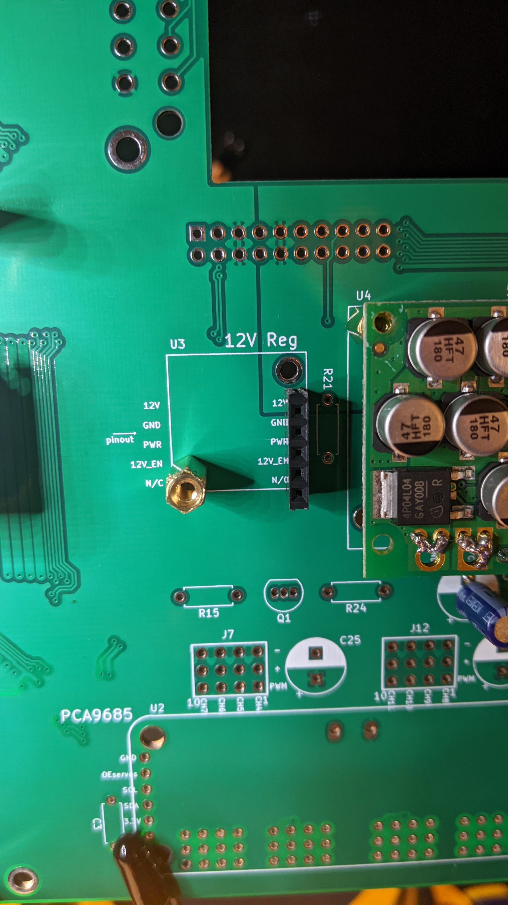 |
|:-:|
| Figure 3.14: U3 footprint |

| 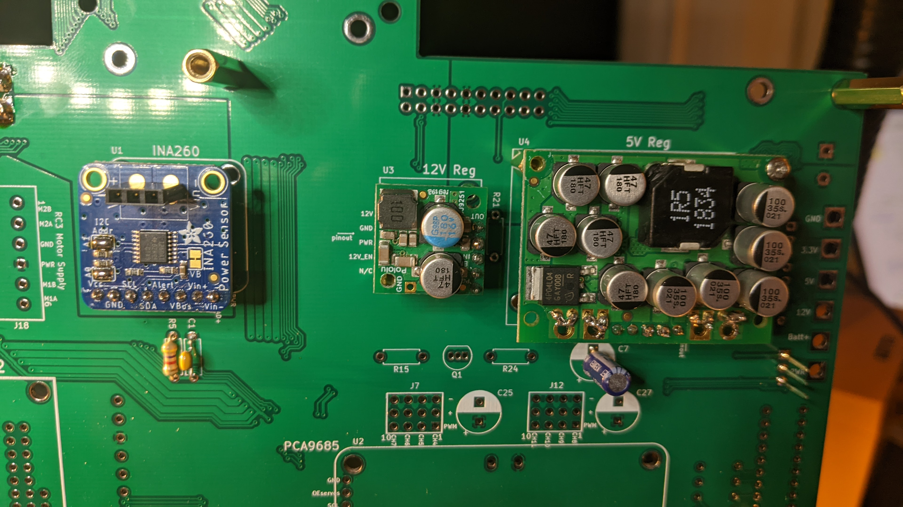 |
|:-:|
| Figure 3.15: 12v regulator installed |

|  |
|:-:|
| Figure 3.16: 12v regulator installed (2) |

### 3.9 Install 3.3V bus regulator U7 and decoupling capacitor C7

The 3.3V bus regulator is a linear voltage regulator and is physically much smaller - it comes in the same packaging as diode D1. Make sure to install the regulator in the correct direction as shown in figure 3.17.

Capacitor C7 is the decoupling capacitor for the 3.3v bus. Make sure to install C7 in the proper direction, as shown in figure 3.19. One side of the capacitor has negative polarity indicators on it, that should be installed opposite the "+" sign on the footprint.

| 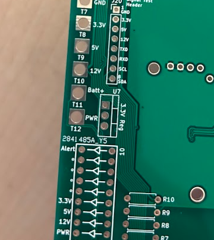 |
|:-:|
| Figure 3.17: U7 footprint |

| 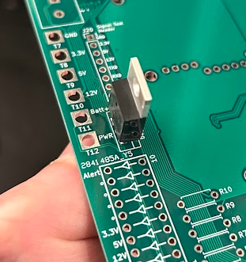 |
|:-:|
| Figure 3.18: 3.3v regulator installed in U7 |

|  |
|:-:|
| Figure 3.19: Capacitor C7 installed |

### 3.10 Install resistors R15, R24, and BJT transistor Q1

These form the circuit for the alert signal LED logic.

|  |
|:-:|
| Figure 3.20: R15, R24, and Q1 footprints |

| 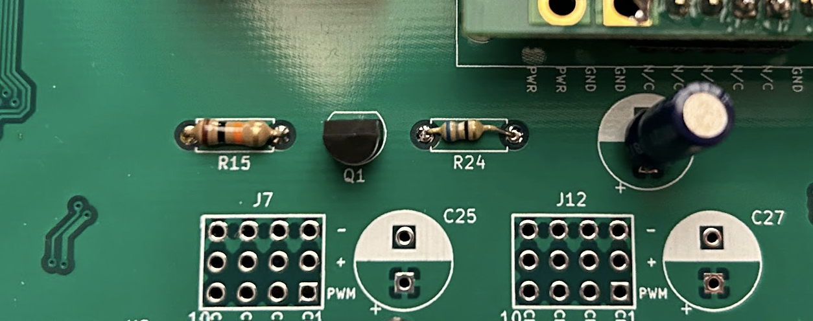 |
|:-:|
| Figure 3.21: R15, R24, and Q1 installed |

### 3.11 Test all voltage lines

Test all the power buses/voltage lines using the test points on the far left side of the top side of the board (T7 through T12).

The silk screen right of each hole indicates what voltage each test point should be at.

- First, connect the power supply to your board and provide 14.8v (see step 3.4)
- then, use the multimeter to test the voltage at each test point

| 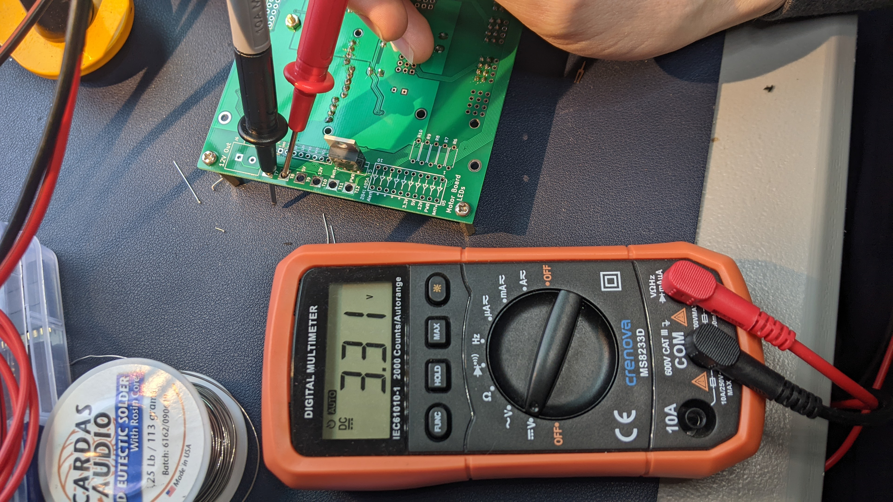 |
|:-:|
| Figure 3.22: testing the 3.3v bus|

| 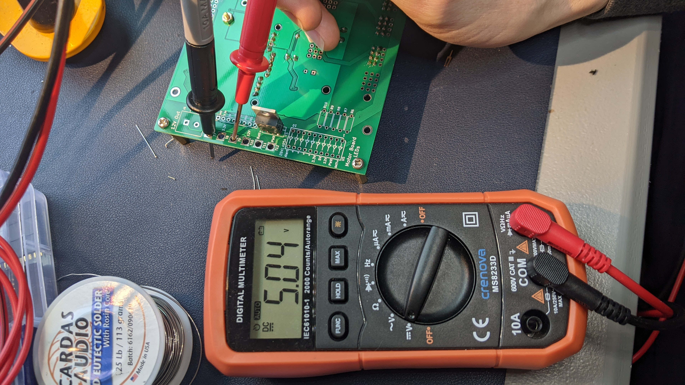 |
|:-:|
| Figure 3.23: testing the 5v bus |

| 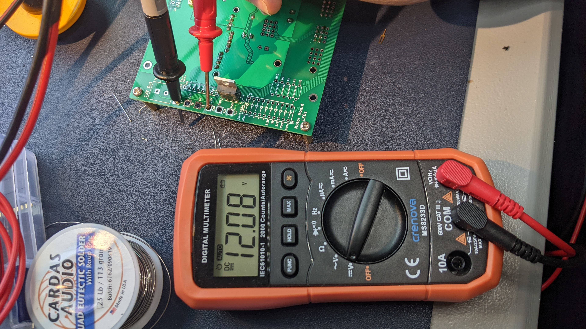 |
|:-:|
| Figure 3.24: testing the 12v bus |

| 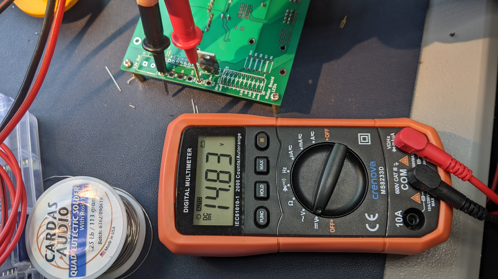 |
|:-:|
| Figure 3.25: testing the Batt+ bus (positive lead from the battery) |

| 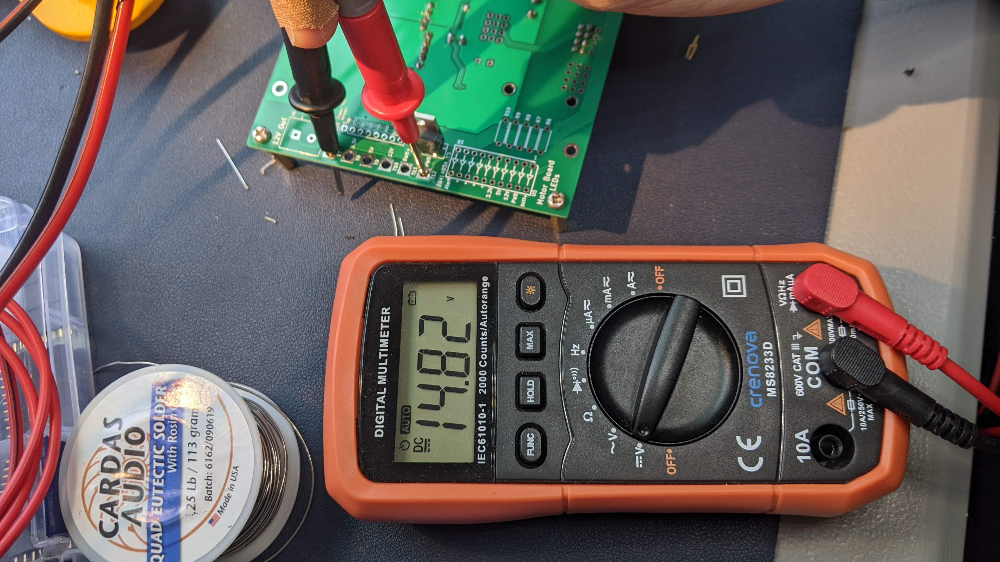 |
|:-:|
| Figure 3.26: testing the PWR bus (main board power plane, after battery protection circuitry ) |

### 3.12 Install PCA9685 daughter board in U2 footprint and capacitor C3

:exclamation: Before continuing, make sure to disconnect the power supply from the previous step! You should not have the board powered on while installing components. :exclamation:

The PCA9685 is a PWM signal source, which we use as our corner motor controller.

First you will need to install female headers on the motor board, for the PCA9685 daughter board to mate with. You'll need: 
- 6x1 female header
- 3x 2x4 female headers

You **may** use larger headers to fill all the holes in the U2 footprint, but it's not really necessary for the normal working configuration of the motor board. Attach these headers to the appropriate spots in the U2 footprint, as shown in figure 3.22.

You will need to attach male headers to the PCA9685 daughter board, as shown in figure 3.23. Also, 5v power is provided to the PCA9685 through the two holes at the top of the U2 header. To connect these, I soldered 2 small wire leads on the PCA9685 daughter board, and then soldered them on to the motor board once I installed the PCA9685.

TODO: update instructions with alternative to janky wire leads for PCA9685
TODO: figure 3.28 is not very good

| 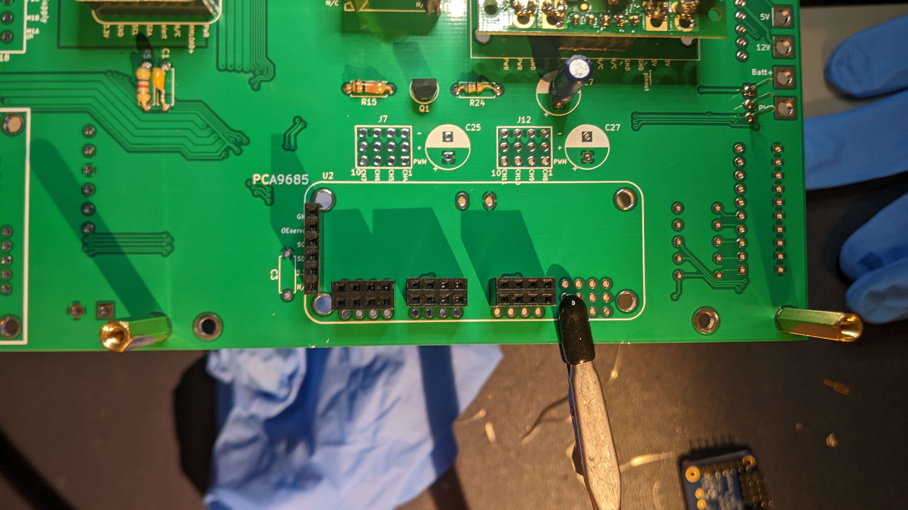 |
|:-:|
| Figure 3.27: U2 with female headers installed |

|  |
|:-:|
| Figure 3.28: Male headers soldered onto PCA9685 daughter board |

| 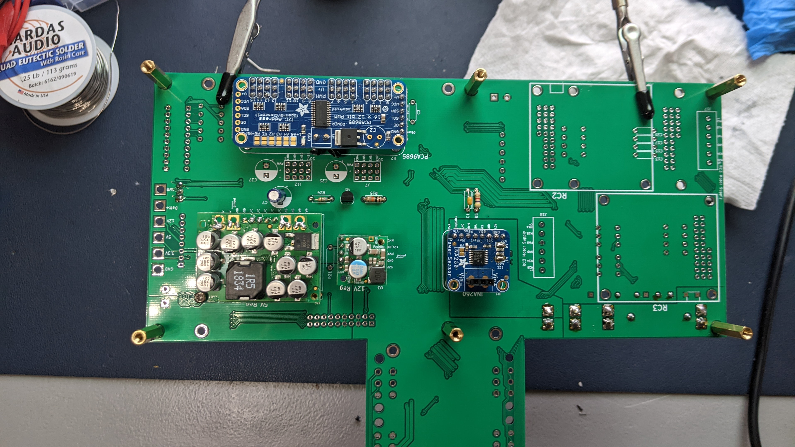 |
|:-:|
| Figure 3.29: PCA9685 installed in motor board |

| 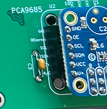 |
|:-:|
| Figure 3.29.1 : C3 installed |

### 3.13 Install resistor R5 and capacitor C1

These are aids for the INA260, and can be left out if the IN260 is not used

| 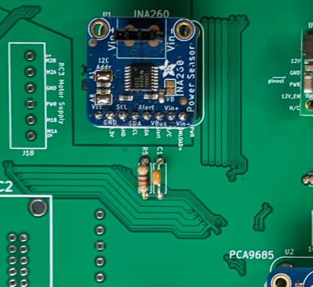 |
|:-:|
| Figure 3.30: PCA9685 installed in motor board |

### 3.13 Install J21, J20, and resistors R6,R7,R8,R9,R10

J21 is the interconnect header for the brain board, and J20 is a signal test header for the motor board

Use an 8x1 female header for J20.

| 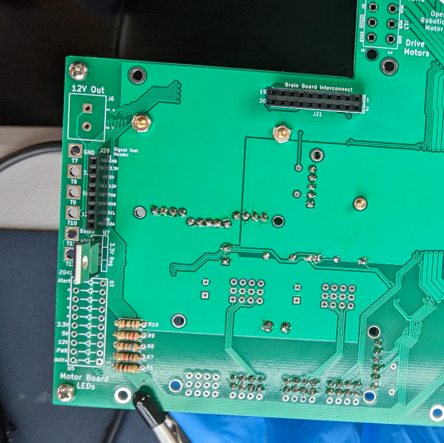 |
|:-:|
| Figure 3.31: Components installed, as viewed from top of board |

### 3.14 Install resistors R2,R3,R4

| 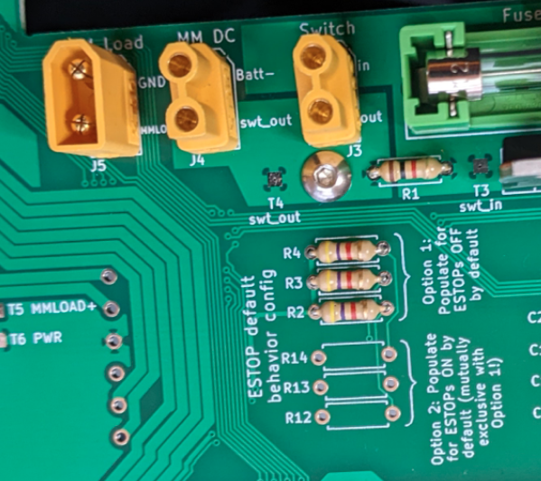 |
|:-:|
| Figure 3.32: Components installed, as viewed from top of board |

### 3.15 Install Roboclaw standoffs, headers, and capacitors

Now we'll add the parts for roboclaw footprints RC1, RC2, and RC3.

First, install standoffs for the 3 RC footprints, as shown an figure 3.33 and 3.34. 

Next, solder in the two female headers for each RC footprint. You'll need a 2x10 and a 5x1 for each RC. These should be soldered into the holes on the side of each RC footprint

Finally, install the following capacitors on the opposite board side from each RC footprint:
- opposite RC1: capacitors C13,C15,C17,C20 (figure 3.34)
- opposite RC2: capacitors C2,C4,C9,C10 (figure 3.33)
- opposite RC3: capacitors C14,C16,C18,C21 (figure 3.34)

| 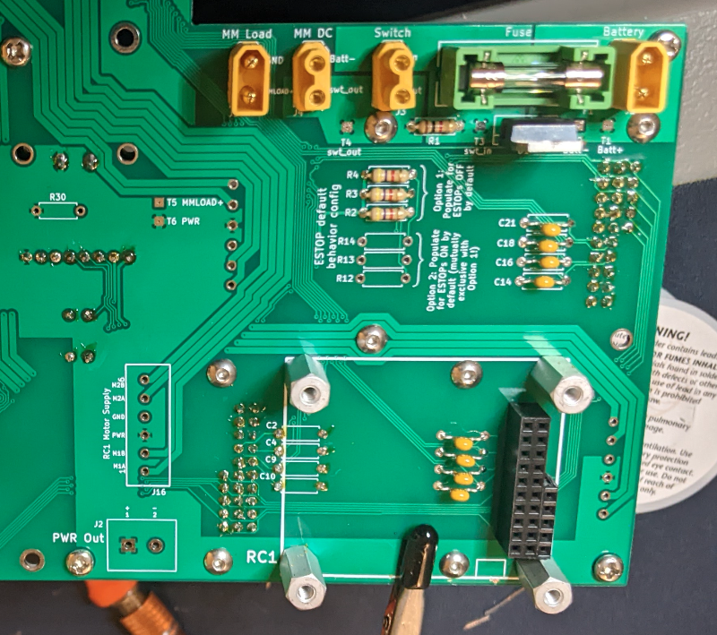 |
|:-:|
| Figure 3.33: C2,C4,C9,C10 installed|

| 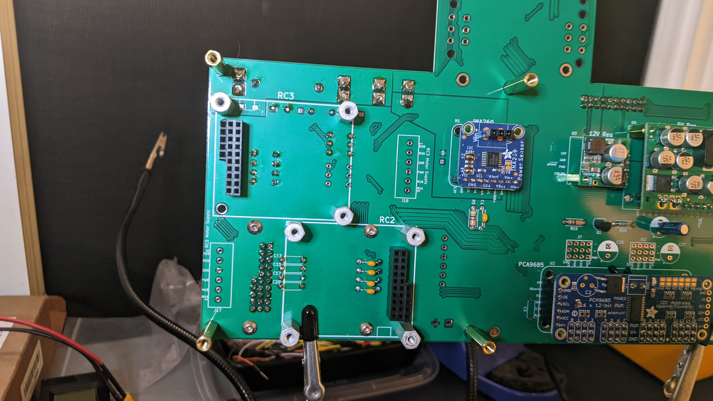 |
|:-:|
| Figure 3.34: C13,C15,C17,C20 and C14,C16,C18,C21 installed|

### 3.16 Install motor supply headers J16,J17,J18

Figure 3.35 shows how these should be installed. J16 on the top of the board is installed in the same way.

Make sure to orient the connector in the proper direction, as indicated in the images. 

|  |
|:-:|
| Figure 3.35: J17 and J18 installed, on bottom of board|

### 3.17 Install 3x Roboclaw boards in footprints RC1, RC2, RC3

First, wire the 6pos terminal block headers to the roboclaw boards, as indicated in figure 3.36.

TODO: update the below and make sure it's correct
FOR v2.0.3, you should wire the pins in the J16,J17,J18 headers directly to the pins on the corresponding side of the roboclaw - it is a direct 1-to-1 mapping all the way down, with no wires crossed.

Do this for all three roboclaws. 

| 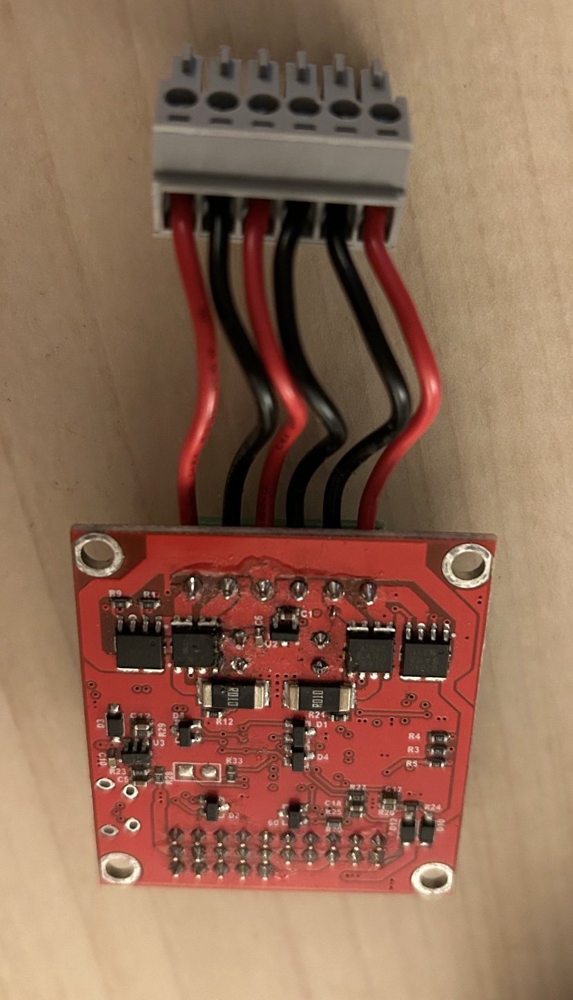 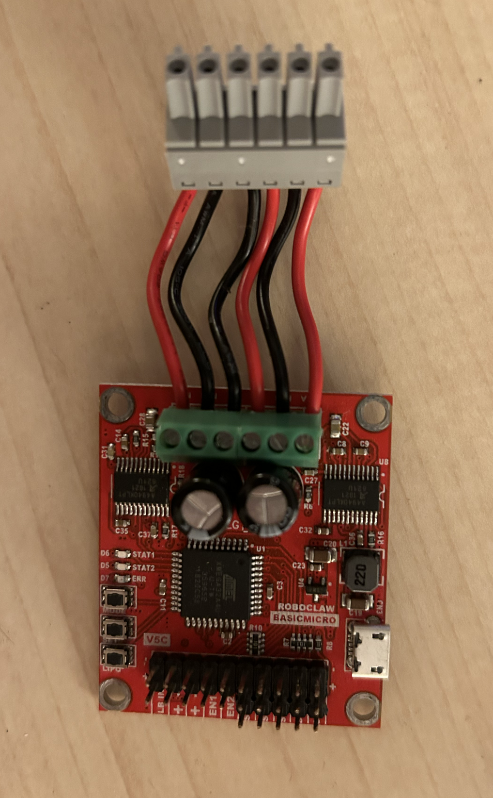  |
|:-:|
| Figure 3.36: Wiring up the roboclaws |

Then install the 3 roboclaws in the RC1, RC2, and RC3 footprints. It doesn't matter which roboclaw goes in which footprint - we will later set unique addresses in software for each of them to communicate over the serial bus.

| 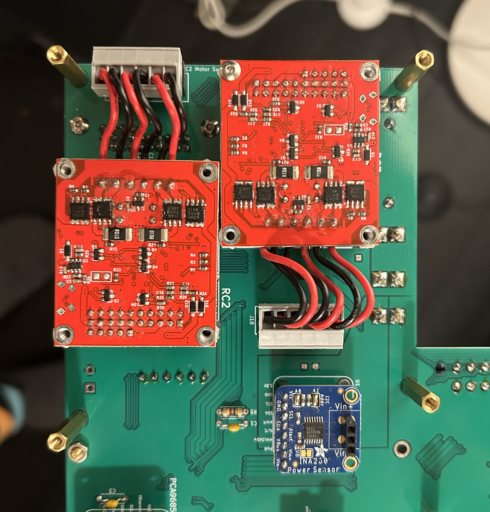 |
|:-:|
| Figure 3.37: Installing the roboclaw boards |

### 3.18 Install capacitors C5,C6

|  |
|:-:|
| Figure 3.38: Installing capacitors C5, C6|

### 3.19 Install corner servo header J19, and capacitor C19

Make sure to install C19 in the proper direction, as shown in figure 3.39. One side of the capacitor has negative polarity indicators on it, that should be installed opposite the "+" sign on the footprint.

| 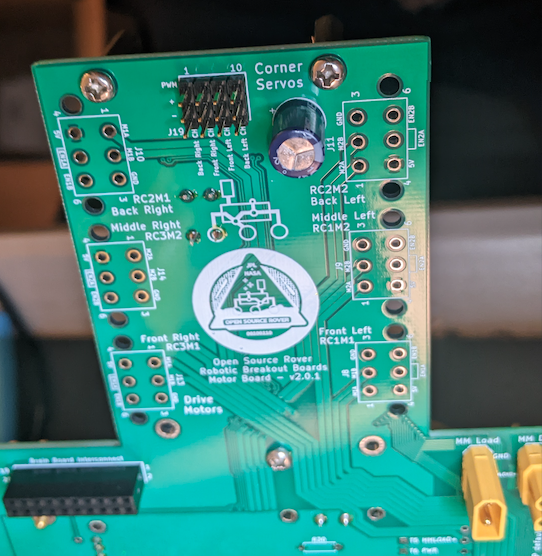 |
|:-:|
| Figure 3.39: J19 and C19 installed (top of photo) |

### 3.20 Install LED array U5

Make sure to align the slightly "chipped"/beveled corner of the LED array with the beveled corner of the U5 footprint, to have proper LED polarity

| 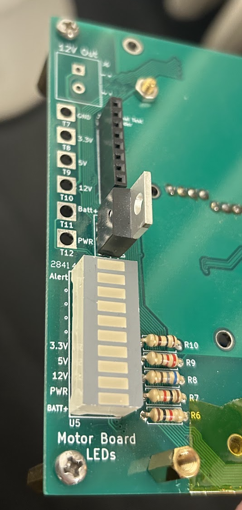 |
|:-:|
| Figure 3.40: LED array U5 installed |

### 3.20 Install drive motor headers J8,J9,J10,J11,J13,J14

|  |
|:-:|
| Figure 3.41: Drive motor headers installed |

## 4. Brain Board Assembly

| 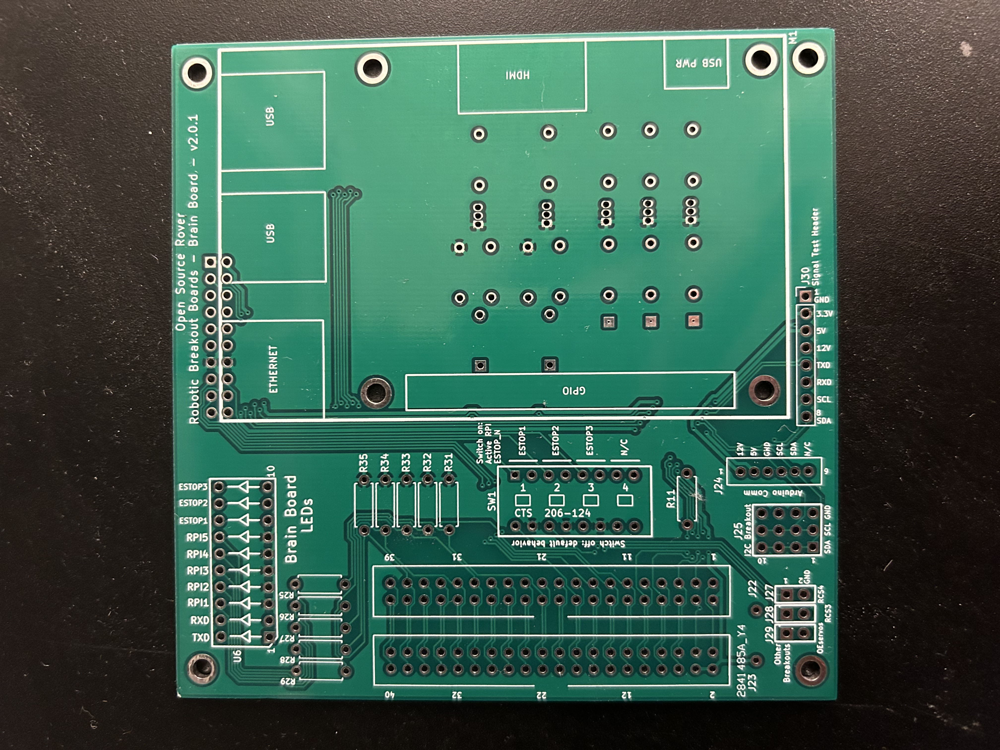  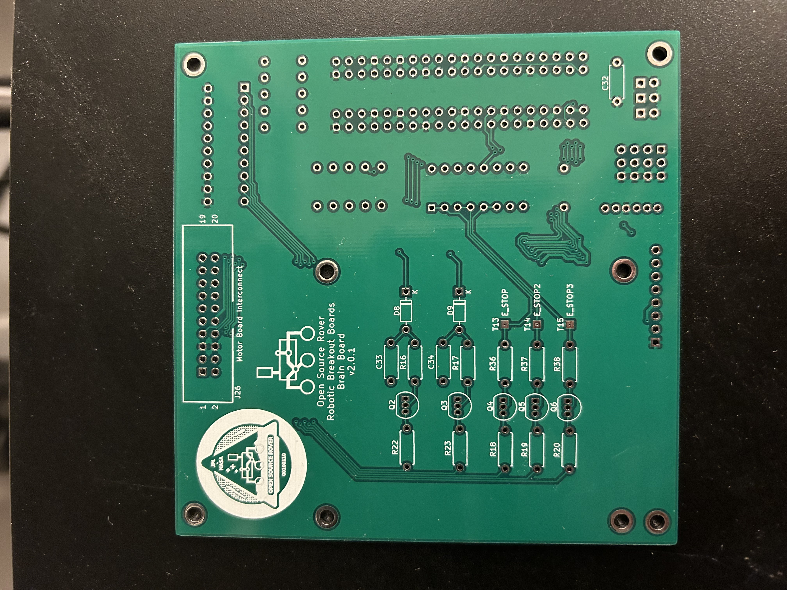 |
|:-:|
| Figure 4.0: front (left) and back (right) of brain board |

### 4.1 Install resistors

Install 3 sets of resistors:
- R11
- R25,R26,R27,R28,R29 
- R31,R32,R33,R34,R35

| 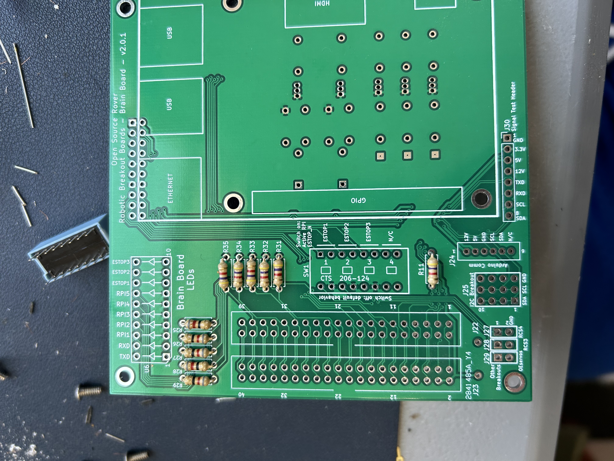 |
|:-:|
| Figure 4.1: Resistors installed |

### 4.2 Install switch SW1

Make sure to install the switch in the correct direction to match the footprint.

| 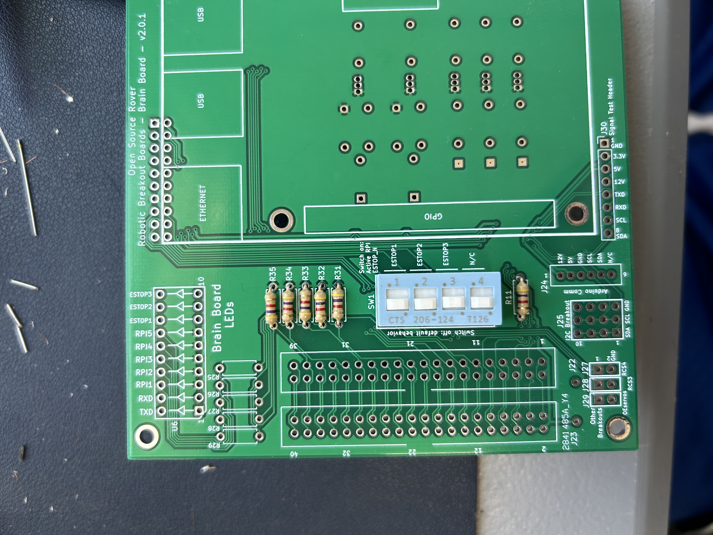 |
|:-:|
| Figure 4.2: Switch SW1 installed |

 ### 4.3 Install LED array U6 and various headers on top of board

Install these components:
- U6 LED array
- J22,J23 raspberry pi ribbon cable headers
- J27,J28,J29 2x1 female headers - "other breakouts"
- J25 3x4 male headers - "i2c breakout"
- J24 3x4 male header (white color) - "arduino comm"
- J30 8x1 male header - "signal test header"

Make sure to align the slightly "chipped"/beveled corner of the LED array with the beveled corner of the U6 footprint, to have proper LED polarity

Make sure to match the gaps on the sides of the J22 and J23 headers with the gaps indicated in the silk screen for these footprints.

Make sure to install J24 with the gap facing to the right of the top side of the board (as shown in figure 4.3)

| 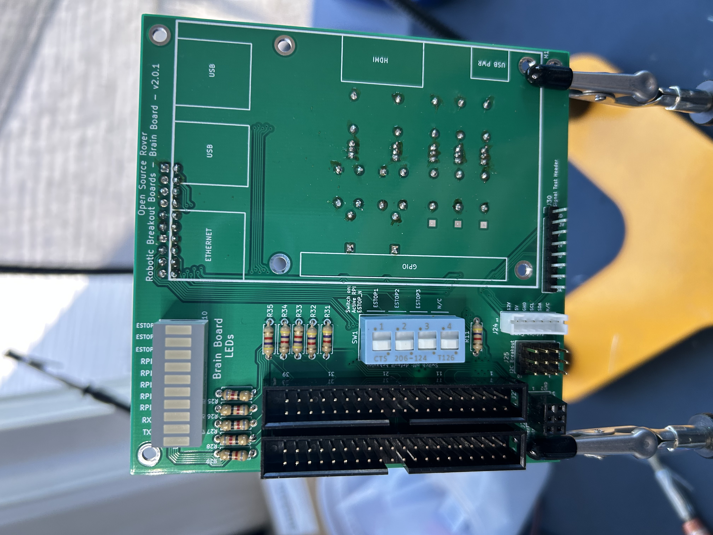 |
|:-:|
| Figure 4.3: U6 and other headers installed  |

### 4.4 Install J26 header and capacitor C32 on back of board

Make sure to match the gaps on the side of the J26 header with the gap indicated in the silk screen for the footprint 

Ignore the resistors and figure 4.4 for the moment

| 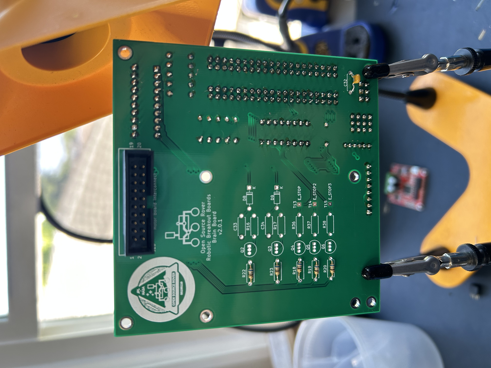 |
|:-:|
| Figure 4.4: J26 (top) and C32 installed on back side of board |

### 4.5 Install ESTOP and Serial TXD/RXD LED logic circuit components

Here we install all the components used for: 
1. the E_STOP,E_STOP2,E_STOP3 logic signals and (BJT transistors Q4,Q5,Q6)
2. the LED indicators for E_STOP,E_STOP2,E_STOP3 states (BJTs Q4,Q5,Q6 again)
3. The LED indicators for serial TXD/RXD activity (BJTs Q2,Q3)

Install all of these as indicated in figure 4.5. Note that polarity/installation direction matters for both the BJTs and the diodes (D8,D9). Make sure to match these with the image correctly! (note the black band on one side of the diodes faces to the right in figure 4.5)

| 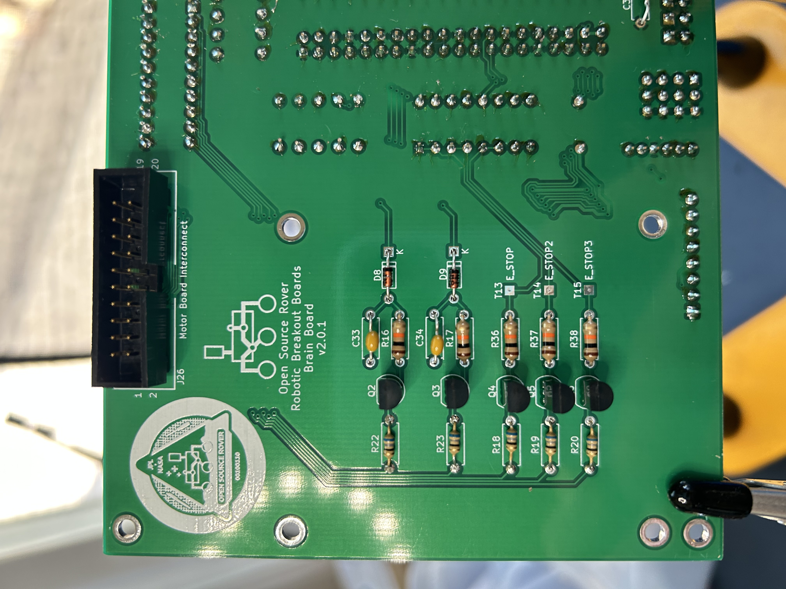 |
|:-:|
| Figure 4.5: ESTOP and Serial TXD/RXD LED logic components installed  |

### 4.6 Mount the Raspberry Pi board

Using appropriate standoffs, attach the raspberry pi to the top of the brain board, as shown in figure 4.6

TODO: identify the parts for the standoffs

| 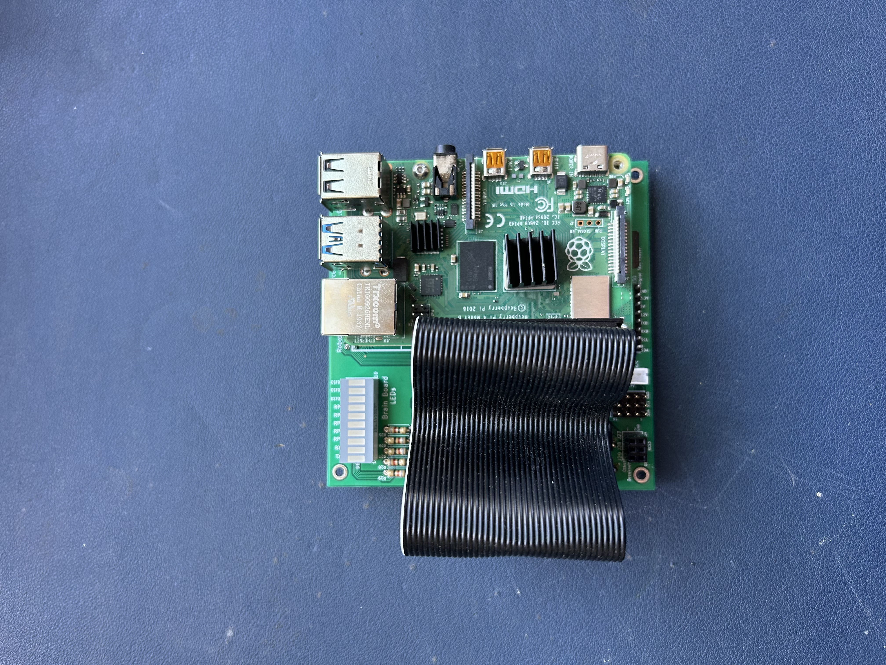 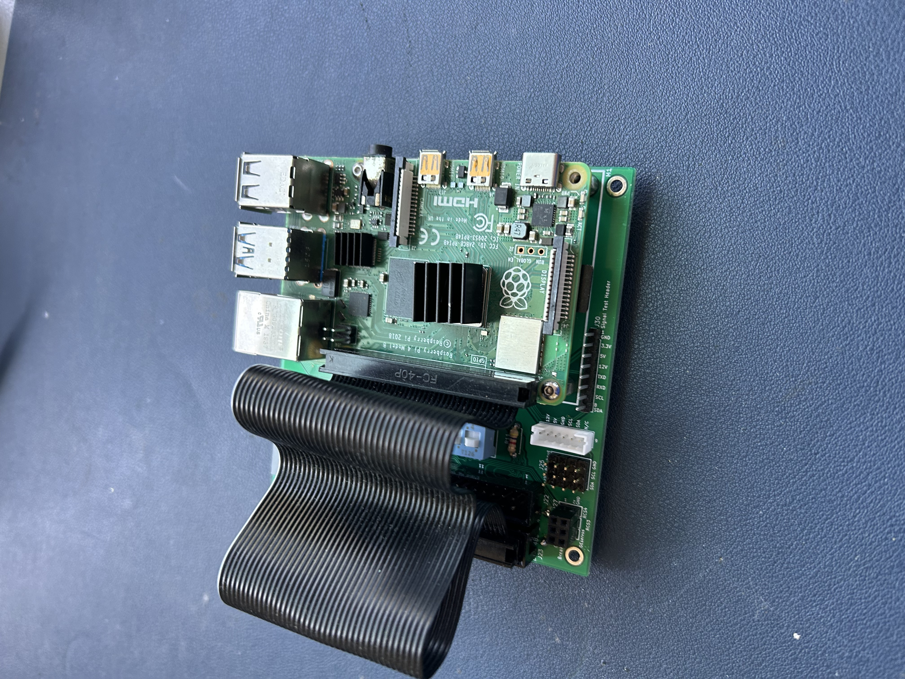 |
|:-:|
| Figure 4.6: RPi mounted on the brain board  |

## 5. Motor Board and Brain Board Mating

Using appropriate standoffs, attach the brain board to the top of the motor board, as shown in figure 5.0

TODO: identify the parts for the standoffs

| 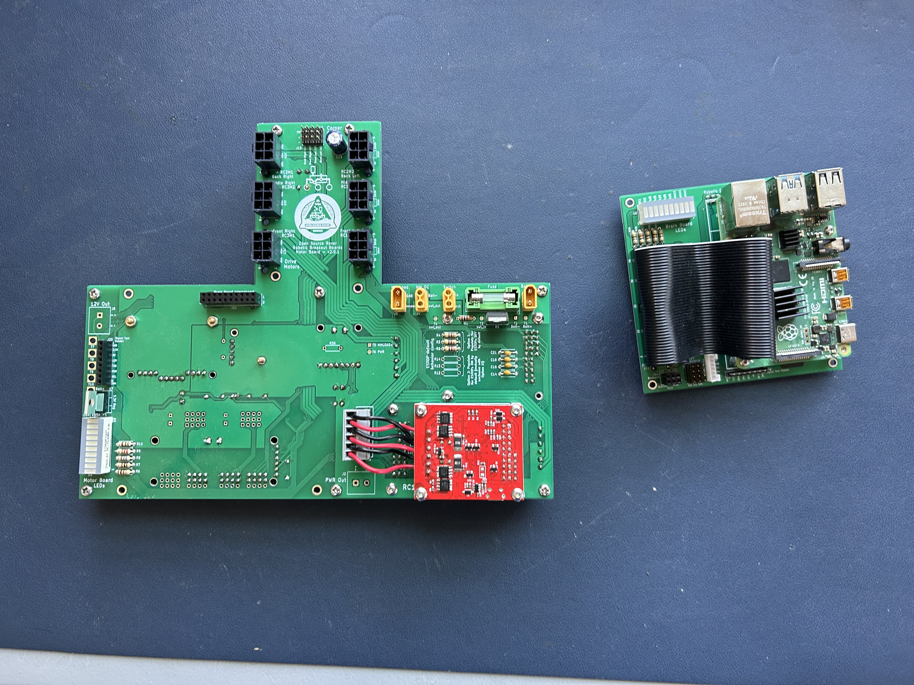  |
|:-:|
| Figure 4.7: Mating the brain board to the motor board  |

And now you're done with the assembly! Enjoy your completed Control Board!

|   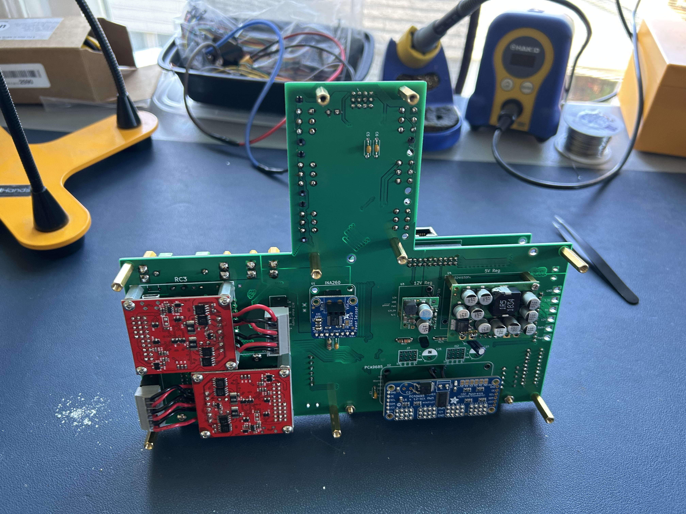 |
|:-:|
| Figure 4.8: Completed control board  |
