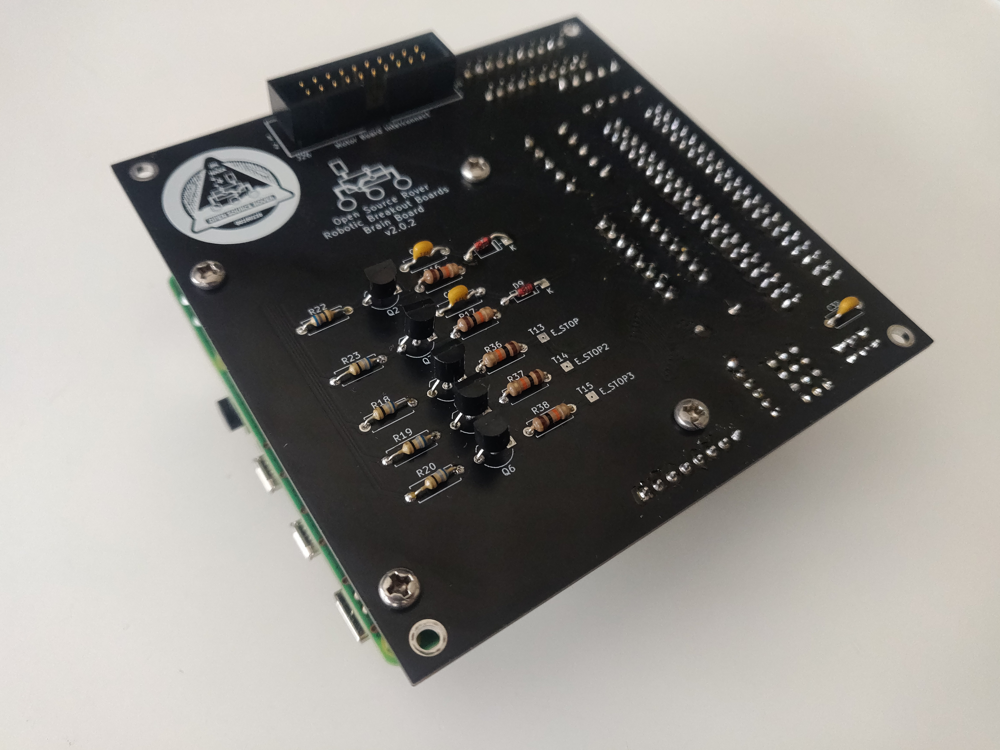

# PCB Assembly

This document goes through the process of assembling and testing the custom Printed Circuit Boards for the project.

**work in progress below**

### 6.2 RoboClaw Testing and Verification

In this section you will be going one by one and and testing the operation of
the RoboClaw Motor controllers. You will be doing this by using the GUI provided
by the manufacturer of the motor controllers. The GUI can be found at
[this link](https://www.basicmicro.com/downloads), under general downloads, then
BasicMicro Motion Studio.

You'll also need the `USB RoboClaw Windows Driver` from the RoboClaw General
Downloads section of the page. This should be installed before you run the
Motion Studio.

To use the GUI, insert a USB to Micro USB cable from your computer to the motor
controller you are going to be testing.

#### Connect Wires

First, connect the wires in the following manner:

**todo, outdated**

| Signal    | Terminal Block Label | Motor Connector Wire Color |
| --------- | -------------------- | -------------------------- |
| Motor (+) | M+                   | Red                        |
| Motor (-) | M-                   | Black                      |
| Ground    | GND                  | Green                      |
| +5V       | +5V                  | Blue                       |
| Encoder A | ENA                  | Yellow                     |
| Encoder   | B                    | ENB White                  |

#### Power on

Power on the board. After a minute or so, in the Basic Motion GUI you should see an available device appear. It might require an update to proceed. Install the latest firmware update and then connect to the device.

#### Prepare PWM signal

Click on the PWM tab. We will now send a PWM signal to the motor and test that connections are all made correctly to the motor and encoder.

#### Vary PWM signal

Slowly move the slide bar for the corresponding motor output channel (Either
M1 or M2 from the above table) for the terminal you are testing. Verify that
the motor spins (we will worry about direction later), and that the encoder
value is also changing (we'll worry about it increasing or decreasing
correctly later as well). Switch direction of the slide bar and verify that
it spins the other direction and the encoder value does the opposite of
previous as well. If these are not happening or are backwards, go back and
check that you are using the correct motor controller, terminal block, etc.
If all your connections are correct, you may have to test your solder
contact between the components on the board itself.

#### 6.4.1 Connect wires

Connect the wires to the motor in the following manner

| Signal    | Terminal Block Label | Motor Connector Wire Color |
| --------- | -------------------- | -------------------------- |
| Motor (+) | M+                   | Red                        |
| Motor (-) | M-                   | Black                      |

#### Test PWM signal

Under the PWM tab, move the slide bar and verify that the motor spins accordingly. If you slide the bar up (positive), the motor should spin counter-clockwise with the motor shaft pointing towards you.

**TODO** insert image or diagram

## Raspberry Pi Install

Next up is to verify that power to the Raspberry Pi is working. For this, you'll need a working operating system installed on the SD card. Follow the [software setup instructions](https://github.com/nasa-jpl/osr-rover-code#setup) to install the rover software on the Raspberry Pi.
