# PCB Assembly

This document goes through the process of assembling and testing the custom
Printed Circuit Boards for the project. One thing you might notice is the boards
have reference designators on them that do not match the reference designators
used in the parts lists. The board components mapping between these can be found
below:

## 1. Control Board References

| **Component**                     | **Parts list Ref** | **Schematic Ref** |
| --------------------------------- | ------------------ | ----------------- |
| Terminal block 6 pos top entry    | E4                 | J1-5              |
| Terminal block 6 pos side entry   | E3                 | J17-26            |
| Term block 2p side entry (5.08mm) | E12                | J13,15,16         |
| Connector Header pin 40P 40x1     | E15                | J8,9,11           |
| Connector Header pin 6P 6x1       | E14                | J10               |
| Connector Header socket 5P 5x1    | E6                 | RC1-5             |
| Connector Header socket 40P 2x20  | E13                | J6,7              |
| Connector Header socket 20 2x10   | E5                 | RC1-5             |
| Capacitor 100nF                   | E11                | C1-17             |
| Resistor 4.7K 1/4 Watt            | E7                 | R1                |
| Resistor 10K 1/4 Watt             | E8                 | R4,6,8,10         |
| Resistor 22K 1/4 Watt             | E9                 | R3,5,7,9          |
| Resistor 10K 1/2 Watt             | E10                | R2                |
| LM358 Op Amp                      | E25                | U1,2              |
| DIP IC socket 8 Pos               | E33                | U1,2              |
| Power Diode                       | E17                | D1                |
| 10A Fuse                          | E16                | F1                |
| USB A Connector                   | E34                | J12,14            |

## 2. Arduino Board References

| **Component**                 | **Parts list Ref** | **Schematic Ref** |
| ----------------------------- | ------------------ | ----------------- |
| Term block 2P side entry      | E16                | J6                |
| Connector Header pin 40P 40x1 | E15                | J2,3,4            |
| Connector Header 16P 2x8      | E30                | J1                |
| Connector Header 6P 6x1       | E14                | J5                |

## 3. Control Board Assembly

### 3.1 Motor & RoboClaw Connectors

| **Item**              | **Ref** | **Qty** | **Image**                                                           | **Item**              | **Ref** | **Qty** | **Image**                                                           |
| --------------------- | ------- | ------- | --------------------------------------------------------------------| --------------------- | ------- | ------- | --------------------------------------------------------------------|
| OSR Control Board     | E1      | 1       | 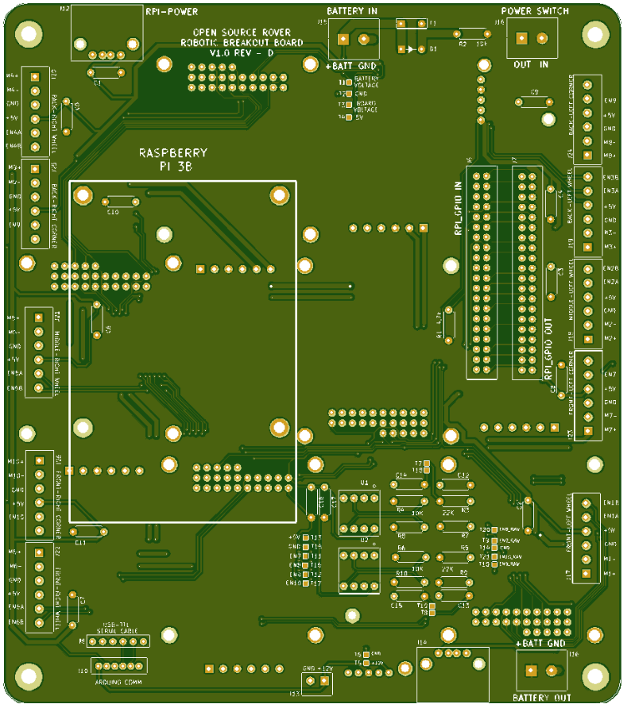 |  10 Pos Header Socket  | E5      | 5       |      |
| 6 Pos Side Term Block | E3      | 10      |  |  5 Pos Header Socket   | E6      | 5       |      |
| 6 Pos Top Term Block  | E4      | 5       | 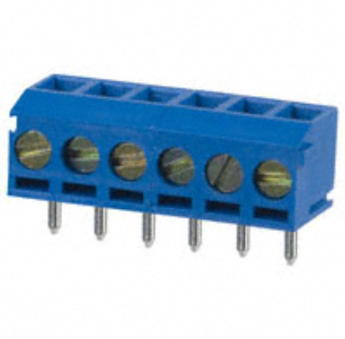 |  Soldering Iron        | N/A     |         |                                                                    |

#### 3.1.1 Solder terminal blocks on top of board

Begin by soldering the 6 Position Side entry terminal blocks **E3** into the
   **top** side of the PCB, on the edge of the board as shown in the images
   below. These terminal blocks will run motor power, encoder power, and encoder
   signals between the motors/encoders and the RoboClaw motor controllers. The 6
   terminal blocks will each be labeled with schematic reference designators
   J17-J26 on the PCB. Be sure that the wire terminals face **OUTWARD** (away
   from the center of the board) on all of these connectors.

|  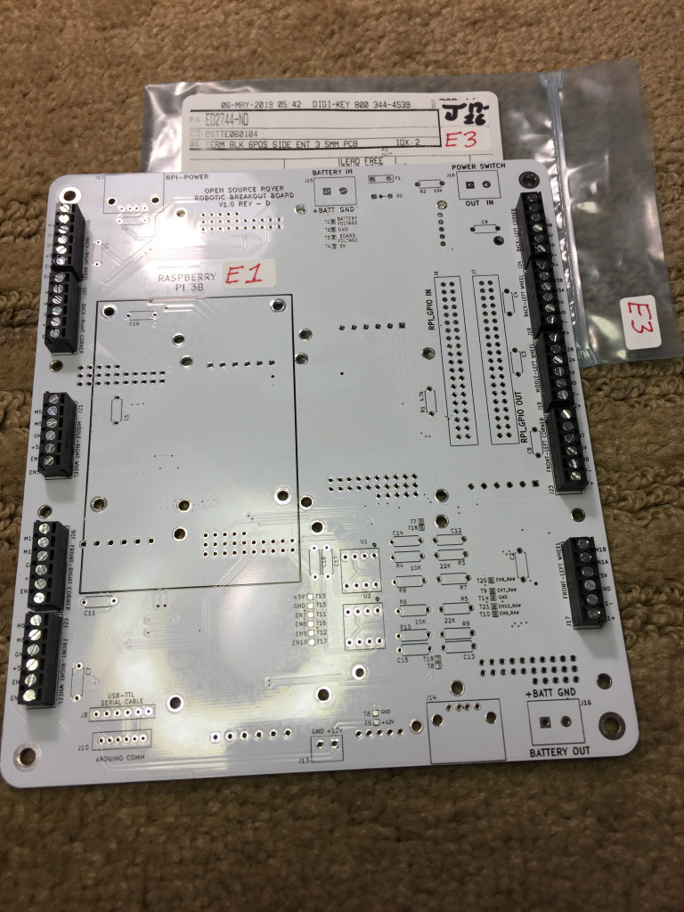 |
|:-:|
| Figure 1: Assembly Step 1 |

#### 3.1.2 Solder terminal blocks on bottom of board

On the **bottom** of the board, solder the 6 Position top entry terminal
   blocks **E4**. They will be labeled with schematic reference designators
   J1-5. The orientation of the wire terminal face should be AWAY from the each
   of RoboClaw outlines (see images below). These terminals will run battery
   power and +/- motor signals to the RoboClaw motor controllers from the PCB.

|  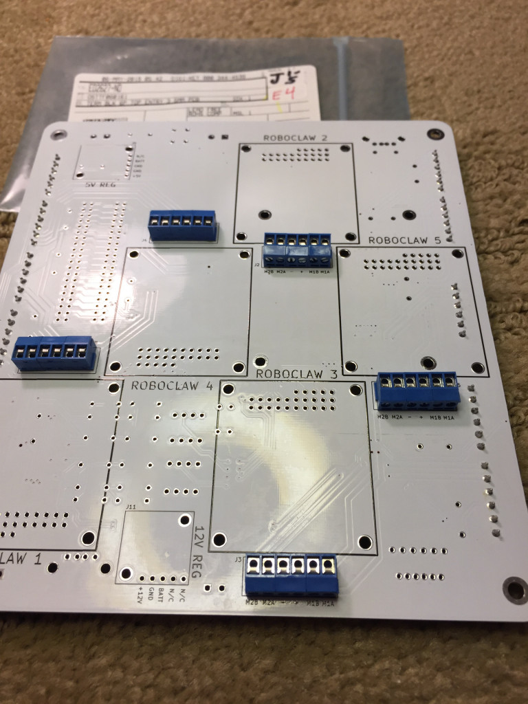 |
|:-:|
| Figure 1: Assembly Step 2 |

#### 3.1.3 Solder socket header connectors on bottom of board

On the **bottom** of the board, solder the 20-position female socket header
   connector **E5** and the 5-position female socket header connector **E6**.
   They will be labeled with reference designators RoboClaw 1-5. These are the
   digital signal pins for the RoboClaw motor controllers.

|  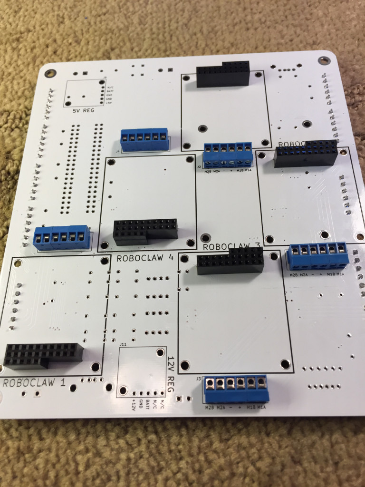 |
|:-:|
| Figure 1: Assembly Step 3 |

### 3.2 Resistors and Capacitors

| **Item**               | **Ref** | **Qty** | **Image**                                                       | **Item**               | **Ref** | **Qty** | **Image**                                                       |
| ---------------------- | ------- | ------- | --------------------------------------------------------------- | ---------------------- | ------- | ------- | --------------------------------------------------------------- |
| OSR Control Board      | E1      | 1       |   | 22K 1/4 Watt Resistor  | E9      | 4       |   |
| 4.7K 1/4 Watt Resistor | E7      | 1       |   | 10K 1/2 Watt Resistor  | E10     | 1       |  |
| 10K 1/4 Watt Resistor  | E8      | 4       |   | 100nF Capacitor        | E11     | 17      |  |

#### 3.2.1 Solder resistors and capacitors

On the **top** of the board, solder the resistors and capacitors by
    comparing the reference designator on the board to the part number listed in
    the table below. Some of these capacitors are used to store energy for
    powering components (to help protect against voltage fluctuations). Others
    are used as noise filtering mechanisms on analog signals (particularly to
    smooth the encoder signals). The resistors are needed to control the voltage
    across various components.

| **Item**               | **Parts List Ref** | **Schematic/Board Ref** |
| ---------------------- | ------------------ | ----------------------- |
| 4.7K 1/4 Watt Resistor | E7                 | R1                      |
| 10K 1/4 Watt Resistor  | E8                 | R4,R6,R8,R10            |
| 22K 1/4 Watt Resistor  | E9                 | R3, R5, R7, R9          |
| 10K 1/2 Watt Resistor  | E10                | R2                      |
| 100nF Capacitor        | E11                | C1-17                   |

| |
|:-:|
| Figure 4: Resistor and Capacitor soldering |

### 3.3 Voltage Regulator connectors

| **Item**            | **Ref** | **Qty** | **Image**                                                      |
| ------------------- | ------- | ------- | -------------------------------------------------------------- |
| OSR Control Board   | E1      | 1       |  |
| 5 Pos Header Socket | E6      | 2       |  |

#### 3.3.1 Solder 5-position header sockets

On the **bottom** of the board, solder the 5-position female header sockets
    **E6**. The sockets will have schematic reference designators of J9 and J11.
    These connectors are what the 12V and 5V voltage regulators will slot into.

|  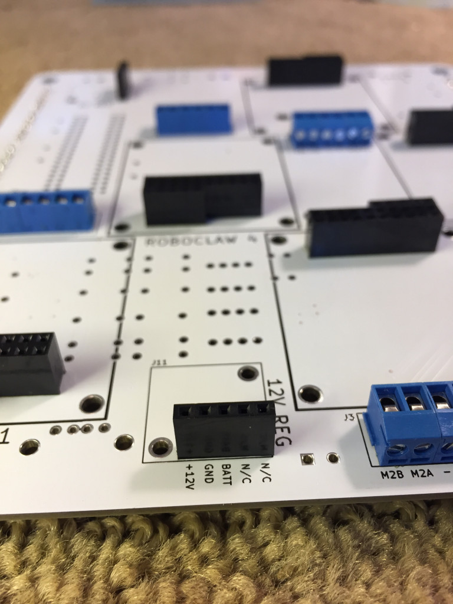 |
|:-:|
| Figure 5: Assembly Step 5 |

### 3.4 Power Connectors

| **Item**                        | **Ref** | **Qty** | **Image**                                                        |
| ------------------------------- | ------- | ------- | ---------------------------------------------------------------- |
| OSR Control Board               | E1      | 1       |    |
| 2 Pos Side Terminal Block       | E12     | 3       |  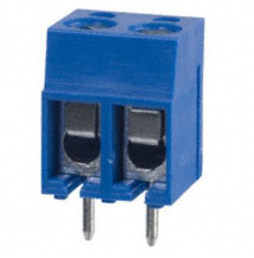 |
| 2 Position 2.5mm Terminal Block | E18     | 1       |   |

#### 3.4.1 Solder 2-position terminal blocks on top of board

On the **top** of the board, solder the 2-position side entry terminal
    blocks **E13**. These will have schematic reference designators J14-16.
    Ensure that the wire terminals on these components face **OUTWARDS**. Also
    on the **top** of the board, solder the remaining 2-position 2.5mm terminal
    block **E18** (schematic reference designator J12).

|  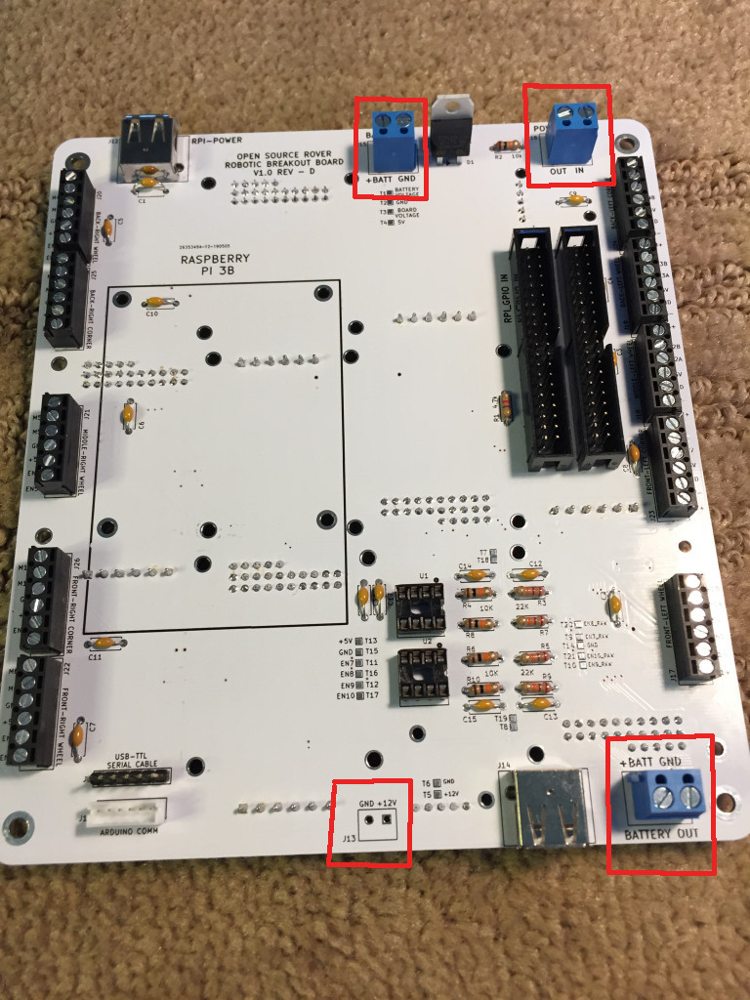 |
|:-:|
| Figure 6: Assembly Step 6 |

### 3.5 Op Amp DIP socket

| **Item**          | **Ref** | **Qty** | **Image**                                                       |
| ----------------- | ------- | ------- | --------------------------------------------------------------- |
| OSR Control Board | E1      | 1       |   |
| 8 Pin DIP Socket  | E33     | 2       | 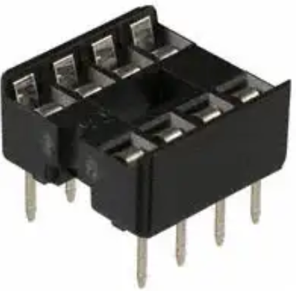 |

#### 3.5.1 Solder 8-pin DIP sockets

On the **top** of the board, solder the 8 Pin DIP sockets **E33**. They will
    have schematic reference designators U1-2. Orientation of these sockets does
    not matter, but note that you WILL (later, in another document) need to plug
    in the Op-Amp chips themselves, and orientation of those chips is important
    when you eventually complete that step. Placing the notch toward the right
    as pictured (toward the resistors and capacitors) will align the socket's
    notch with the chip's.

| 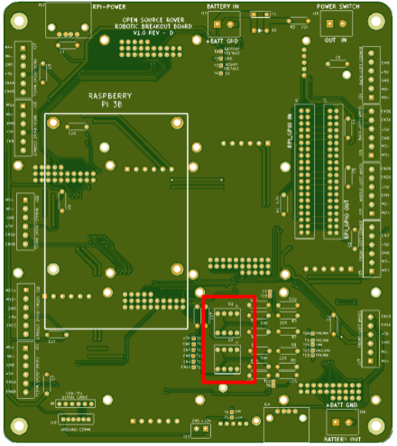  |
|:-:|
| Figure 7: Assembly Step 7 |

### 3.6 RPi GPIO Connector and misc headers

| **Item**                 | **Ref** | **Qty** | **Image**                                                       | **Item**                 | **Ref** | **Qty** | **Image**                                                       |
| ------------------------ | ------- | ------- | --------------------------------------------------------------- | ------------------------ | ------- | ------- | --------------------------------------------------------------- |
| OSR Control Board        | E1      | 1       |   | 6 Position JST Connector | E14     | 1       |  |
| 40 Pin Header Connector  | E13     | 2       |  | 40 Position Header Pins  | E15     | 1       |  |

#### 3.6.1 Solder 40-position headers

On the **top** of the board, solder the 40-position header connectors
    **E13**. The clocking notch on the headers should face **OUTWARD** as shown
    below. The schematic reference designators are J6 and J7.

| 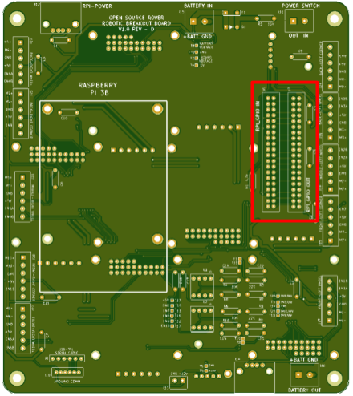  |
|:-:|
| Figure 8: Assembly Step 8 |

#### 3.6.2 Solder 40-position headers (2)

Take the 40 pin header pins **E15** and break off a 6-pin segment. On the
    **top** of the board, solder the 6-pin segment into schematic reference
    designator J8. Then, solder the JST connector **E14** into the J10 schematic
    reference designator. The opening in the pins on the JST connector should
    face **INWARD** as shown below.

|  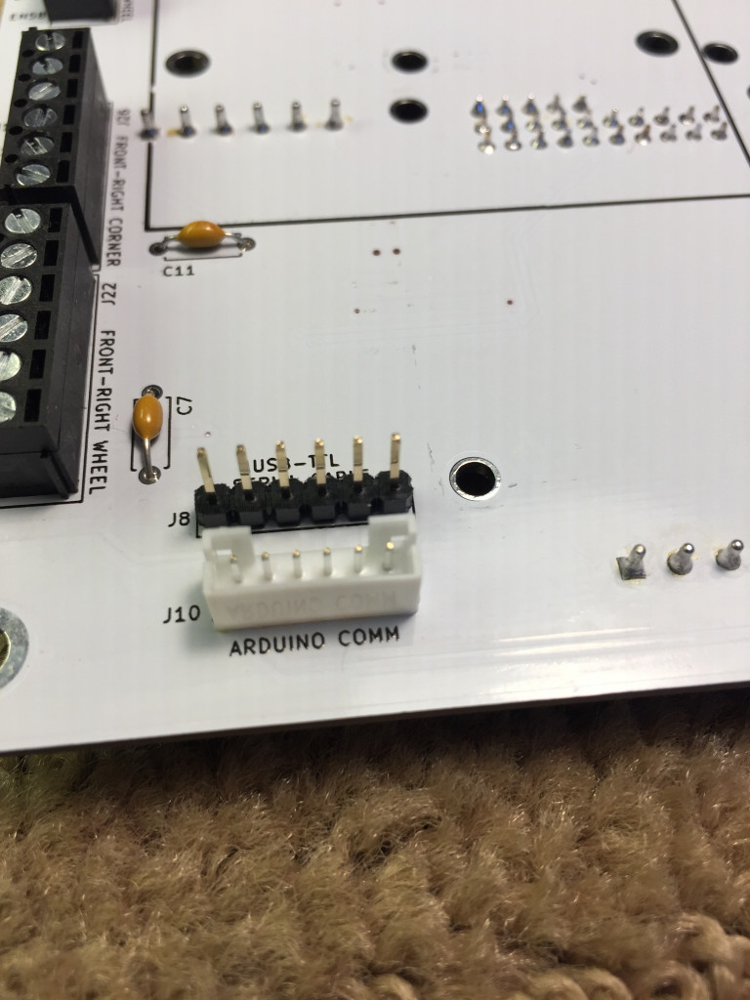 |
|:-:|
| Figure 9: Assembly Step 9 |

### 3.7 Fuse and Diode

| **Item**          | **Ref** | **Qty** | **Image**                                                       |
| ----------------- | ------- | ------- | --------------------------------------------------------------- |
| OSR Control Board | E1      | 1       |   |
| 10 Amp Fuse       | E16     | 1       |  |
| Diode             | E17     | 1       | 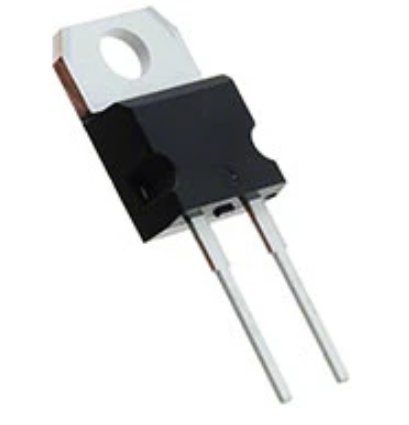 |

#### 3.7.1 Solder fuse and diode

Solder the fuse **E16** and diode **E17** onto the top of the board into
    schematic reference designators F1 (fuse) and D1 (diode). **Pay careful
    attention to the direction that the Diode is mounted on the board**, as it
    will only work in one direction!

|   |
|:-:|
| Figure 10: Fuse and Diode Soldering |

### 3.8 USB connectors

| **Item**          | **Ref** | **Qty** | **Image**                                                       |
| ----------------- | ------- | ------- | --------------------------------------------------------------- |
| OSR Control Board | E1      | 1       |   |
| USB Connector     | E34     | 1       |  |

#### 3.8.1 Solder USB connectors

On the **top** of the board, solder the two USB Connectors **E34**. They
    will have reference designators J12 and J14.

|  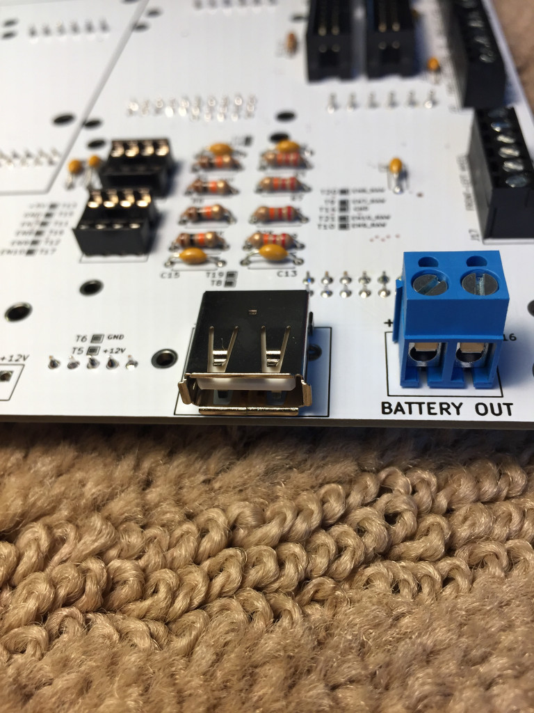 |
|:-:|
| Figure 10: Assembly Step 10 |

### 3.9 Standoffs

| **Item**                       | **Ref** | **Qty** | **Image**                                                       | **Item**                       | **Ref** | **Qty** | **Image**                                                       |
| ------------------------------ | ------- | ------- | --------------------------------------------------------------- | ------------------------------ | ------- | ------- | --------------------------------------------------------------- |
| #6-32 x 3/4" Threaded Standoff | T3      | 4       |     | #6-32 3/8" Button Head Screw   | B2      | 8       |        |
| #4-40 x 1/2" Threaded Standoff | T5     | 20      |    | #4-40 1/4" Button Head Screw   | B8      | 40      |        |
| #2-56 x 1/2" Threaded Standoff | T11      | 4       |   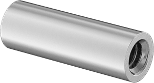  | #2-56 1/4" Button Head Screw   | B13     | 8       |       |
| M2.5 x 10mm Threaded Standoff  | T10     | 4       |    | M2.5 x 6mm Socket Head Screw   | B10     | 8       |       |

#### 3.9.1 Board mounting Standoffs

On the **BOTTOM** side of the board, attach
    the four #6-32 Standoffs **T3** on the outermost corner four mounting holes
    using screws **B2**. These standoffs will be used to attach the board to the
    robot chassis.

|  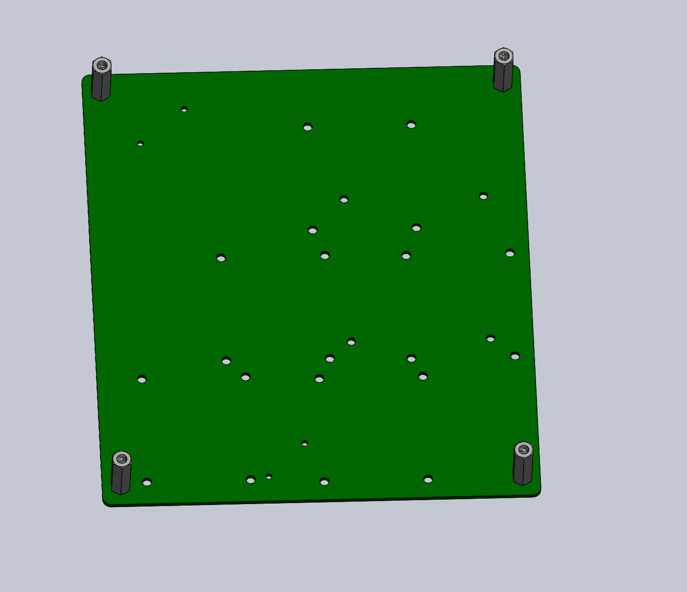 |
|:-:|
| Figure 12: Mounting Standoffs |

#### 3.9.2 RoboClaw mounting Standoffs

On the **BOTTOM** side of the board, attach
    the twenty #4-40 Standoffs **T5** using screws **B8** as shown below. You
    can identify the RoboClaw mounting holes as the ones that are inside the
    RoboClaw rectangles on the silk screen.

| 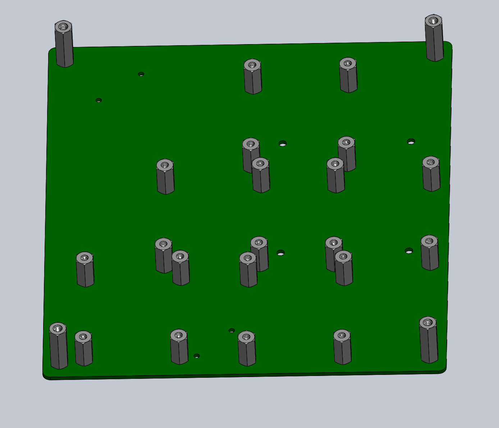 |
|:-:|
| Figure 13: RoboClaw Mounting Standoffs |

#### 3.9.3 Voltage Regulator Standoffs

On the **BOTTOM** side of the board, attach
    the four #2-56 Standoffs **T11** using screws **B13** as shown below.

|  |
|:-:|
| Figure 14: Voltage regulator Mounting Standoffs |

#### 3.9.4 Raspberry Pi Standoffs

On the **TOP** side of the board, attach the
    four M2.5 Standoffs **T10** using screws **B10** as shown in below.

|  |
|:-:|
| Figure 15: Raspberry Pi Standoffs |

| 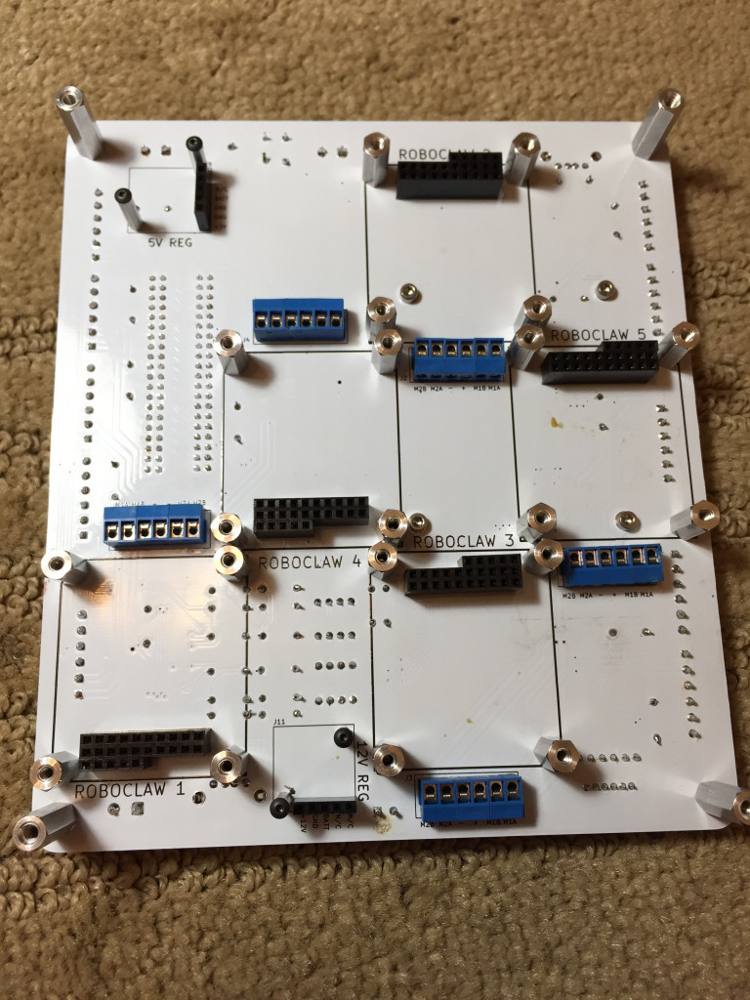 |
|:-:|
| Figure 16: Standoffs Installed (Bottom View) |

## 4. Arduino Shield Assembly

| **Item**                   | **Ref** | **Qty** | **Image**                                                       | **Item**                   | **Ref** | **Qty** | **Image**                                                       |
| -------------------------- | ------- | ------- | --------------------------------------------------------------- | -------------------------- | ------- | ------- | --------------------------------------------------------------- |
| Arduino Shield             | E2      | 1       |   | 1x6 JST header pins        | E14     | 1       |  |
| 2 Position Term Block      | E18     | 1       |  | 1x40 0.1 Pitch Header pins | E15     | 1       |  |
| 2x8 Shrouded Header Pins   | E19     | 1       |  | Soldering Iron             | N/A     |         |                                                                 |

Now, we will assemble the Arduino shield that will sit in the rover's head and
control the face. We will start with the **TOP** side of the Arduino board. The
final product is shown below.

|   |
|:-:|
| Figure 17: Assembled Arduino Shield |

#### 4.1.1 Terminal Block assembly

Begin by taking the 2-position terminal block **E18** and soldering it to
    top of the board at the J6 connector, such that the screw terminals face
    outwards as shown below:

| 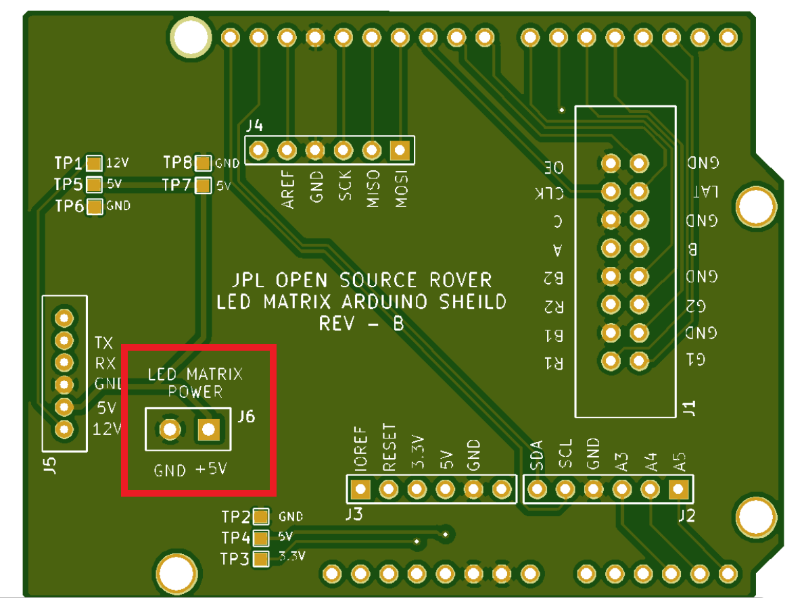 |
|:-:|
| Figure 18: Terminal Block assembly |

#### 4.1.2 JST assembly

Solder the 1x6 JST connector **E14** onto the top of the board at the J5
    connector such that the notch in the connector faces **OUTWARDS** as shown
    below:

| 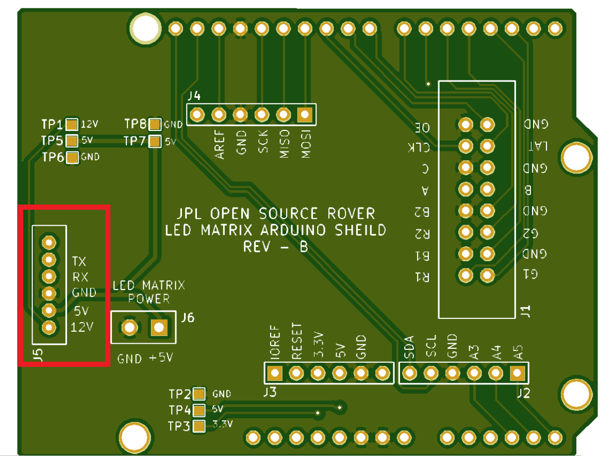 |
|:-:|
| Figure 19: JST assembly |

#### 4.1.3 Terminal Block assembly

Solder the 2x8 shrouded header pin connector **E19** to the top of the board
    at connector J1 such that the notch faces **OUTWARDS** as shown in the final
    product image above.

|  |
|:-:|
| Figure 20: Terminal Block assembly |

#### 4.1.4 Pitch headers (1)

Solder the 0.1 pitch header pins **E15** to connectors J2-4 on the top side
    of the board:

|  |
|:-:|
| Figure 21: 0.1 Pitch headers (1) |

Flip the Arduino board over to the **BOTTOM** side where we will now install
    the remaining headers. The final product is shown in the images below.

#### 4.1.5 Pitch headers (2)

Solder the 0.1 pitch header pins **E15** to the bottom side of the board in
    the remaining hole sets.

|  |
|:-:|
| Figure 22: 0.1 Pitch headers (2) |

#### 4.1.6 Assembled

|   |
|:-:|
| Figure 23: Assembled Arduino Shield  |

# Component Integration and Testing

This next section will go over the process of integrating the electronics onto
the Control Board and the testing to verify that the board and components are
working as expected at each step. You should perform this section with the board
**outside** of the robot chassis in case you need to replace components or fix
any mistakes. It is important to do the following steps **one at time** so you
can verify that electronics are working as intended. These tests will save you
from accidentally breaking one or more of your components if something else is
plugged in incorrectly or shorted.

## 5. Testing the Control Board

### 5.1 Power Distribution System

| **Item**                  | **Ref** | **Qty** | **Image**                                                       | **Item**                  | **Ref** | **Qty** | **Image**                                                       |
| ------------------------- | ------- | ------- | --------------------------------------------------------------- | ------------------------- | ------- | ------- | --------------------------------------------------------------- |
| OSR Control Board         | E1      | 1       |   | 5V Regulator              | E22     | 1       |  |
| Battery                   | E36     | 1       |  | 12V Regulator             | E23     | 1       |  |
| Tamiya Battery Connectors | E35     | 1       |  | RoboClaw Motor Controller | E20     | 5       | 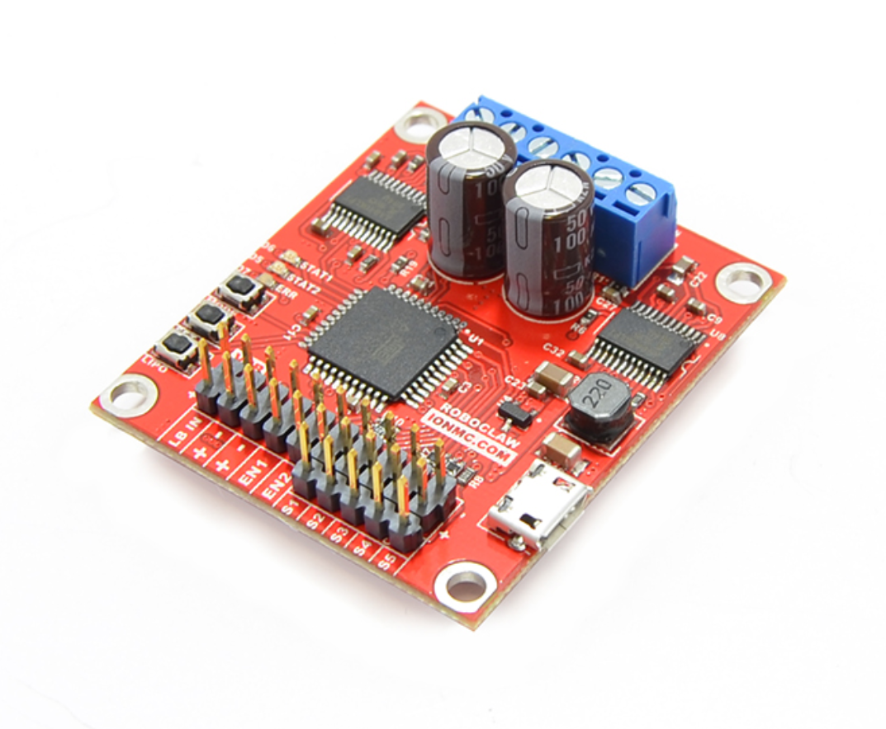 |
| Red 20 AWG Wire           | X1      | 1       |        | Op-Amp LM358P             | E25     | 1       |  |
| Black 20 AWG Wire         | X2      | 1       |        | Micro USB Cable           | E28     | 1       |  |

#### 5.1.1 Test Step 1

Begin by powering the board. For testing purposes, we will plug the battery
    directly into the board, bypassing the switch and volt meter. Thus, the
    connection we use for testing will look a little bit different than when you
    fully install the board into the rover. Insert the red wire on the Tamiya
    Battery Connector **E35** into the IN terminal on connector **J16 / POWER
    SWITCH**, and the black wire to the GND terminal on the connector **J15 /
    BATTERY IN**.

|  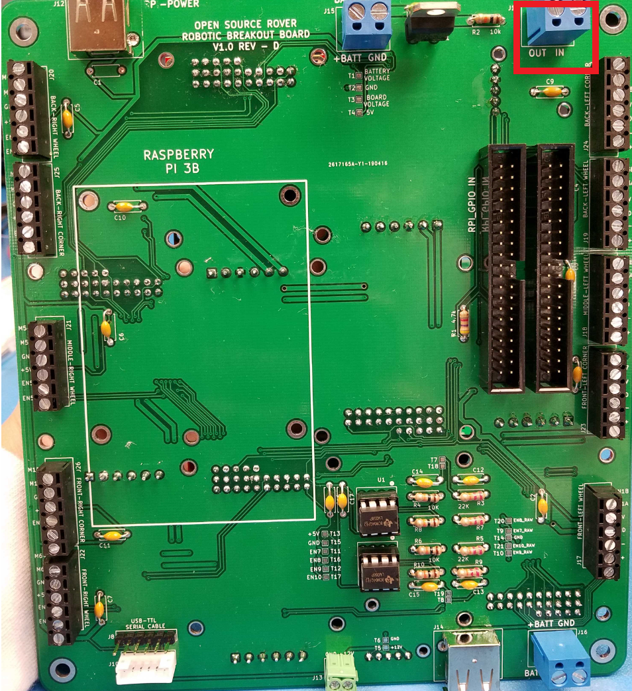 |
|:-:|
| Figure 24: Test Step 1 |

#### 5.1.2 Test Step 2

Using a Digital Multimeter (DMM), probe the voltage across the test points
    T1 and T2. These will tell you the voltage at which the board power rails
    are, which should be the direct voltage of the battery. Verify that from T1
    to T2 reads a positive number, and is between 12V and 16.7V depending on the
    charge state of your battery.

|  |
|:-:|
| Figure 25: Test Pads |

#### 5.1.3 Test Step 3

| :exclamation: :exclamation: :exclamation: Battery Safety :exclamation: :exclamation: :exclamation: |
|:---------------------------|
| Unplug the Tamiya battery connector before plugging in or unplugging ANY components, or before inserting components!!!**(in future steps, we will not explicitly say to unplug the battery, but**you must disconnect the battery at each step BEFORE inserting components or working on the board!**).

Next, you will need to create jumper wires that will connect the RoboClaw motor controller power terminals to the RoboClaws. Take the red and black 24 AWG wires **W1 and W2** and cut 15 2-inch long segments of each color (you should have 15 red and 15 black pieces). Using wire strippers, strip the ends about 0.1 inches at each end. Insert these jumper wires into the terminal blocks on the RoboClaw Motor Controllers **E20** in the following way:

| **Terminal** | **Wire Color** |
| ------------ | -------------- |
| M1A          | Red            |
| M1B          | Black          |
| +            | Red            |
| -            | Black          |
| M2A          | Red            |
| M2B          | Black          |

#### 5.1.4 Test Step 4

Start by inserting one of the RoboClaws into the slot on the bottom of the
    board labeled `ROBOCLAW 2`. Connect the wires directly across from RoboClaw
    motor terminal block to the terminal block on the control board as shown
    below:

|   |
|:-:|
| Figure 26: RoboClaw power/motor wires |

#### 5.1.5 Test Step 5

Plug in the battery. An LED on the RoboClaw will turn on; verify that it is
    green. If the LED is red, it means there is an error. Error codes can be
    traced by looking at
    [the RoboClaw user manual](https://basicmicro.com/downloads).

#### 5.1.6 Test Step 6

Repeat this process one RoboClaw at a time **following the order of 2, 3, 4,
    1, 5** (testing each RoboClaw after you plug it in) until all 5 RoboClaws
    have been plugged into the board.

#### 5.1.7 Test Step 7

Take the two voltage regulators **E23 and 24** and solder their header pins
    to the bottom side of the board. Note that you will be soldering the short
    side of the pins on the top side of the board (the side with large
    capacitors on it).

#### 5.1.8 Test Step 8

Insert the 5V regulator into the control board as shown below. Power your
    board and probe between test points T4 and T2 on the top of the board below
    with your DMM and verify that it reads 5V. If it does not, make sure that
    the 5V regulator is slotted in properly and that your solder connections are
    solid.

|   |
|:-:|
| Figure 27: 5V Regulator & Test Pads |

#### 5.1.9 Test Step 9

Insert the 12V regulator into the control board. Power your board and probe
    between test point T5 and T6 on the top of the board with your DMM and
    verify that it reads 12V. If it does not, make sure the 12V regulator is
    slotted in properly and that your solder connections are solid.

|  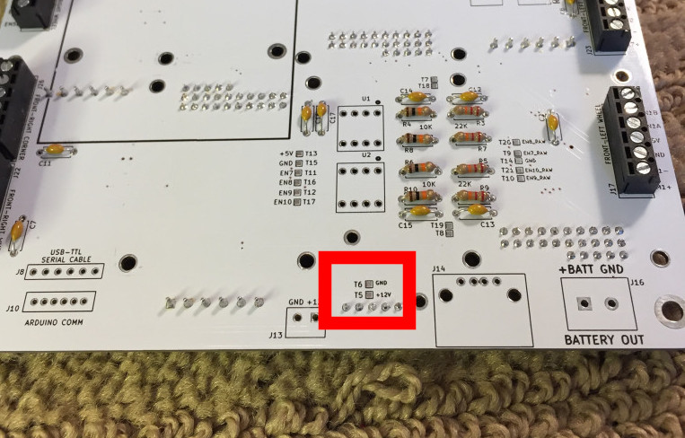 |
|:-:|
| Figure 28: 12V Regulator & Test Pads |

If all voltage test points read expected values and all the RoboClaw motor
    Controllers have green LEDs, the power system has been verified!

## 6. Op-Amp Integration

Press the Op-Amp LM358P **E25** into the slots in the 8 Position DIP socket.
Take careful note of the direction of the chip in the DIP socket, as the notch
**MUST** face the correct direction.

|  |
|:-:|
| Figure 29: Op-Amp Integration |

### 6.1 Voltage Divider Verification

Now that the Op-amps are installed we want to check and make sure the voltage
dividers are working correctly. To do this, we will run power from the motors
directly back into the analog read signal, and see what voltage it gets divided
down to. On the motor connectors for each corner motor (J23-26), use a jumper
wire to connect the 5V signal line to the ENx line. Then, use a DMM to measure
the voltage between each of the following test pads and GND and compare the
values to the expected voltage ranges:

| Signal                     | Test Pad | Voltage (to ground, in Volts) |
| -------------------------- | -------- | ----------------------------- |
| Op Amp Power               | T13      | 5                             |
| M7 Encoder Signal Divided  | T7       | 1.5 – 2.0                     |
| M7 Encoder Raw             | T9       | 5                             |
| M7 Encoder after Op-Amp    | T11      | 1.5 – 2.0                     |
| M8 Encoder Signal Divided  | T18      | 1.5 – 2.0                     |
| M8 Encoder Raw             | T20      | 5                             |
| M8 Encoder after Op-Amp    | T16      | 1.5 – 2.0                     |
| M9 Encoder Signal Divided  | T8       | 1.5 – 2.0                     |
| M9 Encoder Raw             | T10      | 5                             |
| M9 Encoder after Op-Amp    | T12      | 1.5 – 2.0                     |
| M10 Encoder Signal Divided | T19      | 1.5 – 2.0                     |
| M10 Encoder Raw            | T21      | 5                             |
| M10 Encoder after Op-Amp   | T17      | 1.5 – 2.0                     |

### 6.2 RoboClaw Testing and Verification

In this section you will be going one by one and and testing the operation of
the RoboClaw Motor controllers. You will be doing this by using the GUI provided
by the manufacturer of the motor controllers. The GUI can be found at
[this link](https://www.basicmicro.com/downloads), under general downloads, then
BasicMicro Motion Studio.

You'll also need the `USB RoboClaw Windows Driver` from the RoboClaw General
Downloads section of the page. This should be installed before you run the
Motion Studio.

To use the GUI, insert a USB to Micro USB cable from your computer to the motor
controller you are going to be testing.

You must now make a temporary connection between the motor controllers and your
motors. We found it easiest to test using a set of male-male jumper wires
connected between the motor terminal being tested and a test motor.

### 6.3 Drive Motor Blocks

Do each of the steps below for the terminal blocks labeled J17-22; these
terminal blocks correspond to the driving motors for the rover. **Make sure that
while you are plugging in connections, your board is powered off!** The terminal
blocks correspond to the motor controller outputs in the following manner:

| Terminal Block Label | RoboClaw Board Label | Motor Output Channel |
| -------------------- | -------------------- | -------------------- |
| J17                  | RC1                  | M1                   |
| J18                  | RC1                  | M2                   |
| J19                  | RC2                  | M1                   |
| J20                  | RC2                  | M2                   |
| J21                  | RC3                  | M1                   |
| J22                  | RC3                  | M2                   |

#### 6.3.1 Connect Wires

First, connect the wires in the following manner:

| Signal    | Terminal Block Label | Motor Connector Wire Color |
| --------- | -------------------- | -------------------------- |
| Motor (+) | M+                   | Red                        |
| Motor (-) | M-                   | Black                      |
| Ground    | GND                  | Green                      |
| +5V       | +5V                  | Blue                       |
| Encoder A | ENA                  | Yellow                     |
| Encoder   | B                    | ENB White                  |

#### 6.3.2 Power on

Power on the board. After a minute or so, in the Basic Motion GUI you should
    see an available device appear. It might require an update to proceed;
    install the latest firmware update and then connect to the device.

#### 6.3.3 Prepare PWM signal

Click on the PWM tab. We will now send a PWM signal to the motor and test
    that connections are all made correctly to the motor and encoder.

#### 6.3.4 Vary PWM signal

Slowly move the slide bar for the corresponding motor output channel (Either
    M1 or M2 from the above table) for the terminal you are testing. Verify that
    the motor spins (we will worry about direction later), and that the encoder
    value is also changing (we'll worry about it increasing or decreasing
    correctly later as well). Switch direction of the slide bar and verify that
    it spins the other direction and the encoder value does the opposite of
    previous as well. If these are not happening or are backwards, go back and
    check that you are using the correct motor controller, terminal block, etc.
    If all your connections are correct, you may have to test your solder
    contact between the components on the board itself.

#### 6.3.5 Repeat for other motor terminals

Repeat the steps above for each of the drive motor terminal blocks, labeled
    J17-22.

### 6.4 Corner Motor Blocks

Do the following procedure for the terminal blocks labeled J23-26. These
correspond to the corner motors for the rover. Terminal blocks correspond to the
motor controller outputs in the following manner:

| Terminal Block Label | RoboClaw Board Label | Motor Output Channel |
| -------------------- | -------------------- | -------------------- |
| J23                  | RC4                  | M1                   |
| J24                  | RC4                  | M2                   |
| J25                  | RC5                  | M1                   |
| J26                  | RC5                  | M2                   |

#### 6.4.1 Connect wires

Connect the wires to the motor in the following manner

| Signal    | Terminal Block Label | Motor Connector Wire Color |
| --------- | -------------------- | -------------------------- |
| Motor (+) | M+                   | Red                        |
| Motor (-) | M-                   | Black                      |

#### 6.4.2 Prepare encoder simulation

The main difference between the drive and corner motor systems is that for
    the corner system, we need to use the encoders. We want to test the voltage
    division circuit used on the control board; this divider which will expect
    a 0-5V signal from the absolute Hall effect encoder. To simulate the
    encoder, connect the +5V terminal on the motor terminal block straight into
    the ENA signal in the same terminal block.

#### 6.4.3 Connect to Basic Motion GUI

Connect to the motor controller in the Basic Motion GUI. Under the General
    settings tab (under Encoders), change the type of encoder from Quadrature to
    Absolute. You should see that the encoder values change to a number
    somewhere around 1600. As long as it is a fairly constant value and is in
    the range of 1400-2000 then everything is working. If the value varies
    wildly or is not in the 1400-2000 range, recheck that the OP-amp is
    installed in the correct direction. If this number still isn't correct then
    make sure you correctly installed all the resistors/capacitors in the
    assembly steps.

#### 6.4.4 Test PWM signal

Under the PWM tab, move the slide bar and verify that the motor spins
    accordingly.

#### 6.4.5 Repeat for other motors

Repeat this process for all the corner motor terminal blocks, labeled
    J23-26.

## 7. Raspberry Pi Install

Next up is to verify that power to the Raspberry Pi is working. For this, you'll
need a working operating system installed on the SD card. This will take some time; follow the
[software setup instructions](https://github.com/nasa-jpl/osr-rover-code#setup)
to install the rover software on the Raspberry Pi.

| **Item**               | **Ref** | **Qty** | **Image**                                                                  | **Item**               | **Ref** | **Qty** | **Image**                                                                  |
| ---------------------- | ------- | ------- | -------------------------------------------------------------------------- | ---------------------- | ------- | ------- | -------------------------------------------------------------------------- |
| OSR Control Board      | E1      | 1       |              | 40 Pin Ribbon Cable    | E29     | 1       |             |
| Raspberry Pi 3B        | E21     | 1       |             | USB to Micro USB Cable | E27     | 1       |             |

| :exclamation: Only proceed with the following once you have successfully finished the installation of the rover code on your raspberry pi |
|:---------------------------|

#### 7.1.1 Attach RPi

Attach the Raspberry Pi to the board on top of the standoffs you attached
    earlier, making sure that the USB ports face downward on the board as shown
    below.

#### 7.1.2 Plug in cables

Plug in the micro USB cable **E27** to the USB power port labeled J12 and to
    the **power port** of the Raspberry Pi (labelled 'PWR'). Then, plug in the
    ribbon Cable **E29** into the Raspberry Pi GPIO header pins and connect the
    other end to the **J6** 40 pin GPIO connector.

|   |
|:-:|
| Figure 30: RPi Install |

## 8. Arduino Shield Testing

| **Item**         | **Ref** | **Qty** | **Image**                                                       | **Item**         | **Ref** | **Qty** | **Image**                                                       |
| ---------------- | ------- | ------- | --------------------------------------------------------------- | ---------------- | ------- | ------- | --------------------------------------------------------------- |
| Arduino Shield   | E2      | 1       |   | 1x6 JST Cable    | E26     | 1       |  |
| Arduino Uno      | E24     | 1       |  | 16x32 LED Matrix | E37     | 1       |  |

Note: Testing the arduino board is dependent on finishing the control board and
having it tested fully. Do not proceed until you have successfully tested your
main control board.

Slot the Arduino Uno onto the bottom of the Arduino shield, matching the
footprints on the board.

|  |
|:-:|
| Figure 31: Arduino Shield Mounted |

#### 8.1.1 Plug in cable

Plug in the 1x6 JST cable **E26** into the Arduino shield and to the Control
    board. This cable will run 12V, 5V, GND, and two serial communication lines
    from the main rover to the Arduino shield which runs the screen in the head.
    This step relies on successful tests of the 5V and 12V regulators on the
    control board and verifying that they work correctly. If you have not tested
    the main board successfully, you may damage the Arduino.

#### 8.1.2 Measure

Using a Digital Multimeter, probe the following **Arduino shield test pads**
    and verify their voltages:

- TP1 to TP6 should read +12V. This voltage powers the Arduino Uno board

- TP5 to TP6 should read +5V. This voltage powers the LED Matrix and runs
        the LEDs on it

- TP4 to TP2 should read +5V. This is the 5V converter on the Arduino board

- TP3 to TP2 should read +3.3V. This is the 3.3V converter on the Arduino
        board

If all the above test points read the correct voltages, then the Arduino Shield
board is working correctly! You are now ready to finish the Electrical Assembly
of the rover!
