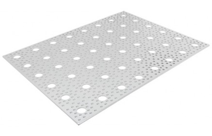
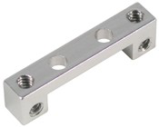
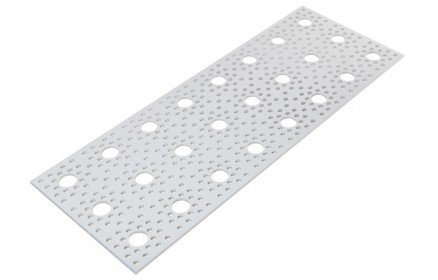
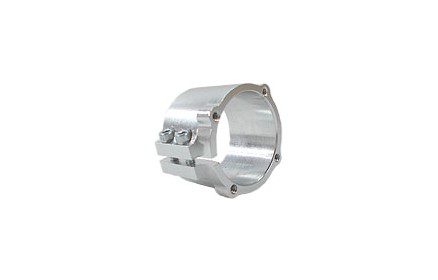
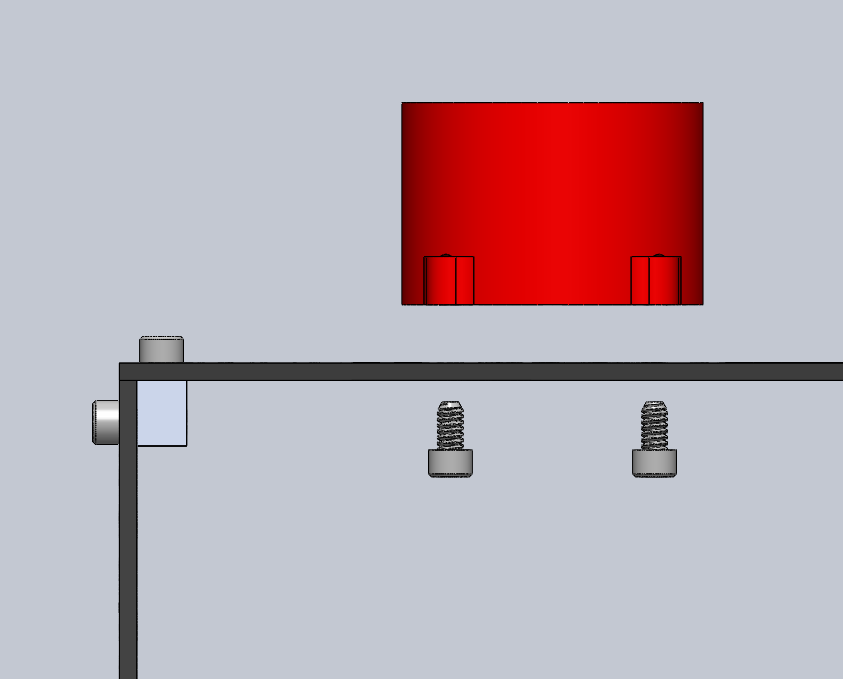

# Main Body Assembly

The body is the housing of all the electronics for the rover. It is the attachment points for the rocker-bogie systems, as well as the differential pivot system.

## 1. Features

* Gives passthrough connections for USB ports on Raspberry Pi
* Cutouts on the rear of the body give access for voltage monitor and battery for charging
* Really pretty

## 2. Information about module

| Author/Creator            | JPL       |
| --------------            | -------            |
| Cost without 3D printer   | 240.38             |
| Cost with 3D printer      | 240.38             |
| Date Added                | 4/11               |
| Group/Organization/School | JPL                |
| Time to build             | 3 hrs              |

### 2.1 Skills

* Band Saw/Dremel

### 2.2 Tools

#### 2.2.1 Mandatory

* Band saw or Dremel
* Allen Key set
* Imperial Wrench Set

#### 2.2.2 Optional

* Laser cutter

### 2.3 Dependencies on Other Modules

* None

### 2.4 Mechanical Interface/Attachments to Rover

* 0.5 Inch aluminum rod into bearing blocks on rocker-bogie arms
* 0.5 Inch aluminum rod into clamping hub on differential pivot

## 3. Machining/Fabrication

### 3.1 9x12 Aluminum Plate Drilling

| Item | Ref | Qty | Image |
| :--- | :-- | :-- | :---: |
| 9"x12" Aluminum Plate | S35 | 1 |  |

First we need to drill a hole in one of the 9x12 Aluminum plates **S35** because we will need a hole of just over 0.5 in diameter for the differential pivot mount. There is already a small hole drilled in the location we want to use, but it needs to be widened substantially. Start with the drill #23 and drill the hole shown by Figure 1. Repeat this with drill sizes stepping up until you get to a drill of 0.5 in.

|   |
|:-:|
| Figure 1: Drilling the Aluminum Plate |

### 3.2 Laser Cut Parts

Some more text

## 4. Mechanical/structural Assembly

### 4.1 Chassis

| Item | Ref | Qty | Image | Item | Ref | Qty | Image |
| :--- | :-- | :-- | :---: | :--- | :-- | :-- | :---: |
| Dual Side mount A            | S17 | 4 |  | #6-32x1/4" Button Head Screw | B1 | 16 |  |
| 4.5"x12" Aluminum Plate      | S37 | 2 |  | #6-32x3/8" Button Head Screw | B2 | 4 |  |
| 1" PVC Clamp                 | S24 | 1 |  | Allen Key Set                | | |  |
| 9"x12" Aluminum Plate        | S35A | 1 |  | 5/16" Wrench                 | | |   |

#### 4.1.1 Top panel

Take the modified 9x12 Aluminum plate **S35A** and attach the four Dual side mount A **S1** using screws **B1** at the locations shown below. Take care to match the orientation shown.

|  |
|:-:|
| Figure 2: Attaching side mounts to top panel |

#### 4.1.2 Attach the side panels

Attach the 4.5x12 plates **S37** to the dual side mounts using screws **B1**

|  |
|:-:|
| Figure 3: Attach the side panels |

#### 4.1.3 Attach the PVC clamping hub

Attach the 1-inch PVC bore clamping hub **S24** to the top plate of the body using screws **B1** Use the location shown in Figure 4.

|  |
|:-:|
| Figure 4: Attach the PVC clamp to top plate |
