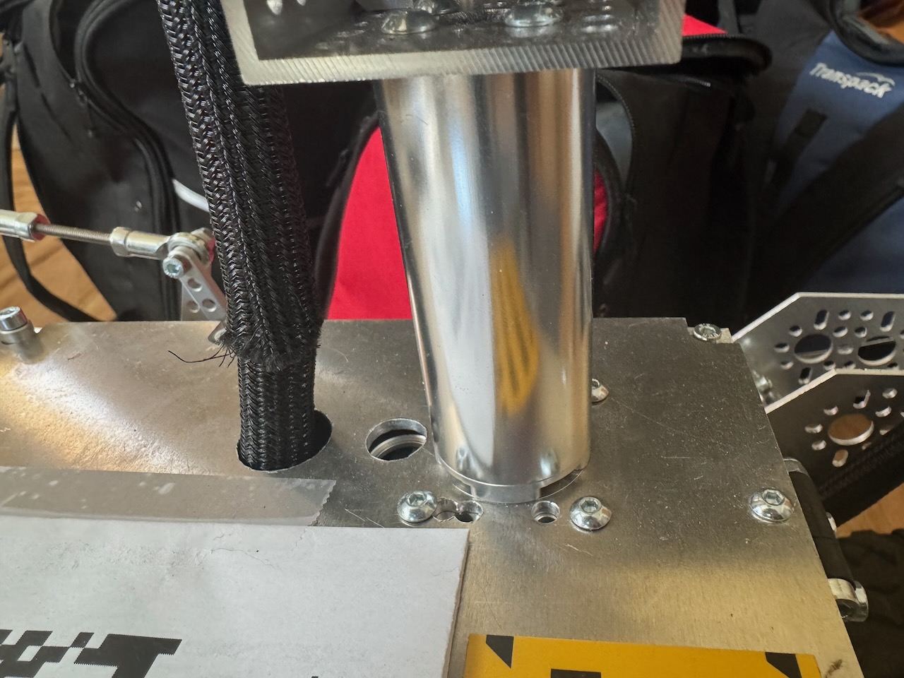

# Expansion Options
This page describes various, optional, hardware expansions for the the rover.

## Mast
A mast can be added to the rover to house a camera, light, screen, environmental sensors or other components. 

This section describes how to build the pan and tilt mast seen below. Before you get too far along it is recommended to attach two servos to the PCA board and write some basic code that confirms you can control them. This build information covers the mechanical parts of the build, installing the sensors and the code to integrate them is beyond the scope of these instructions.

### Materials List
#### Mast Structure
The following materials are needed to build the main structure of the mast (as seen above). All parts were purchased from gobilda.com. The "head" of the mast is covered further down.
- torque servo (2000-0025-0002) x 2
- servo block (3217-2701-2501) x 2
- 72mm length goTube (4103-0032-0072) x 1
- steel angle bracket (1142-0001-0001) x 1
- 1 pack dual block mount (1205-0001-0005) x 1
- U-channel (1 hole) (1120-0001-0048) x 1
- Various M4 screws
- servo wire extension sets (either make your own or buy on GoBilda)

#### Head
- 3D printed "box" for the head. (STL files for these 3D parts are in the 3d_models folder)
- sensors! you need to put something on the mast (the build above holds a camera and there is an extra hole for a light)

### Building It
Attach both of the servo blocks to the servos.

#### Underside
Remove the top plate of the rover body because you'll need to drill some holes in it. Drill a hole big enough for the servo hub shaft to fit through (exact size needed). In the example images this hole was placed 50mm back from the front and 50mm offset to the left (when facing the front of the rover). You'll also want to drill 4 holes to mount the block mount (would be good to know exact dimenions and locations for these holes).

Once the holes are drilled you can proceed with attaching the servo that controls the pan rotation to the _underside_ of the body top plate as seen in the image below. You'll attach the servo with its block to the the block mounts and the block mounts to the top plate of the body.

_Underside of the top plate of the rover body. Red arrow points to one of the mount blocks. The other mount block is on the other side but not visible in this picture_

#### Topside
Attach the goTube to the servo hub shaft from the top. Using a long hex driver down through the center of the goTube, attach this unit to the servo.

_Close up image showing goTube attached to servo hub, which is attached to the servo hidden underneath the top plate_.

Attach the second servo to the 1-hole U-Channel. Place the U-channel so that "U" is facing up. Attach this assembled part to the top of the goTube (the U-channel attached to the goTube is just visible in the image above). Attach the angle bracket to this second servo hub shaft – this will control the tilt of the head.

3D print the head and attach to the angle bracket.

Re-assemble the top plate to the rover body.

