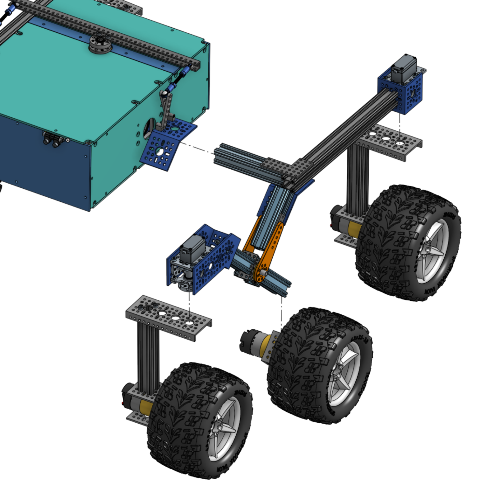
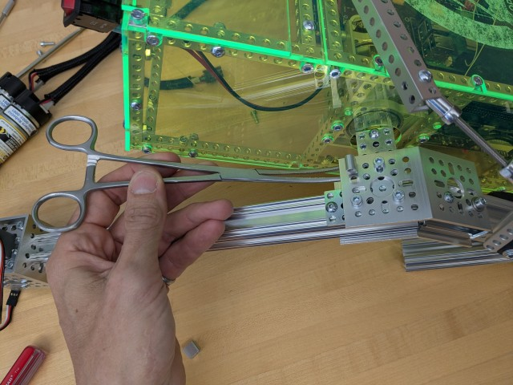
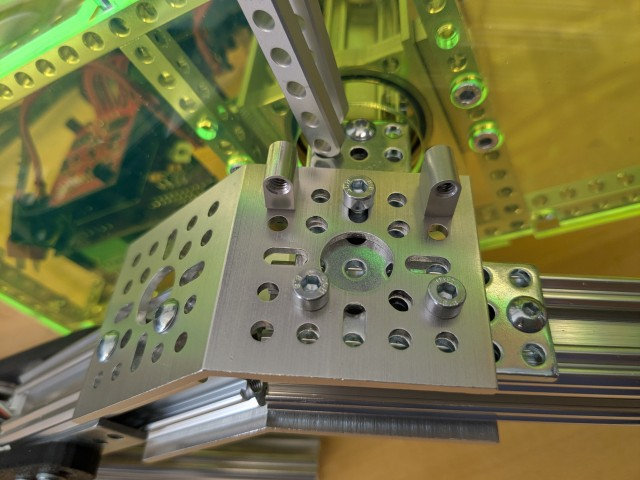
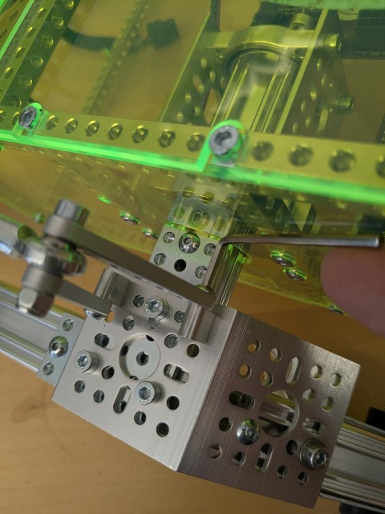
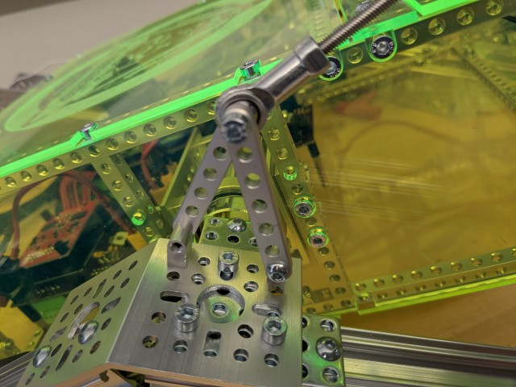

# Mechanical Subsystem

The mechanical subsystem makes up the physical rover without any of its brains or electronics installed.

The image below shows our suggested progression through the mechanical build process for this project. All individual subassemblies are meant to be completely parallelizable, so each individual subassembly could be built on its own at the same time. Once all the subassemblies are finished, there is one mechanical integration process where each of the subassemblies is integrated together to create the final rover body. Along with the pictures in each folder's README document, open the [OnShape model](https://cad.onshape.com/documents/e4f00b1a3d2edb1a84bbba1c/w/8ab8f394324bcc586236ef5d/e/9191e5ad2a70f387b419bc55?renderMode=0&uiState=645ede92f3a1a9205158b296) so you can see what goes where and spin it around. Note that the OnShape model does not have all screws included to keep the model speedy and light.

## Building the subassemblies

Click on the images to get started on a subassembly!

|  |  |  |
| --------------------------------------------------------------------------- | ----------------------------------------------- | ------------------------------------------------------------------------------- |

## Putting it all together

If you haven't already, now is a good time to attach the PCBs to the bottom body plates using the standoffs. The body plates have holes that correspond to where the standoff screws should go.

Inserting the left rocker-bogie in the body. Note that the 45 angle bracket in blue should already be attached to the rocker-bogie and the wheels should not be attached yet. A 32mm ID round spacer that should be installed below is also not seen on this image.
**I didn't have space on the outside of the body, just one spacer in the center**

### Inserting the rocker-bogies in the body

Line up the rocker-bogies with the body such that they can be easily inserted. It helps to put the body on a box such that the holes line up with the rocker-bogie axes. Slide a 32mm internal diameter (ID) spacer around the wires and onto the rocker-bogie axis. Then, carefully insert the wires extending from the rocker-bogie axis through the body plate hole and large diameter bearings and into the body, immediately followed by the axis itself. Repeat for the other side.

Inserting the rocker-bogie axis into the body axis clamp. The rocker-bogie is not shown. The cables come out of the axis on the bottom right.

Secure the body axis to the body using another 32mm ID spacer and flat 2-hole bracket + button screw. Repeat for the other side.

### Attaching the differential pivot to the rocker-bogies

Attach the differential pivot legs to the rocker-bogie 45 degree brackets using M4x8 screws.  It may be easier to unmount the blocks, attach them to the bracket, then attach the pivot legs to them as shown in the sequence below.  A curved pair of needle-nose pliers or a hemostat is helpful to secure the M4x8mm screw while placing the block on the top, as it's hard to reach.  The button head screw that attatches to the inside leg is a bit tight.

|| |
| ----------------------------------------------- | ---------------------------------------------------------- |
| Holding the blocks in place | Blocks Installed |

|| |
| ----------------------------------------------- | ---------------------------------------------------------- |
| Tightening the back leg | Differential Pivot Installed.

### Attaching the middle drive motors

With the help of someone else, carefully flip the rover over so we can attach the motor assemblies.

Connect the two drive motor U-channels to the rocker bogie middle legs using 3 button screws. Then insert the motor into the U-channel and secure the clamp around the motor's gearbox to the U-channel using 4 socket M4 screws. It helps to have another person around here as well to hold the motors so they don't dangle on the cables.

### Attaching the corner assemblies

Using 3 socket M4 screws, attach each corner assembly to the output shaft bracket of the servo. Making sure you connect the right corner assembly to the right side. Flip the rover over again and route the corner cabling through a hole in the bracket holding the servo. The bullet connectors and DuPont connectors from the rocker bogie and corner assemblies should meet here.

> **tip**: Now is a good time to do another connectivity check. Using your multimeter, confirm that each wire connects all the way through.

> **Maintenance note**: The corner servo gearset can sometimes be damaged in operation. See [here](servo_gear_replacement/README.md) for a guide on repairing your corner servos.

Finally, insert the PCI-E connectors inside the body and the DuPont connectors for the servo motors into the appropriate receptacles on the PCB. The silk screen lettering on the PCB informs which wire should go where. Once inserted, make sure the rocker-bogies can rotate relatively freely around the body by lifting the wheels up.

If all goes well you're done with the mechanical and electrical stages and you're ready to install the software!
