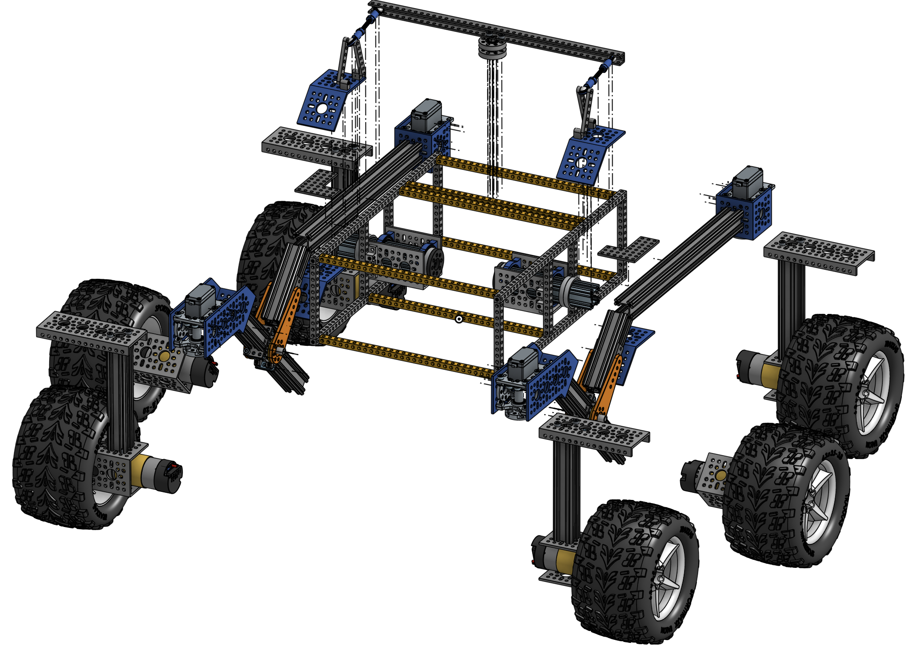

# Mechanical Subsystem

The mechanical subsystem makes up the physical rover without any of its brains or electronics installed.

The image below shows our suggested progression through the mechanical build process for this project. All individual subassemblies are meant to be completely parallelizable, so each individual subassembly could be built on its own at the same time. Once all the subassemblies are finished, there is one mechanical integration process where each of the subassemblies is integrated together to create the final rover body. Along with the pictures in each folder's README document, open the [OnShape model](https://cad.onshape.com/documents/e4f00b1a3d2edb1a84bbba1c/w/8ab8f394324bcc586236ef5d/e/9191e5ad2a70f387b419bc55?renderMode=0&uiState=645ede92f3a1a9205158b296) so you can see what goes where and spin it around. Note that the OnShape model does not have all screws included.

## Building the subassemblies

Click on the images to get started on a subassembly!

| ](wheel_assembly/images/wheels.png) | ](body_assembly/images/body.png) |
| --- | --- |
| ](differential_pivot/images/diff_pivot.png) | ](rocker_bogie/images/rocker_bogie.png) |

## Putting it all together

TODO

