# Main Body Assembly
The body is the housing of all the electronics for the rover and acts as the attachment point for the differential pivot and the body axis that the rocker-bogies on either side connect to.

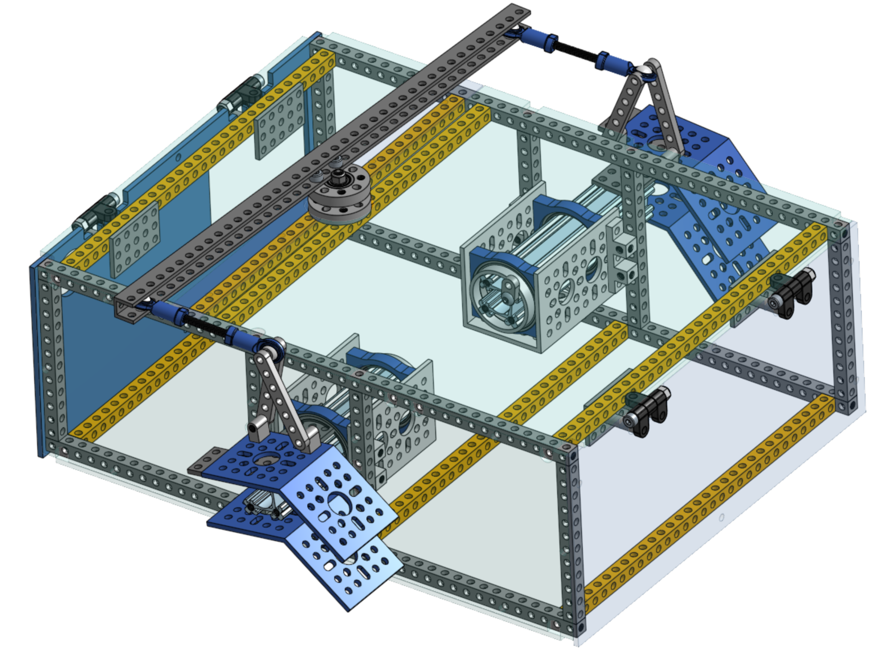
View of the body without PCB and with some of the body plates made transparent.

## Assemble the body frame
Gather the pieces from the [parts list for the body](../../parts_list/README.md/#parts-for-body-assembly).
* 4x 41 hole, 328mm square beams
* 5x 29 hole, 232mm square beams
* 8x 12 hole, 96mm square beams
* 26x M4x16 socket screws

### Bottom Frame
Connect 2x 29 hole and 2x 41 hole beams with M4x16 screws as shown.  Be sure to attach the cross beams 1 hole in on the long beams.
Insert 1 29 hole beam into hole #16, counting from the front of the rover. (TODO: Update image to move crossbar.)

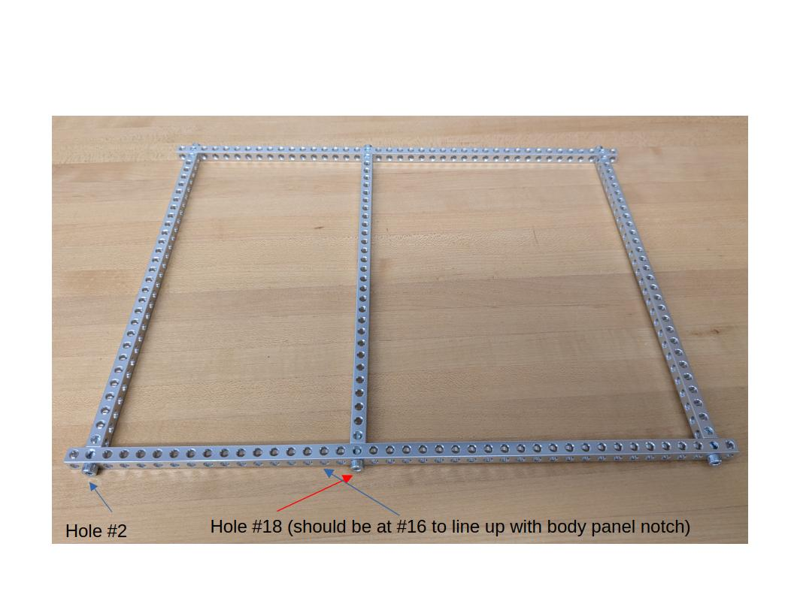

### Top Frame
Connect 2x 29 hole and 2x 41 hole beams with M4x16 screws as shown.  

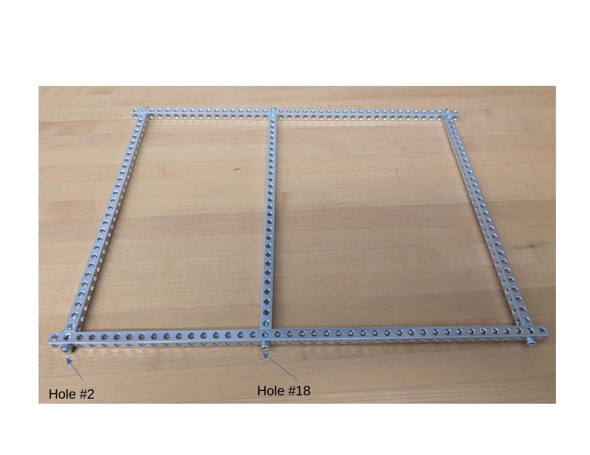

### Verticals
Connect 8x 12 hole beams along the long edges in holes #1, 17, 25, and 41 on both sides. (TODO: Update image to move crossbar.)

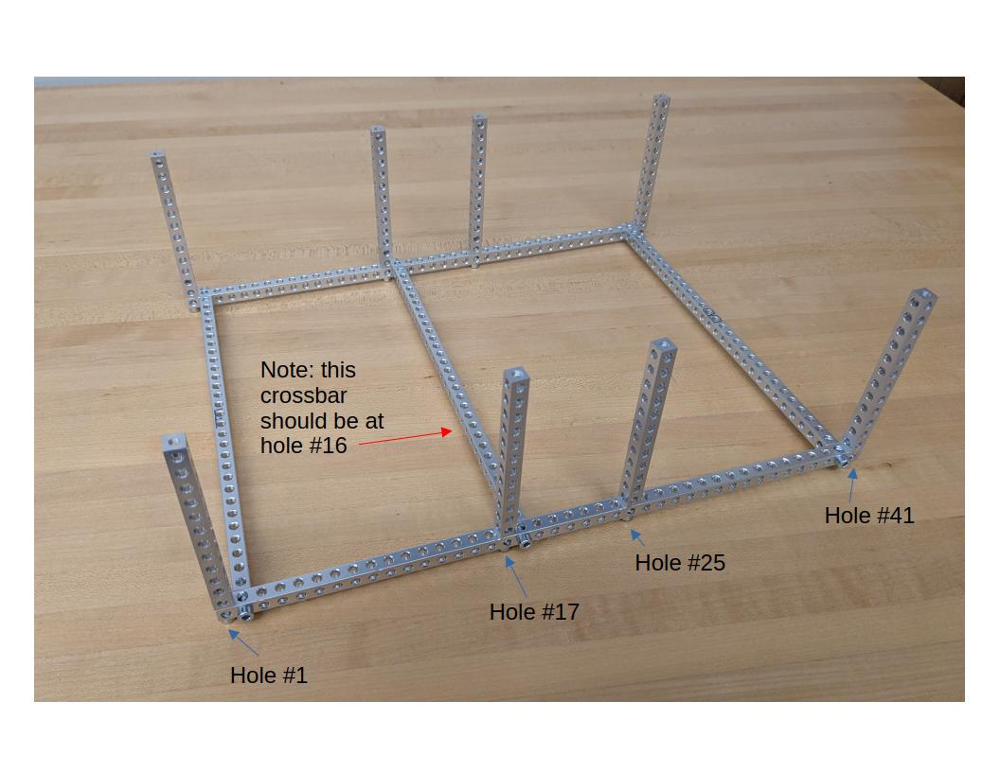

## Assemble the bearing support structures that connect to the rocker-bogie
Make two of these and connect them to the sides of the body. They should be installed exactly in the middle, which means that you're going to connect each side to the 17th hole on the long 41-hole beams on the top and bottom of the body frame. Use the M4 16mm socket screws.  Use M4x12 screws on the end toward teh outside of the rover and M4x8 screws on the end toward the center of the rover end.

The bearings have a flat side and a 'hollow' side. The hollow sides should both be pointing to the center of the rover side, as shown in the image.

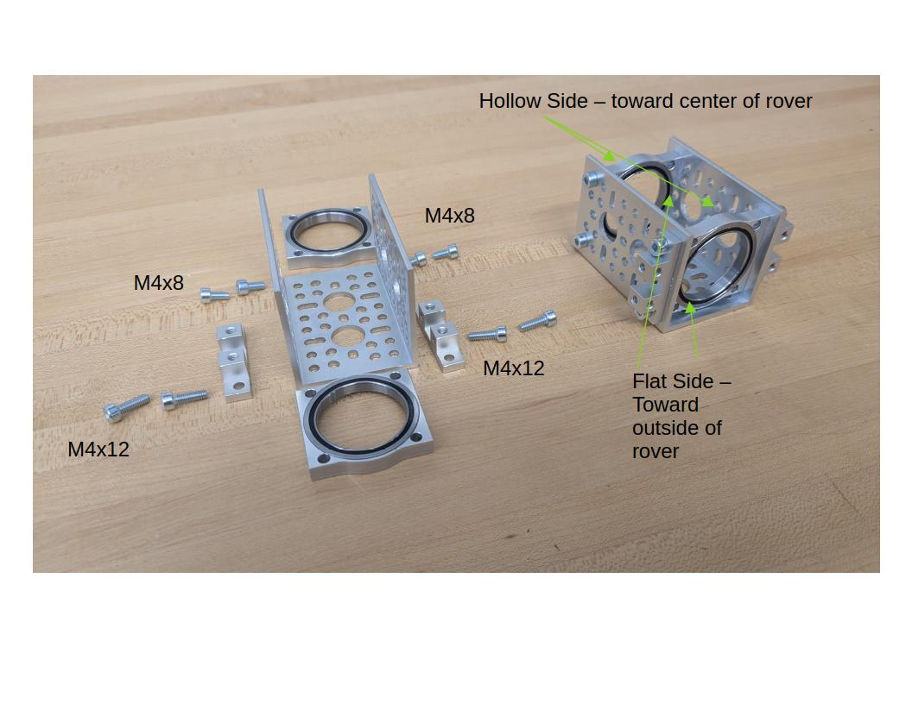

Now, install the supports on the 6th hole from the top of the 12 hole beam, and the 5th hole from the bottom.  If it's a bit tight, loosen up the verticals until all the screws are started, then tighten all of them after.

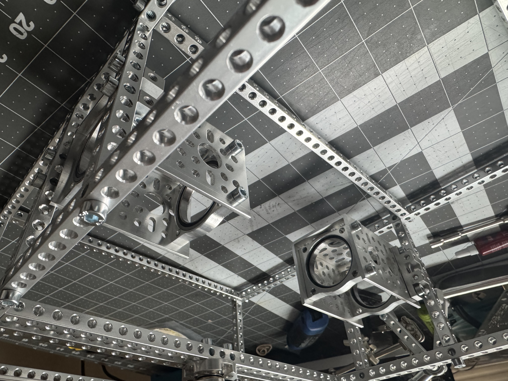

## Install the hinges for the top body plates
You will need the 20 or 22mm M4 standoffs, the 3x5 hole plate, the hinge assembly (assemble following the [instructions on GoBilda](https://www.gobilda.com/plastic-hinge-2-pack/), orientation matters).

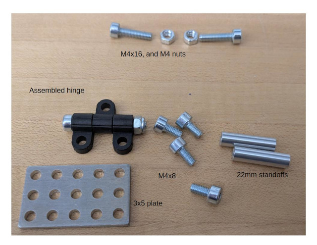 

First, attach the standoffs to the 3x5 plate with M4x8mm socket head screws

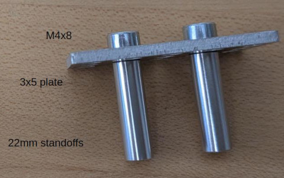 

Then, attach the plate to the top front and top rear beam, leaving 4 holes to the outside of the plate.

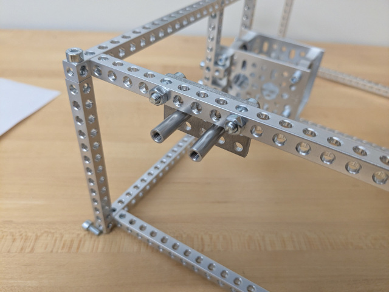

Finally, attach the hinges to the standoffs, facing the flat part of the plastic to the outside and top as shown, with M4x8 screws

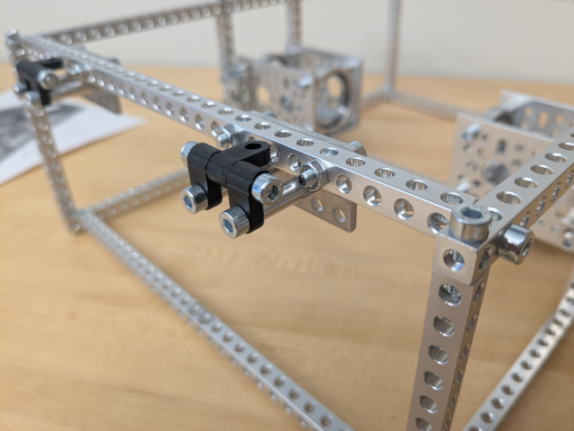

You will attach the body plate to the top part of the hinge in a later step.

 

## Make the differential pivot

The Differential Pivot helps to offload forces from one side of the rover to the other while climbing. The differential pivot is crucial in the rocker-bogie suspension system and is designed to help keep all 6 wheels on the ground at all times. It also allows a second attachment point for the body so that it does not freely rotate about the center axes that run through it and connects the two rocker-bogies.

### Gather the parts
You'll need the parts shown below.

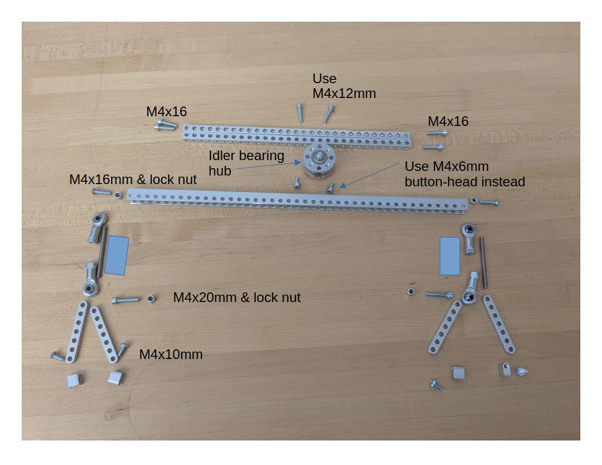

TODO: update image to show M4x6mm button screws instead of the M4x6mm socket head screws show here (and in the CAD)

Assemble the idler bearing hub following the [instructions on GoBilda](https://www.gobilda.com/idler-bearing-hub-32mm-od-16mm-height/).

Connect the block mount to the 7-hole linkage using M4x10mm button-head screws.  Connect the 20mm threaded rod to a steel ball linkage on each end to create two turnbuckles.

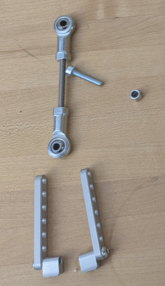

Connect the turnbuckle to the 7-bar linkages with an M4x20 socket head screw and lock nut, and to the second hole from the end of the U channel with an M4x16 button head screw and lock nut.  Repeat for other side.

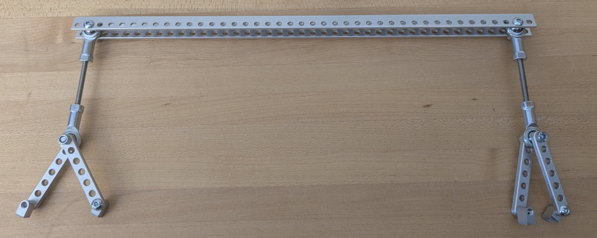

Connect the differential pivot (the whole assembly) to the idler bearing hub with two M4x6 button-head screws 

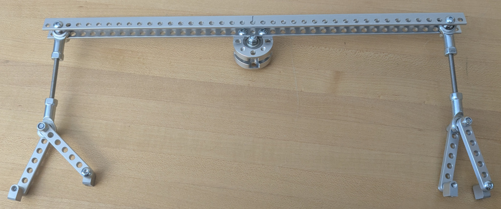

Add 2x 29 hole, 232mm square beams in holes #28 and 30 from the front, on the longer 41 hole, 328mm beams, using M4x16mm socket head screws.  Mount the idler bearing hub to the crossbars with M4x12mm socket head screws as shown.

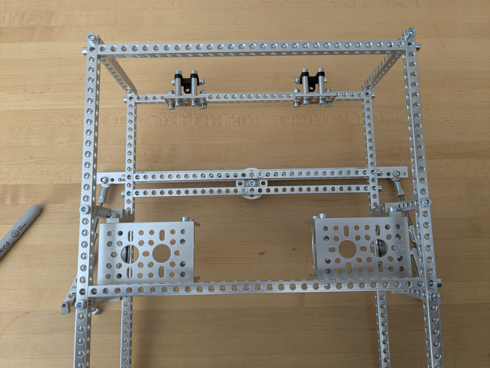

The differential pivot should be able to freely rotate around the body. We'll attach the side of the differential pivot to the rocker-bogies later.

## Install the laser cut body plates
Use M8x16 button head screws because of their lower profile along with nuts on the inside so the screws don't fall out while driving. 
If you've completed the PCB assemblies yet, you can attach them to the bottom body plate already, but you can also do this later.

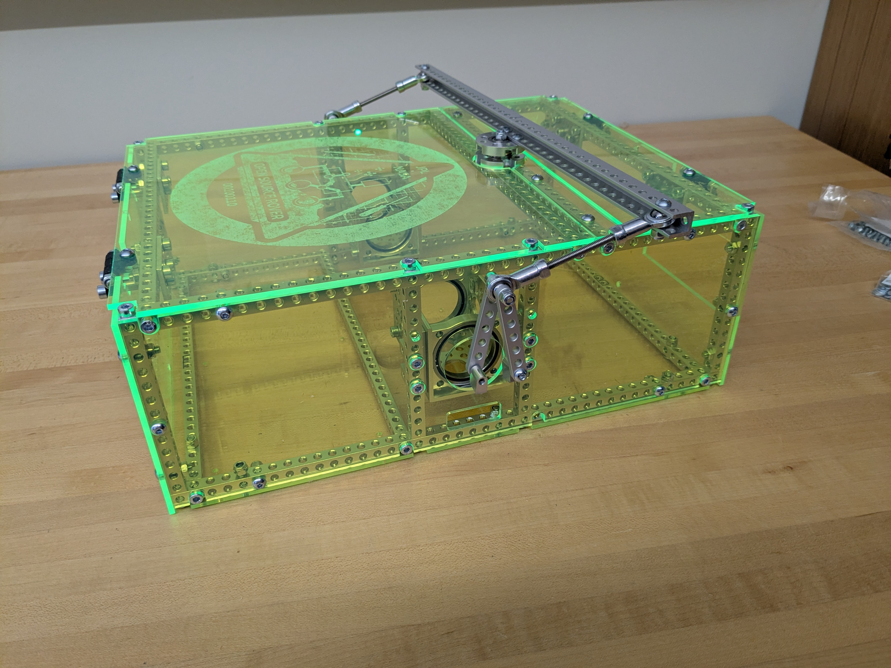

