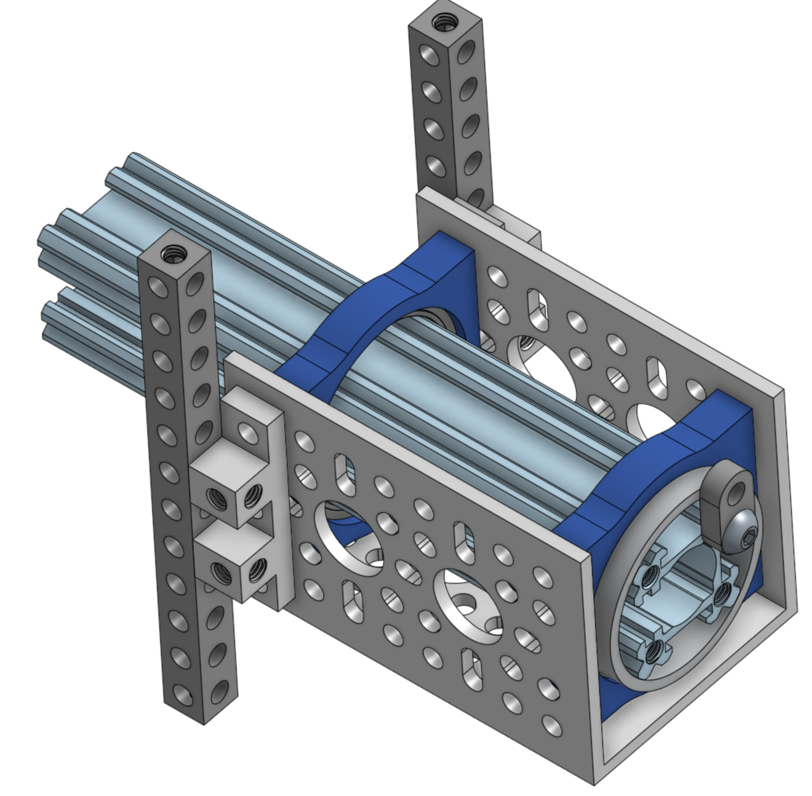

# Main Body Assembly

**Note**: documentation is a work in progress.

The body is the housing of all the electronics for the rover and acts as the attachment point for the differential pivot and the body axis that the rocker-bogies on either side connect to.

## Assemble the body skeleton

Use M4 screws and pay close attention to the placement of the beams using the image below and the online OnShape model.

## Assemble the axes that connect to the rocker-bogie

Make two of these and connect them to the sides of the body.

## Install the hinges for the top body plates

## Install the laser cut body plates

Use button screws because of their lower profile.
