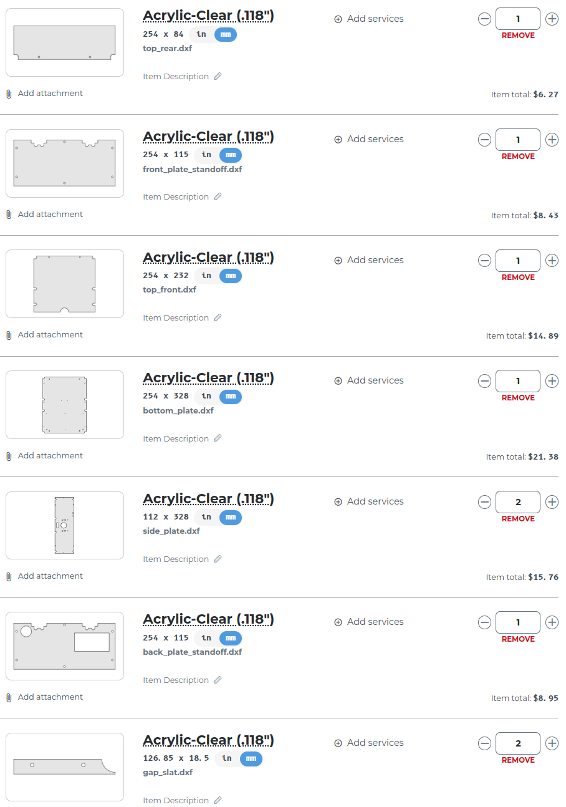

# Laser cut parts

Contains the files required to cut the body plates.

> **Note**: The side plates and 'gap slats' are identical and so only one file is included. Make sure you include **two side plates and two gap slats** when you get it laser cut!

## Ordering

Various companies will allow you to order laser cut parts with them with fast turnaround times. Some options:

* [SendCutSend](https://sendcutsend.com/)
* [Sculpteo](https://www.sculpteo.com)

Formats provided:

* 2D: DXF and SVG
* Engrave: PDF

You are free to pick different materials and colors. Using SendCutSend, your cart should look something like this:

### Shareable carts

You can skip the DXF upload steps when using SendCutSend by using [this premade cart](https://cart.sendcutsend.com/eagotwf9yciz). 

## Optional: Engrave the mission patch

Front plates with the Rover patch logo as an engraving have been included as PDF files. There are two versions. The 'Opaque' version requires that the logo be engraved on the top surface of the material. The 'Clear' version allows the engraving to be on the bottom side so the top surface is smooth. 

## Changelog

* **Cutout tolerance fix (fixes #525):** the U-shaped hinge/standoff cutouts in the front/back standoff plates were enlarged by 1 mm in every dimension (walls, fillet radii, and semicircular lobes), and the small semicircular edge cutouts on the side/bottom/top plates were enlarged by ~1 mm as well. There should now be enough clearance no matter whether 20 mm or 22 mm M4 standoffs are used. Previously either standoff length caused the cutout to collide with the standoff corner socket heads.
* Use 22mm standoffs.
* All holes have been made slightly larger to better accomodate the M3 screws. The size of the switch hole on the rear plate is also slightly larger. 
* Some of the holes on the side and bottom plates have been moved to simplify assembly.
