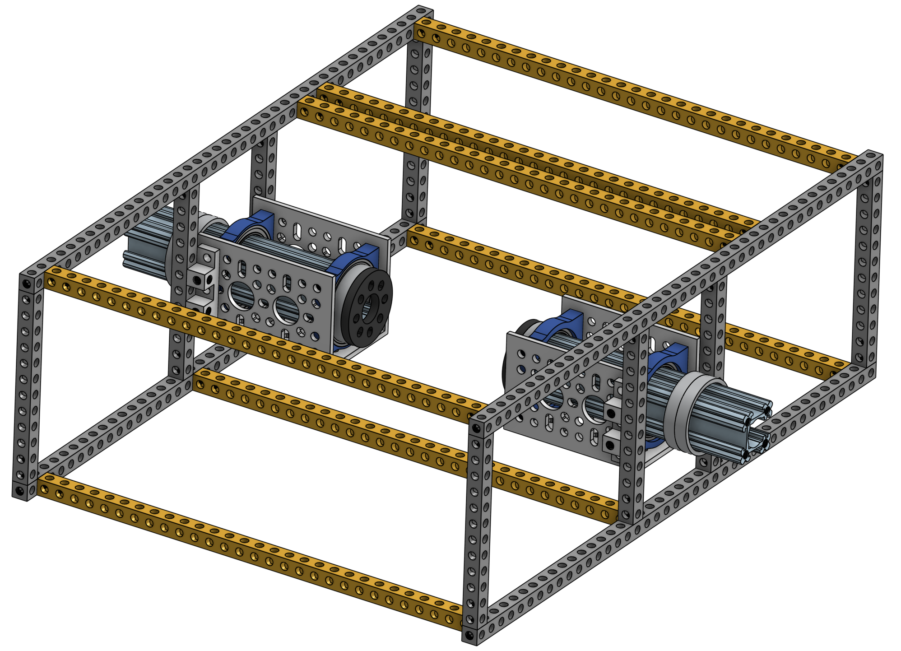
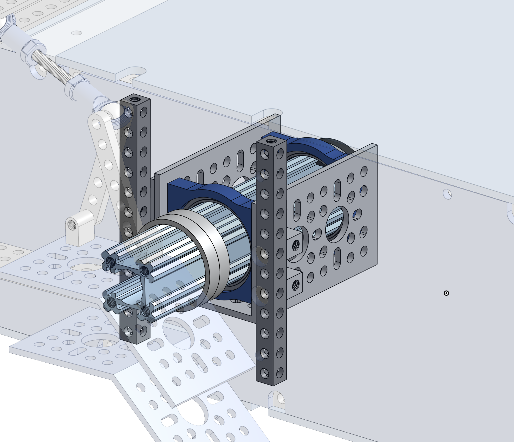

# Main Body Assembly

**IN PROGRESS**

The body is the housing of all the electronics for the rover. It is the attachment points for the rocker-bogie systems, as well as the differential pivot system.

## Mechanical Interface/Attachments to Rover

* axes on either side connect to the rocker-bogies
* top of body skeleton connects to differential pivot
* electronics are mounted inside

TODO: complete BOM / required tools

| Item | Ref | Qty | Image |
| :--- | :-- | :-- | :---: |
| 9"x12" Aluminum Plate | S35 | 1 |  |

## Laser cutting body plates

Either use a service (e.g. sendcutsend or [Sculpteo](www.sculpteo.com)) or your local maker space with a laser cutter. We recommend acrylic, but other materials like MDF should also work.

The 2D cutout files  are the .DXF files and can be found on the github under Mechanical - Body Assembly - Laser Cut Parts

To get the above parts from Sculpteo, go to Laser cutting and then upload these files (with mm selected as units). Hit Next. Make sure scale is set to 100%, change the material to Acrylic, have thickness to 1/8 inch, and then select whatever color you wish.

### Assembling the body axes

You'll need to build this assembly twice. Below table includes parts for both.

| Item | Ref | Qty | Image | Item | Ref | Qty | Image |
| :--- | :-- | :-- | :---: | :--- | :-- | :-- | :---: |
| part            | ref | 4 |  | part2 | ref2 | 16 |  |
