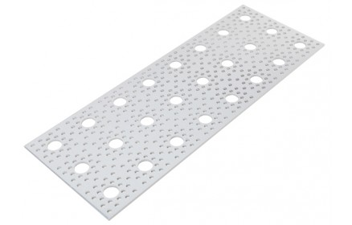
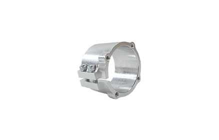
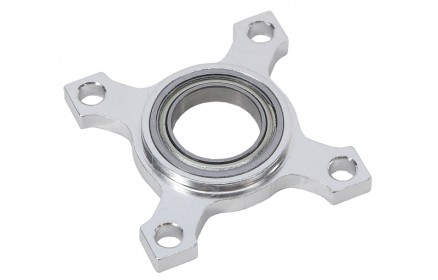

todo:
fix picture sizes

# Main Body Assembly

The body is the housing of all the electronics for the rover. It is the attachment points for the rocker-bogie systems, as well as the differential pivot system.

## 1. Features
  * Gives passthrough connections for USB ports on Raspberry Pi
  * Cutouts on the rear of the body give access for voltage monitor and battery for charging
  * Easy attachment point for differential pivot system
  * Uses Actobotics parts to facilitate modularity and ability to change, and add new components easily.

## 2. Information about module

| Author/Creator            | JPL       |
| --------------            | -------            |
| Cost without 3D printer   | 240.38             |
| Cost with 3D printer      | 240.38             |
| Date Added                | 4/11               |
| Group/Organization/School | JPL                |
| Time to build             | 3 hrs              |

## 3. Skills
  * Band Saw/Dremel

## 4. Tools

### 4.1 Mandatory
  * Band saw or Dremel
  * Allen Key set
  * Imperial Wrench Set

### 4.2 Optional
  * Laser cutter

## 5. Dependencies on Other Modules:
  * None

## 6. Mechanical Interface/Attachments to Rover:
  * 0.5 Inch aluminum rod into bearing blocks on rocker-bogie arms
  * 0.5 Inch aluminum rod into clamping hub on differential pivot

## 7. Machining/Fabrication

### 7.1. 9x12 Aluminum Plate Drilling

| Item | Ref | Qty | Image |
| :--- | :-- | :-- | :---: |
| 9"x12" Aluminum Plate | S35 | 1 |  |

First we need to drill a hole in one of the 9x12 Aluminum plates **S35** because we will need a hole of just over 0.5 in diameter for the differential pivot mount. There is already a small hole drilled in the location we want to use, but it needs to be widened substantially. Start with the drill #23 and drill the hole shown by Figure 1. Repeat this with drill sizes stepping up until you get to a drill of 0.5 in.

Take the 0.5 in hollow rod **S19** and make sure it spins freely in the hole you have created. If it does not, drill the hole slightly larger or sand/file the hole until the rod spins with no resistance (The 0.5 in hollow rod must spin _freely_ while mounted inside the bearing blocks. See step 2.2 Differential pivot for example. It may help to follow step 2.2 in this document to test if you have enough clearance)

|   |
|:-:|
| Figure 1: Drilling the Aluminum Plate |

### 7.2. Laser Cut Parts

The front and back panel of the rover are designed to be made from laser cut acrylic, as to keep them modular to design different things to mount there as wanted. The 2D cutout files  are the .DXF files  and can be found on the github under Mechanical - Body Assembly - Laser Cut Parts

If you do not have access to a lases cutter there is an online service which you can order these from below: https://www.sculpteo.com

To get the above parts from Sculpteo, go to Laser cutting and then upload these files (with mm selected as units). Hit Next. Make sure scale is set to 100%, change the material to Acrylic, have thickness to 1/8 inch, and then select whatever color you wish.

## 8. Mechanical/Structural Assembly

**DISCLAIMER** All images were created using CAD that has #6-32 Socket head cap screws, but the parts list calls for button head screws. The button head screws are correct.

### 8.1. Chassis

| Item | Ref | Qty | Image |
| :--- | :-- | :-- | :---: |
| Dual Side mount A            | S17 | 4 |  |
| 4.5"x12" Aluminum Plate      | S37 | 2 |  |
| 1" PVC Clamp                 | S24 | 1 |  |
| 9"x12" Aluminum Plate        | S35A | 1 |  |
| #6-32x1/4" Button Head Screw | B1 | 16 |  |
| #6-32x3/8" Button Head Screw | B2 | 4 |  |
| Allen Key Set                | | |  |
| 5/16" Wrench                 | | |   |

8.1.1. **Top panel** Take the modified 9x12 Aluminum plate **S35A** and attach the four Dual side mount A **S1** using screws **B1** at the locations shown below. Take care to match the orientation shown.

|  |
|:-:|
| Figure 2: Attaching side mounts to top panel |

8.1.2. **Attach the side panels** Attach the 4.5x12 plates **S37** to the dual side mounts using screws **B1**

|  |
|:-:|
| Figure 3: Attach the side panels |

8.1.3. **Attach the PVC clamping hub** Attach the 1-inch PVC bore clamping hub **S24** to the top plate of the body using screws **B1** Use the location shown in Figure 4.

|  |
|:-:|
| Figure 4: Attach the PVC clamp to top plate |

### 8.2. Differential Pivot Block

The differential pivot is used to transfer weight off of the wheel that is currently climbing to the other front wheel, allowing the rover to climb more easily. Additionally, it serves as a second contact point for the rover’s body such that it does not rotate freely about the cross rod.

| Item | Ref | Qty | Image |
| :--- | :-- | :-- | :---: |
| 0.5" Pillow Bearing Block  | S11 | 2 |  |
| #6-32x1/4" Spacer          | T1 | 8 |  |
| #6-32 Hex nuts             | B11 | 4 |  |
| #6-32x1" Button Head Screw | B6 | 4 |  |
| Allen Key Set              | D2 | |  |

8.2.1. **Mount the pillow bearing blocks** Using spacers **T1**, screws **B6**, and hex nut **B11**, mount the pillow blocks **S11** to the top of the body over the hole in the aluminum plate that you drilled earlier as shown in Figure 5.

|  |
|:-:|
| Figure 5: Mounting the pillow bloc |

### 8.3. Control Board PCB

| Item | Ref | Qty | Image |
| :--- | :-- | :-- | :---: |
| Assembled Control Board PCB | E1 | 1 |  |
| #6-32x3/8" Button Head Screw | B2 | 4 |  |

You may want to skip this step until the PCB is completed and tested and insert the PCB late

8.3.1. **Mount the PCB** Mount the PCB **E1** to the top of the chassis using screws **B2**. Note the position of the PCB below.

|  |
|:-:|
| Figure 6: Mounting the PCB |

|  |
|:-:|
| Figure 7: Mounting the PCB |

Note the screw positions in Figure 7. You might not be able to get the screw circled in light blue in
because of the PVC clamping hub. This is okay, install the other 3 circled in yellow.

### 8.4. Closing the body

| Item | Ref | Qty | Image |
| :--- | :-- | :-- | :---: |
| Dual Side Mount A              | S17 | 12 |   |
| #6-32x1/4" Button Head Screw   | B1 | 28 |    |
| 9"x12" Aluminum Plate          | S35 | 1 |    |
| Volt Meter                     | E38 | 1 |    |
| Laser Cut Front Panel          | S39 | 1 |    |
| Laser Cut Back Panel           | S40 | 1 |    |
| Switch                         | E39 | 1 |    |
| 3D printed Battery Holder      | S41 | 2 |    |
| #6-32 Heat set insert          | I2 | 4 |     |

8.4.1. **Attach the Dual Side Mounts** Mount Dual Side Mounts A **S17** using screws **B1** on the side plates in both the front and back.

|  |
|:-:|
| Figure 8: Dual Side Mount A locations |

8.4.2. Also attach Dual Side Mounts A **S17** using **B1** screws on the top plate, in the front and back

|  |
|:-:|
| Figure 9: Dual Side Mount A (cont) |

8.4.3. **Front and back panels** Using screws **B1** attach the front and back laser cut panels to the chassis.

|  |
|:-:|
| Figure 10: Front and Back Panels attached |

8.4.4. **Attach the switch and volt meter** Take the Volt Meter **E38** and the Switch **E39** and attach them to the back panel. Note that the switch goes in from the inside of the body, and the volt meter should snap press fit in from the outside.

|  |
|:-:|
| Figure 11: Volt Meter/Switch Installation |

8.4.5. **Attach the Battery Holder** Take the 3D printed Battery holder **S41** and using a solder Iron at 460 degrees F, push the #6-32 heat-set insert **I2** into the battery holder as shown below.

|  |
|:-:|
| Figure 12: Installing heat set inserts|

8.4.6. **Install the battery holders** Mount the Battery holders onto the body assembly using screws **B1** as shown in Figure 13.

|  |
|:-:|
| Figure 13: Battery holder installation |

8.4.7. **Build bottom plate assembly** Take the 9x12 Aluminum Plate **S35** and attach 6 dual side mount A **S17** along the edges as shown in Figure 14. Be sure to verify that the orientation of the dual side mounts **S17** matches the pictures.

|  |
|:-:|
| Figure 14: Building the Bottom Panel |

8.4.8. **Attach the bottom plate** Take the bottom plate assembly you constructed in the previous step and attach it to the chassis.

|  |
|:-:|
| Figure 15: Attaching the Bottom Panel |

The Body Assembly is now Complete!

|  |
|:-:|
| Figure 16: Completed Body Assembly |
