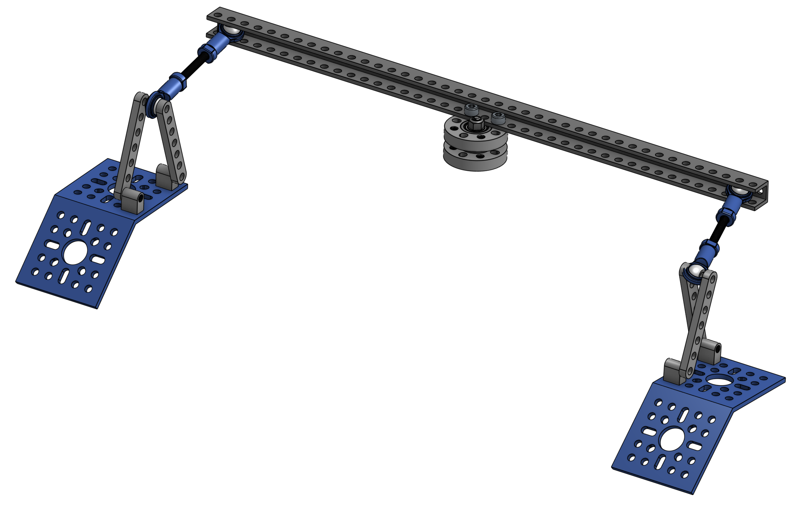

# Differential Pivot

**IN PROGRESS**

The Differential Pivot helps to offload forces from one side of the rover to the other while climbing. The differential pivot is crucial in the rocker-bogie suspension system and is designed to help keep all 6 wheels on the ground at all times. It also allows a second attachment point for the body so that it does not freely rotate about the center axes that run through it and connects the two rocker-bogies.

## Features

* Uses inexpensive RC turnbuckles to give multi-degree rotation about 2 separate points, allowing the geometry to be greatly simplified

### Mechanical Interface/Attachments to Rover

* The 45 degree angled brackets (in blue in the above picture) attach to each rocker-bogie
* The bearing assembly in the middle attached to the top of the body

## Assembly

TODO: update table.

| Item | Ref | Qty | Image |
| :--- | :-- | :-- | :---: |
| M4x7 button head | ? | 4 | |

TODO: complete build instructions with steps and pictures.
