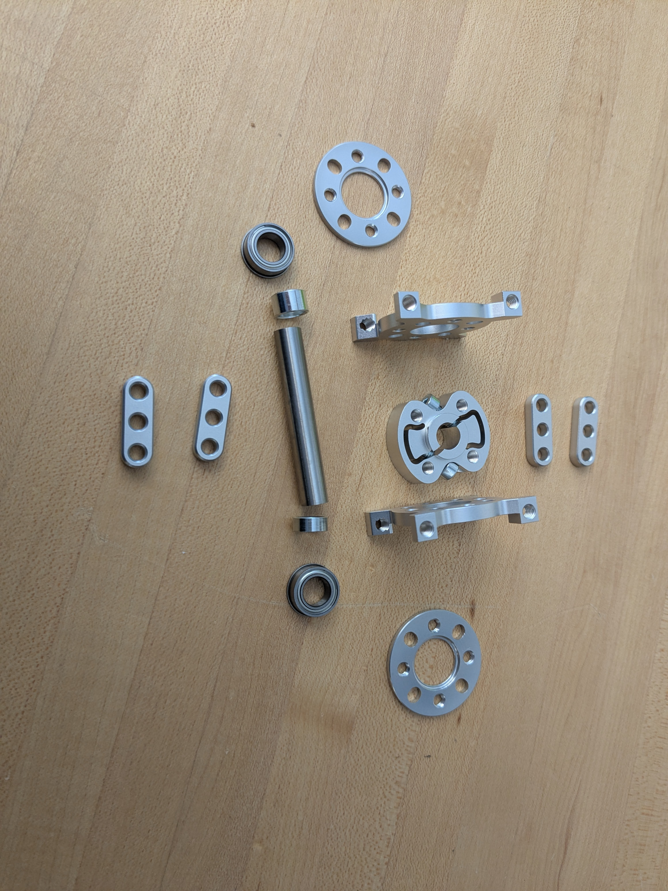
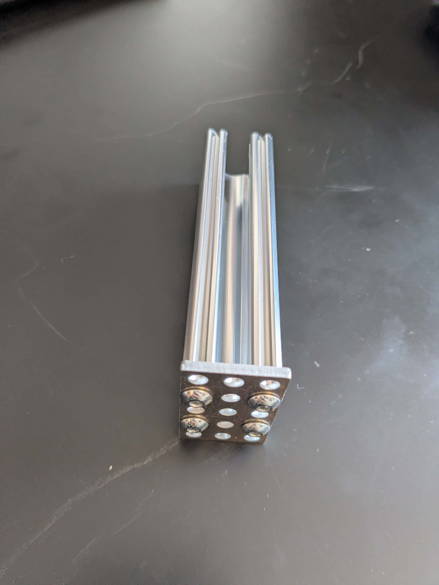
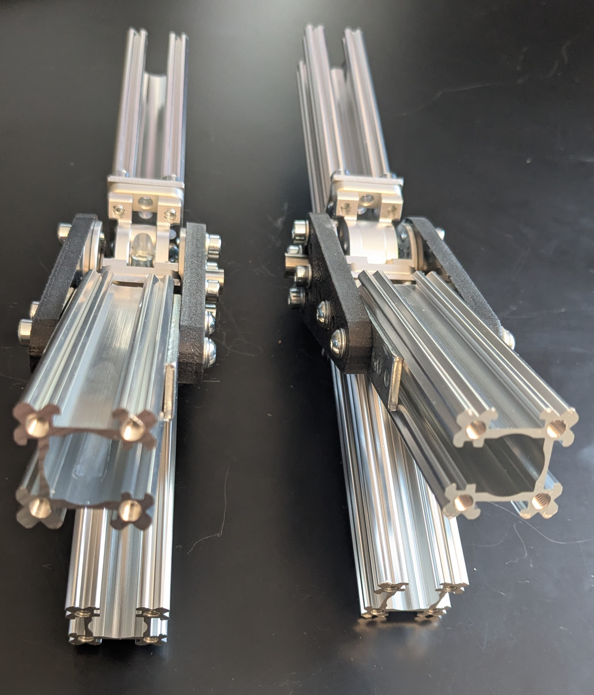
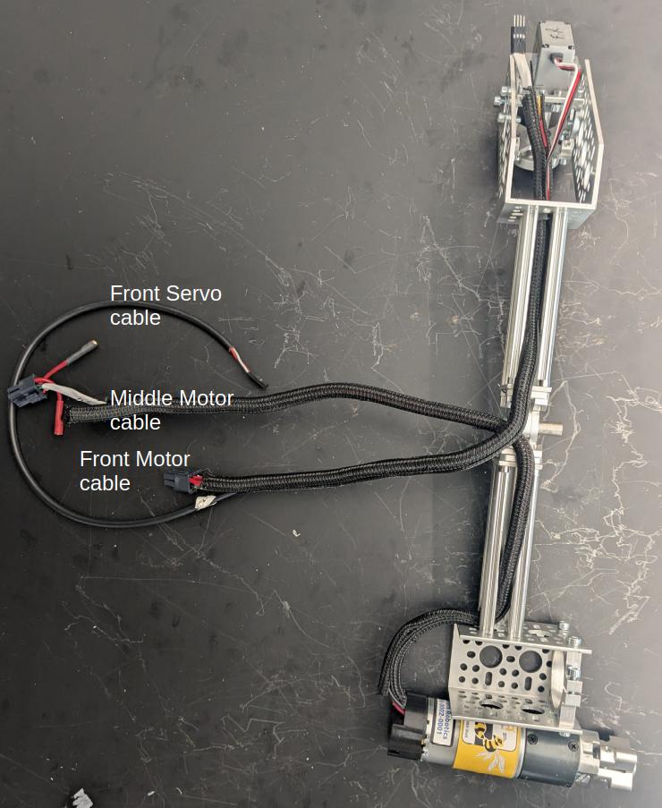
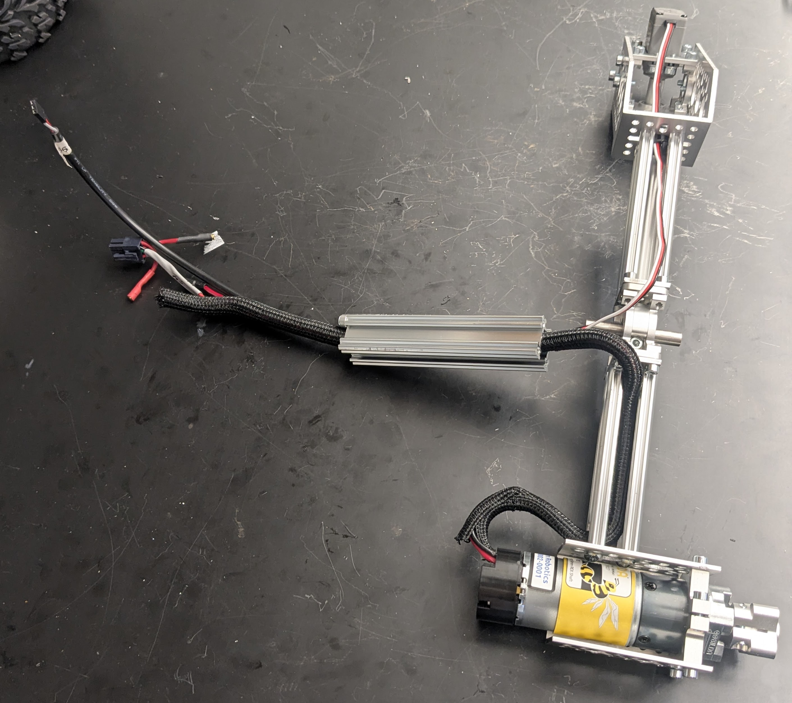
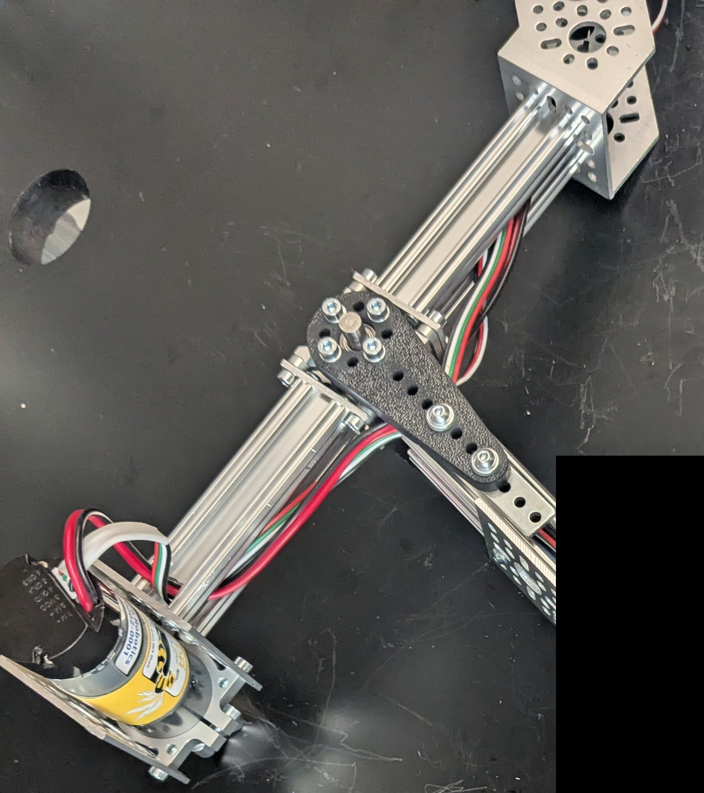
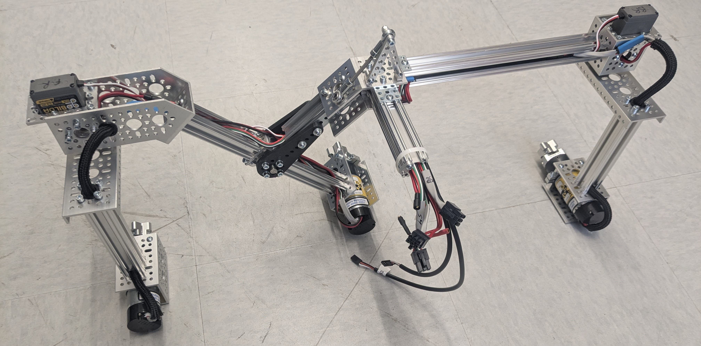

# Rocker-Bogie Suspension

The Rocker-Bogie is the suspension system that enables the rover to climb aggressive obstacles. The design allows all 6 wheels to be in contact with the ground as much as possible, increasing traction.  The suspension system on a typical consumer vehicle can traverse obstacles about half the height of one wheel; the Rocker-Bogie suspension system can traverse obstacles over 2 times the height of the wheel.

## Features

* Modular link lengths give the ability to customize rover geometry
* Optimized for climbing in the forwards direction
* Rigid support structure resists lateral bending/twisting about the Bogie joint

## Mechanical Interface/Attachments to Rover

* Servo block output shafts connect to corner motor assemblies
* rocker-bogie connects to the body axis clamp via two brackets that are detailed in the [integration readme](../../integration/README.md)
* middle drive motor connects to the extruded shaft at the bottom

## Assembly

You will be creating two almost identical assemblies. Below instructions are for one side. We recommend building one side first rather than trying to build both sides in parallel, that way you'll be able to make the other side faster. Before you start building, familiarize yourself with the details of this assembly, in particular because you'll be building two assemblies that are mirrorred. Specifically, you'll want the open slits on the bogie to be facing the same side:

| close up showing slits                         |
| ---------------------------------------------- | 
|   |

### Creating the rocker-bogie joint

First, gather the parts you'll need for the joint that connects the rocker to the bogie.

| Joint Parts |
| ---------------------------------------------- | 
|   |

Assemble the joint following the steps below. Since the clamp in the middle isn't symmetric and protrudes on one side, two spacers of different lengths are used. You can see this in the top left image. You'll use spacer `1522-0010-0040` of length 4mm on the side of the clamp that has the protrusion, while on the other, flat side, you'll use spacer `1514-0010-0060` of length 6mm. This creates a tight assembly that prevents the joint from flexing from side to side.

|             |         |
| -------------------------------------- | ----------------------------------- |
|  |  |

Wait with the yellow and orange (ball bearing) parts. The bearing should first be inserted into the yellow hub.

> **Tip**: Use the OnShape model and navigate to the tab 'rocker-bogie' in the bottom to isolate this assembly. Then right click on various parts to temporarily hide them so you can see how the assembly works in 3D.

### Attach the control arms to the joint bearings

Referencing the orange and yellow parts in the image below, connect the hub (yellow) with the inserted bearing to the control arm using 8x socket or button M4 screws of length 12mm (or 10mm). Use washers so that the screw doesn't bury itself in the plastic control arm and to make sure the screw doesn't extend (much) on the insides of the hubs. When done, the bearing should not be able to fall out. Put these two assemblies aside for now. We'll connect each finished joint to the rockers in the following step.

### Create the bogie

Attach a 3 hole x 5 hole plate `1116-0024-0040` to each of two length 96mm aluminum extrusions `1118-0024-0096` with 10mm button head screws as shown below.  Pay attention to direction of the slits for the cabling. You'll want the slit to face the short side of the plate.

Now attach the plate to a 3-hole flat beam, and to the bogie joint, with 10mm socket head screws.  You'll want the slits to face the top of the rover (the bogie arm) so you can route the cabling going to the front servo and motor inside of the channel.

| Plate on bogie shaft| Assembled bogie |
| ---------------------------------------------- | ---------------------------------------------- | 
|   |   |

#### Attach the front servo bracket and middle wheel bracket

Attach bracket `1111-0003-0001` to the top of the extruded shaft you just attached to the joint using three or four M4 screws.

Attach U channel `1120-0002-0072` to the bottom of the other extruded shaft you just attached to the joint using three or four M4 screws.

#### Route wiring through bogie

Install `2911-0014-0001` grommets at the top and bottom of the extruded aluminum goRail (inside the U channel on the bottom, and inside the servo bracket on the top), to protect your wires as they go around corners.

Run the servo wiring, including a 54cm extension, down from the front servo, which should be near the front servo bracket, down toward the joint.  

Run the 54cm encoder wires for the front corner motor from the front servo bracket toward the joint.

Run the middle motor power wiring from the U channel up toward the joint.

Run the middle motor encoder wires from the joint down to the U channel (or as shown in the picture, around it if you choose to notch your shafts), and encase in the protective sleeve.  

It should look like the last picture below, except that your servo block and servo won't be installed at this point.

| 
| --------- | 
| Bogie wiring installed.  |

#### Attach the front servo and servo block

Attach bracket `1111-0003-0001` to the extruded shaft you just attached to the joint using three or four M4 screws.

Then assemble the servo block to the servo motor. Insert the set screw that came with the servo inside the hollow shaft that fits onto the spline profile on the servo output, but don't tighten it yet as we'll have to readjust later when calibrating the corner motors. This screw prevents the corner assembly from falling off the rocker-bogie while driving. Finally, attach the servo motor and block to the front rocker-bogie bracket. The image below shows the resulting assembly.

|  |
| --- |
| Bracket and Bogie Joint |

### Connect the control arms and rocker to the joint

Take one of the control arms with bearing and hub you made in an earlier step and attach the steel bracket, two hurricane nuts, and 4x socket screws like in the image. 

> **NOTE**: Consider using an extra screw and hurricane nut in the middle to strengthen the joint further

Repeat for the other control arm. If the screws don't slide freely through the holes in the black control arm, drill the holes out to make sure the hurricane nuts rotate and lock in place in the rail.

Connect the short part of the rocker (shaft `1110-0024-00096`) to the control arm on one side such that the hurricane nuts fit all the way in the channel.  Tighten such that you can still slide the control arm relative to the channel.  Make sure the slit faces the underside/back of the rover (you can also point the slit upwards or downwards if you prefer). 

Route the wiring coming from the front, middle, and rear motors and servos through the slit (see left image below). It helps to temporarily keep the wiring in place with some tape as you attach the shaft to the bogie joint.

Flip the assembly over and repeat on the other side, making sure the setup is symmetric. Now tighten the screws all the way.

|  |  |
| --- | --- |
| Running wiring through short shaft of rocker | Joint installed. | 

> **NOTE**: the OnShape model may represent the orientation of the slits incorrectly. In order to make the model nimble, the same rocker-bogie assembly is used on both sides of the rover which has the side-effect that the two assemblies aren't mirrorred like they are supposed to be. Always stop to think about what you're building to avoid having to take things apart later.

### Assemble the back servo

Attach the 1-channel U bracket to the long extruded shaft `11118-0024-0288` using 3 or 4 M4 socket screws of length 10mm. Assemble another servo block as you did before. Insert this into the 1-channel bracket and attach using 6 button M4 screws of length 10mm (6mm or 8mm also works).

### Attach the front and back of the rocker-bogie

Use 4 hurricane nuts and the 45-degree bracket to connect the front and back of the rocker-bogie with 6mm M4 socket screws, as shown in the image below, on the underside of the rover. Avoid screws longer than 6mm, as they will hit the goRail before fully tightening.

Flip the assembly over and attach the two brackets like in the picture below, using 4 more hurricane nuts and socket screws to secure the pieces to the rocker bogie aluminum extrusions. Then route all wires through the aluminum channel that will eventually slide into the rover body. The slit in the channel should orient in the direction where most of the cables enter it (flipped compared to the image below) but either direction works.

|  |
| --- |
| Wiring snugly fits inside the extruded aluminum channels, even with little or no sheathing. Only use this image as an idea of how the wiring should be routed, other parts of this image may not reflect the current state of the rocker-bogie at this stage in the process. |

Secure the channel to the rocker-bogie using 5 hurricane nuts (2 at the bottom) and socket screws, making sure the channel end sits flush to the other channels and the wiring isn't squeezed inbetween.

|  |  |
| --- | ---|

Repeat these steps for the other rocker-bogie, making sure it mirrors the first assembly. Once you're done, you're ready with these very important subassemblies!

> **Help improve documentation!** Please make an issue on Github when you spot something that's off or can be improved. Pull requests are even better! If you have a question, post in the #troubleshooting channel in our Slack group.