#  Rocker-Bogie Suspension
The Rocker-Bogie is the suspension system that enables the rover to climb aggressive obstacles. The design allows all 6 wheels to be in contact with the ground as much as possible, increasing traction.  The suspension system on a typical consumer vehicle can traverse obstacles about half the height of one wheel; the Rocker-Bogie suspension system can traverse obstacles over 2 times the height of the wheel.

## 1. Features
  * Modular link lengths give the ability to customize rover geometry
  * Optimized for climbing in the forwards direction
  * Rigid support structure resists lateral bending/twisting about the Bogie joint

## 2. Information about module

| Author/Creator            | JPL       |
| --------------            | -------            |
| Cost without 3D printer   | 203.94             |
| Cost with 3D printer      | 203.94             |
| Date Added                | 4/11               |
| Group/Organization/School | JPL                |
| Time to build             | 5 hrs              |

### 2.1 Skills
  * Band Saw/Dremel

### 2.2 Tools
* Band Saw/Dremel

#### 2.2.1 Mandatory 
  * Band saw or Dremel
  * Allen Key set
  * Imperial Wrench Set

#### 2.2.2 Optional

### 2.3 Dependencies on Other Modules:
  * None

### 2.4 Mechanical Interface/Attachments to Rover:
  * Actobotics channel and channel connectors to middle wheel assembly
  * Actobotics channel and channel connectors to corner steering assembly
  * 1/2 inch clamping hub to 1/2 aluminum rod on differential pivot
  * 1/2 bearing blocks to 1/2 aluminum rod on body 

## 3. Machining/Fabrication

| Item | Ref | Qty | Image | Item | Ref | Qty | Image | 
| :--- | :-- | :-- | :---: | :--- | :-- | :-- | :---: | 
| 3" Channel            | S2 | 4 | 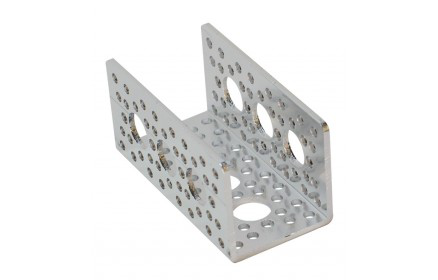 | Metal Hacksaw or Bandsaw | D4 |  |  |

### 3.1 Cutting the Aluminum Channels

On piece **S2**, measure the distance shown in Figure 1 from the edge and mark a straight line from the opposite corner to that point. Cut off the corner along that line. We use this piece to make the geometry of the rocker-bogie more structurally reinforced across its lateral bending moment. However, these channels will need to have their corners cut out because of clearance issues further on. In total, you will need 4 of these modified pieces. Cut those now.

|   |
|:-:|
| Figure 1: Channel Cutting Dimensions |

### 3.2 Cutting the Aluminum Rod

Take the 4 inch aluminum rod **S18** and cut it down to 3 inches long, indicated by Figure 2. These cuts keep the rod from sticking out too far from either end of the rocker-bogie pivot joint. In total, you will need 2 of these 3-inch aluminum rods. Cut those now.

| 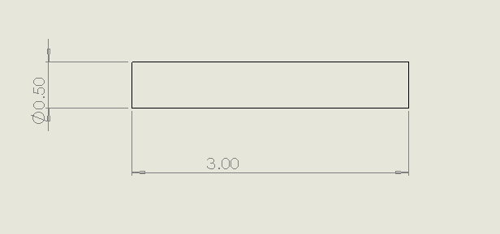 |
|:-:|
| Figure 2: Aluminum Rod cutting dimensions |

## 4. Mechanical/structural Assembly

The Rocker-Bogie assembly is what attaches your wheels to the rover's body and allows it to climb over obstacles.

| Item | Ref | Qty | Image | Item | Ref | Qty | Image | 
| :--- | :-- | :-- | :---: | :--- | :-- | :-- | :---: | 
| 3" Channel (Modified) | S2A | 4 |  | #6 Washer  | W1 | 28  |  |
| 3.75" Channel | S3 | 4 | 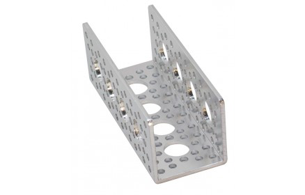 | 0.5" Nylon Washer  | W3 | 12  |  |
| 9" Channel | S5 | 2 | 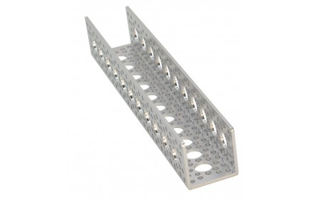 | #6 x 1/4" Standoff  | T1 | 32  |  |
| Pattern F Bracket | S7 | 8 | 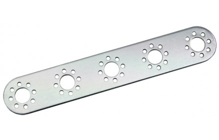 | #6-32 x 3/8" Button Head Screw  | B2 | 40  |  |
| 0.5” Pillow Block | S11 | 4 | 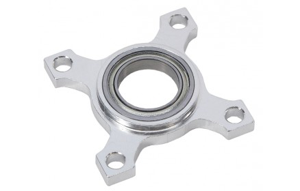 | #6-32 x 5/8" Button Head Screw  | B4 | 32  | 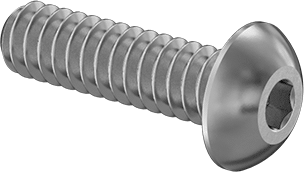 |
| 0.5” Face Tapped Clamping Hub | S13 | 2 | 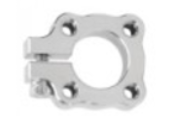 | #6-32 Locking Hex Net  | B11 | 68  | 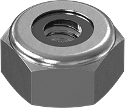 |
| 0.5" x 3" Aluminum Tube (Modified) | S18A | 2 | 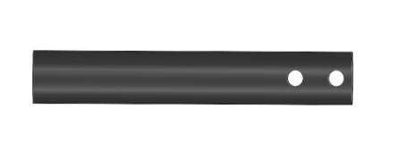 | Allen Key Set  | D2 |  | 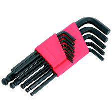 |
| 0.5” Collar Clamp | S22 | 4 |  | 5/16 Wrench  | D1 |   | 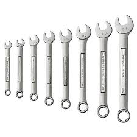 |

### 4.1 Begin the Rocker Attachment

Attach 9 inch channel **S5** and the a modified 3 inch channel **S2A** to pattern F bracket **S7** using screws **B2** and hex nuts **B11** making sure to put a 6-32 washer **W1** in between the channels and the bracket. Make sure that the cut modification in **S2A** is angled towards the 9 inch channel as shown in Figure 4.

| 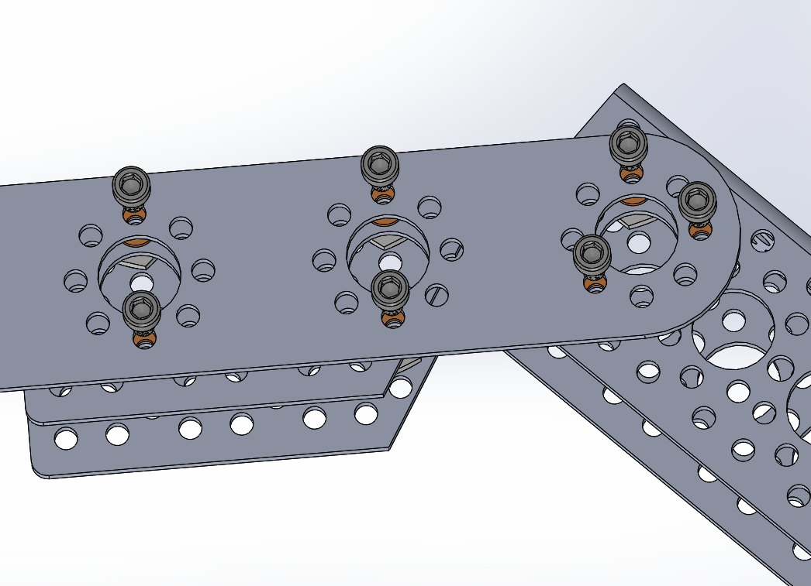 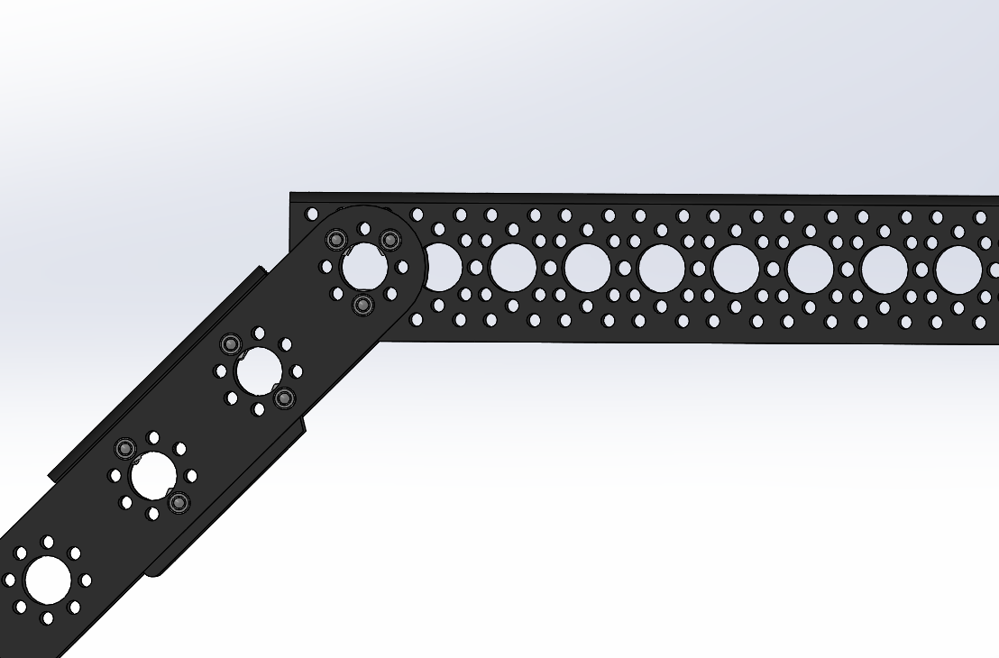  |
|:-:|
| Figure 3: Begin the Rocker attachment |

### 4.2 Start the bogie pivot joint

Put rod **S18A** though the last hole in the pattern F bracket. Then,  assemble the pivot joint by attaching another modified 3 inch channel **S2A** and another pattern F bracket using washers **W3**, collar clamp **S22**, standoffs **T1**, and screws **B4**. Make sure to use the 2nd from the bottom hole on the 2nd pattern F bracket. See Figure 4.

|   |
|:-:|
| Figure 4: Start Rocker-Bogie pivot joint |

### 4.3 Attachment for Front Corner

Attach 3.75 inch channel **S3** to the top hole of the pattern F bracket using spacers **T1**, screws **B4**, and hex nuts **B11** as shown in Figure 5.

|   |
|:-:|
| Figure 5: Attaching channel to corner steering |

### 4.4 Attachment for middle Wheel 

Attach another 3.75 inch channel **S3** to the bottom hole of the pattern F bracket using spacers **T1**, screws **B4**, and hex nuts **B11** as shown in Figure 6.

|  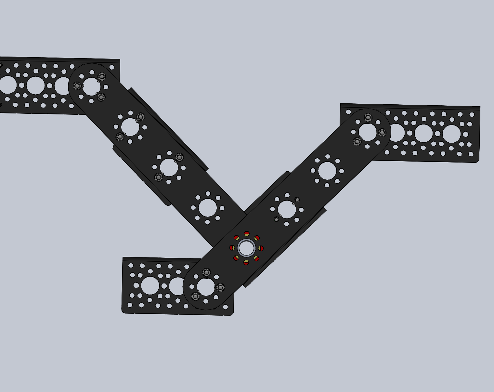 |
|:-:|
| Figure 6: Attachment for middle wheel |

### 4.5 Opposite edge of Rocker-Bogie Joint

Attach another Pattern F bracket **S7** to the opposite side of the channels using washers **W1** and **W3**, screws **B2**, and hex nuts **B11** as shown in Figure 7.

| 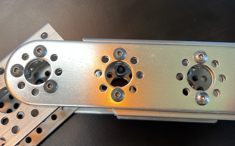  |
|:-:|
| Figure 7: Start the other side of Rocker-Bogie joint|

### 4.6 Other edge of Rocker-Bogie Joint (2)

Using washers **W1**, collar clamp **S22**,  spacers **T1**, and screws **B10** attach pattern F bracket to the final connecting channels as shown in Figure 8.

| 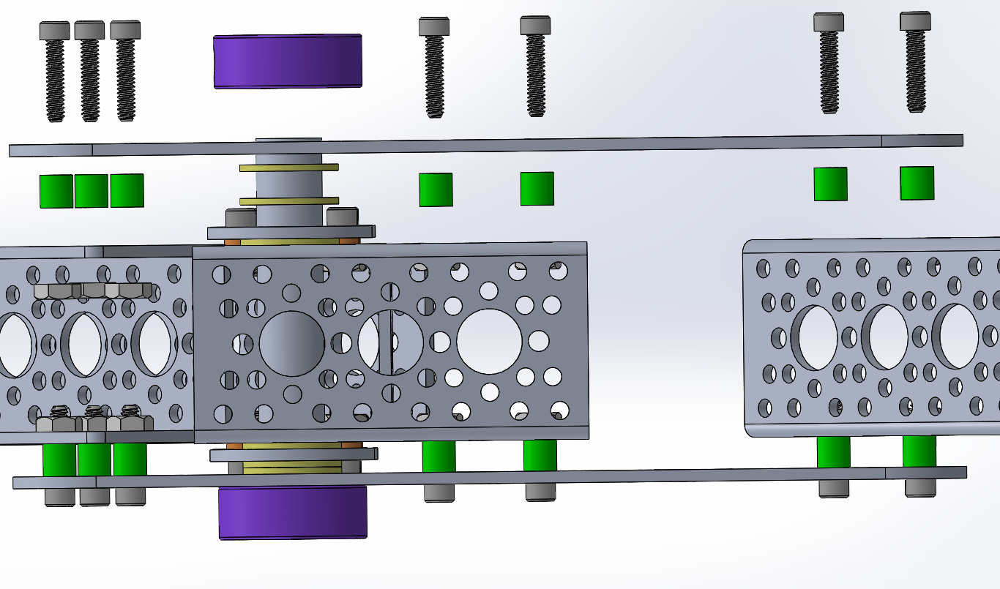  |
|:-:|
| Figure 8: Other edge of Rocker-Bogie joint |

### 4.7 Checkpoint

At this point your rocker bogie joint should look like Figure 9.

| 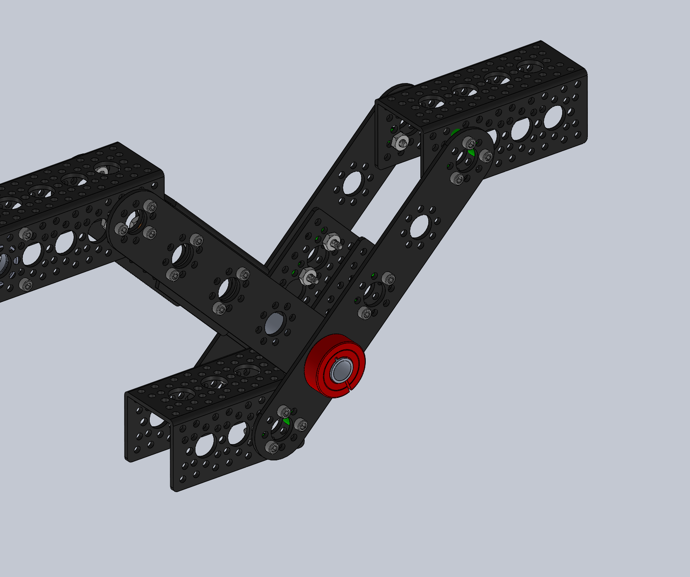 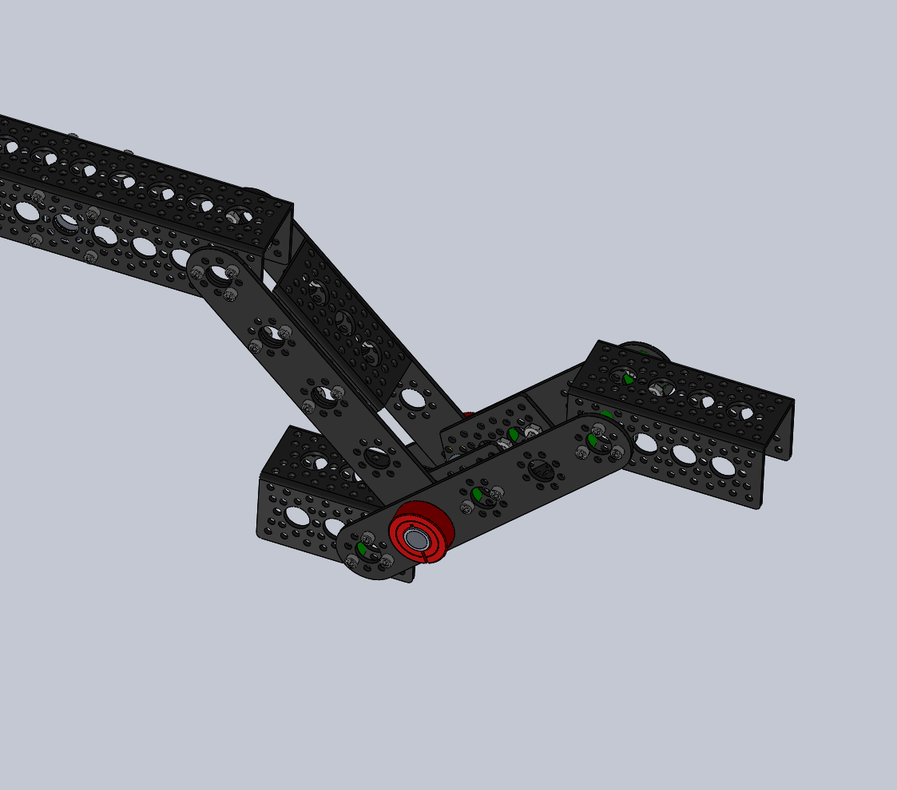 |
|:-:|
| Figure 9: Rocker-Bogie Checkpoint |

### 4.8 Attach Bearing Blocks

Attach two Pillow Bearing Blocks **S11** using screws **B2** and hex huts **B11** as shown in Figure 10. The bearing blocks should be aligned with the 5th large hole back from the front of the 9-inch U channel.

| 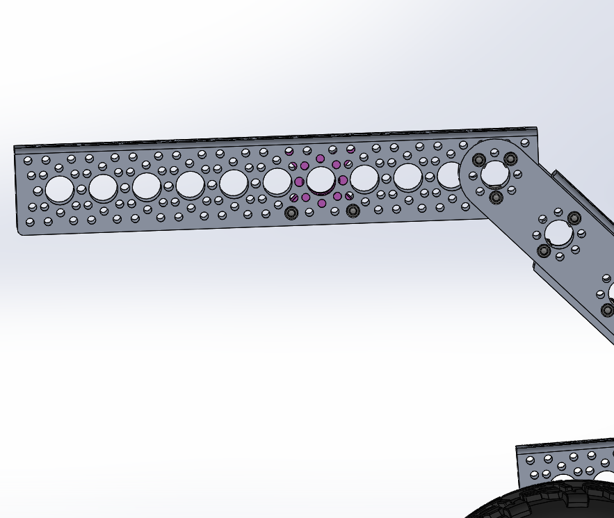 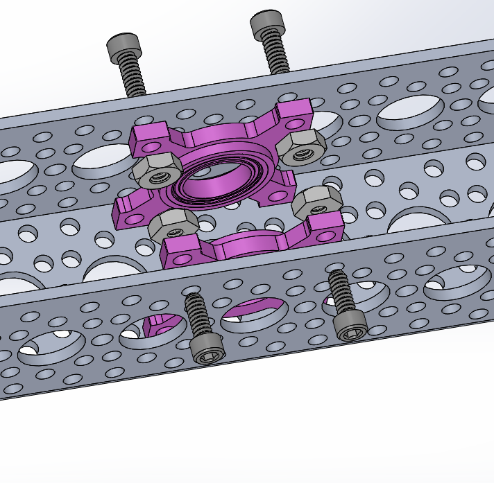 |
|:-:|
| Figure 10: Pillow bearing block attachment|

### 4.9 Attach Clamping Hub

Attach the Clamping Hub **S13** using screws **B2** as shown in Figure 11. The clamping hub should be centered above where you just placed the pillow bearing blocks.

|  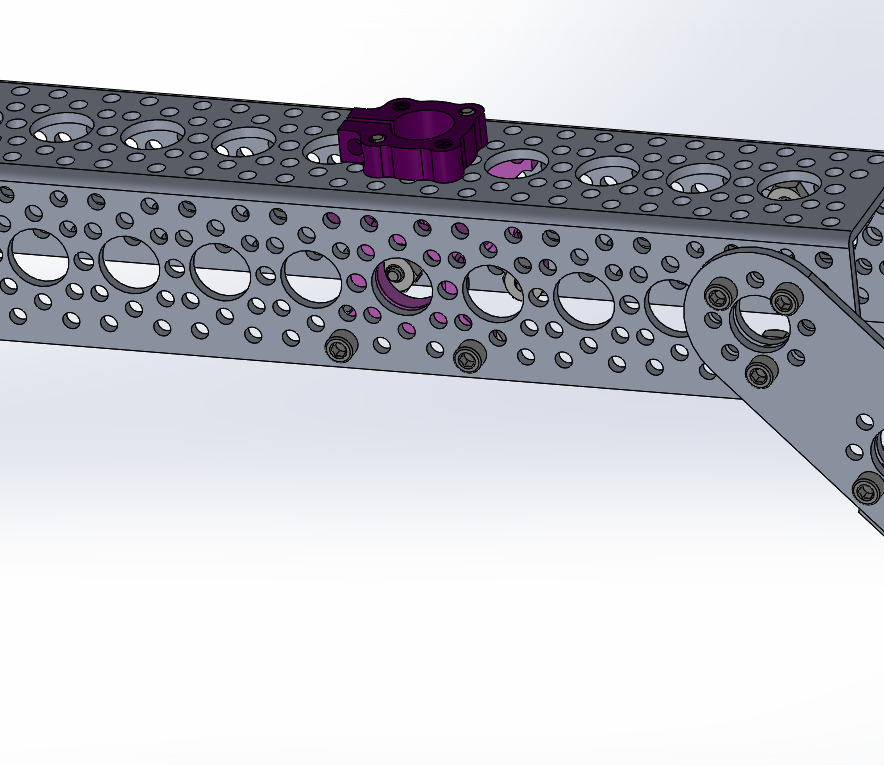 |
|:-:|
| Figure 11: Clamping hub attachment |

Your rocker-bogie suspension joint is now complete!  Repeat all of section 2 in this document to create the suspension for the other side of the rover.

|  |
|:-:|
| Figure 12: Finished Rocker-Bogie |
