# Servo Motor Gear Replacement

In some cases, when the rover experiences a sudden, sharp impact (like a crash into a hard object), the corner servo motors can fail. More specifically, a central shaft holding two of the gears in place has been known to shear. When this happens, the gears will not mesh as smoothly, and, when forced, this can cause gear teeth to deform and break off completely from the output gear (see below).
 
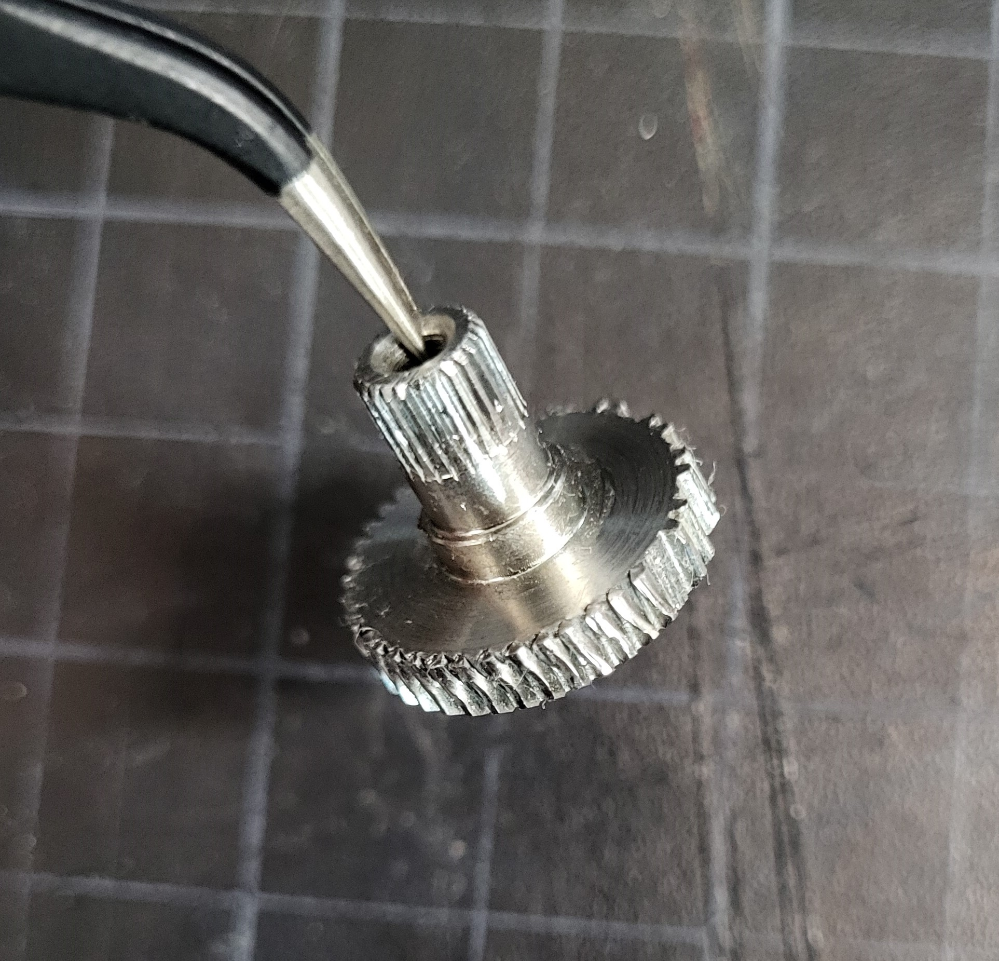
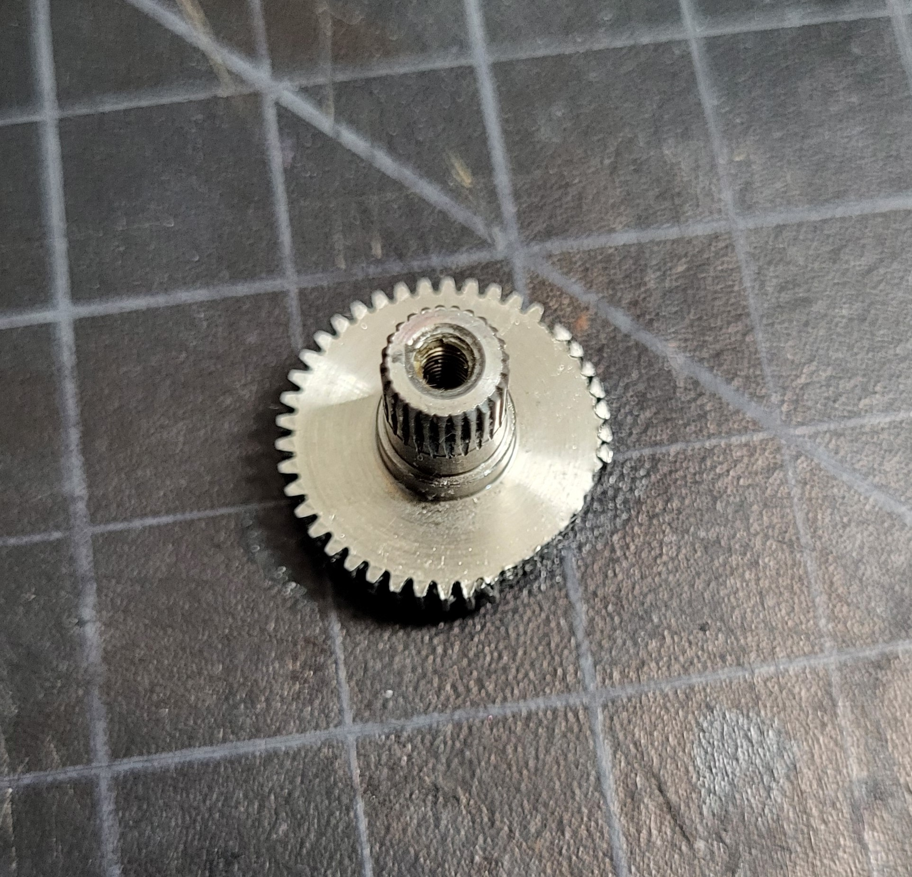

This does not mean that the servo motor is useless. We can replace the gearset of the servo motor instead of purchasing a whole new motor. 

GoBilda sells [replacement gearsets](https://www.gobilda.com/servo-gear-set-for-2000-series-torque-servo-v3-0/) for their servo motors, as well as [replacement shafts](https://www.gobilda.com/replacement-shaft-for-2000-series-dual-mode-servo-gear-set-6-pack/). Be sure you have [grease](https://www.gobilda.com/super-lube-synthetic-grease-with-ptfe-clear-1ml-2-pack/) for the gears!

For the rest of this guide, references to "top", "bottom", "output gear", and "central shaft" are according to the following image:

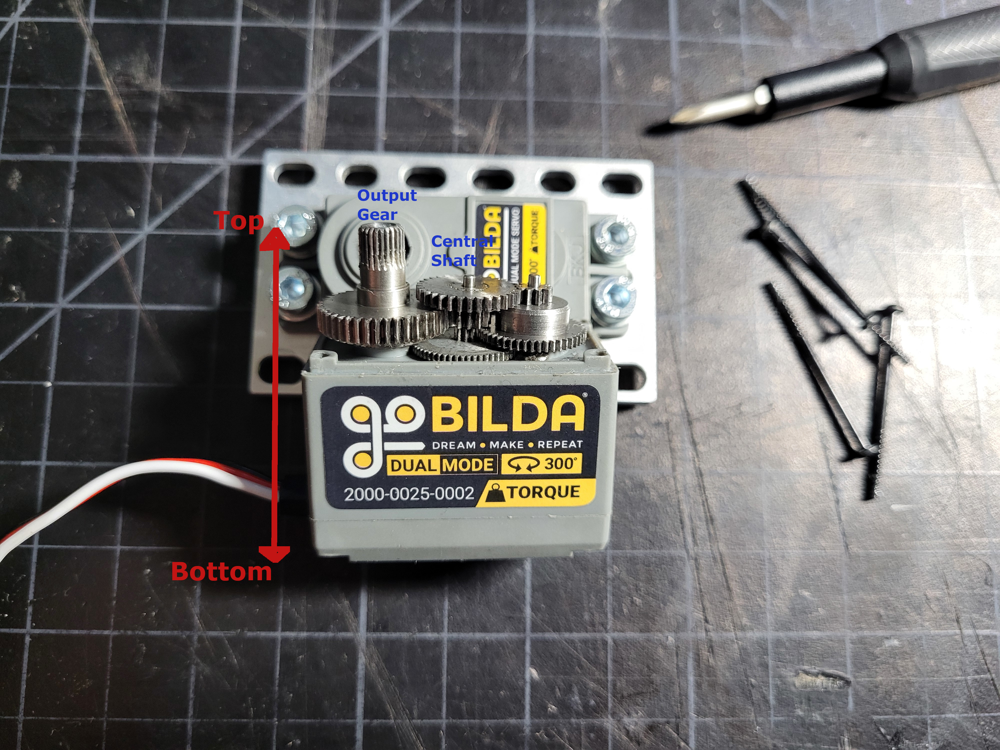

## Diagnosing an issue

The first sign of an issue with the servo motors is when your corner wheels will not turn. This could be caused by either a loose electrical connection, or an issue in the gearset. 

In either case, power down the rover to allow the servos to free spin. Verify that the electrical connections are stable before resorting to motor disassembly.

If your connections are stable, then manually rotate the corner assembly. Rotate it to the extremes slowly, going through this motion a few times. If at any point the gears feel like they are binding or sticking, then there is an issue in the gearset. At this point, it is possible that just the shaft has sheared and the gears themselves are still intact. If you hear any rattling or the binding isn't momentary, then at least one gear has likely been damaged and needs to be replaced.

If the gears bind up, **do not force the rotation any further!!** This could cause more gears to fail if they haven't already!

## Disassembling the Motor

1) You have a choice to either remove the motor from the corner assembly, or to disassemble the motor in-situ. In either case, first remove the screw connecting the servo hub-shaft to the servo output.

    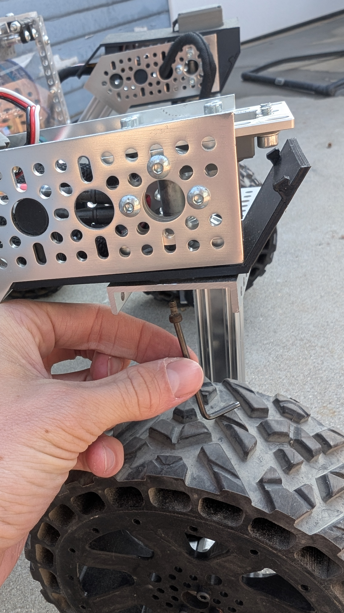

2) Remove the corner screws from the servo motor body.

    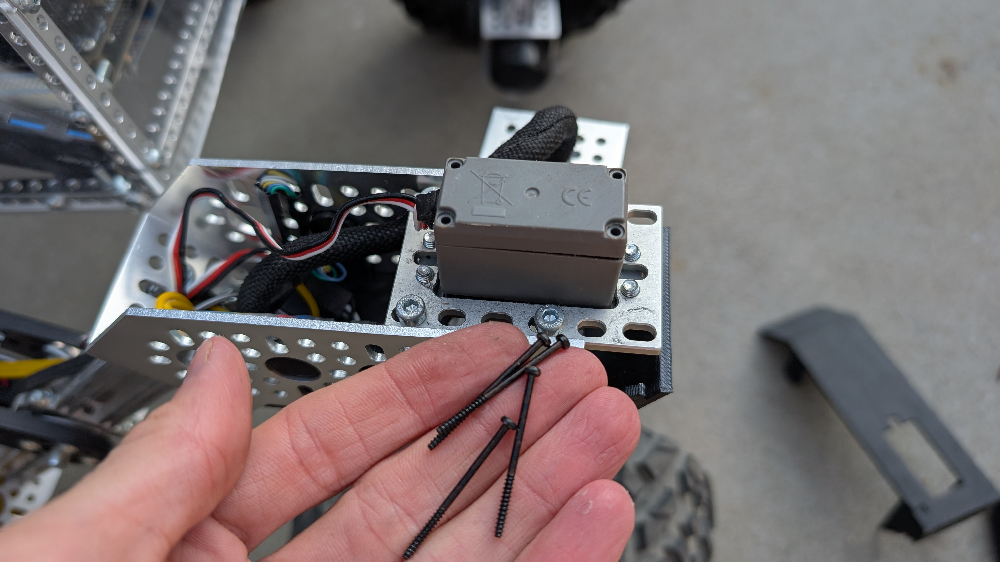

3) Being careful not to remove the bottom portion of the body, which contains the servo circuit board, remove the body from the top portion of the servo.

    

    In the image, note how the shaft sections from the two central gears seem to have a ragged/jagged surface. This is the central shaft, which has sheared. 

    

    This closeup better shows both the sheared shaft, and the broken teeth on the output gear. In this case, both the output gear and the shaft need to be replaced

4) With a pair of tweezers or fine needlenose pliers, remove the gears from the motor housing. 

    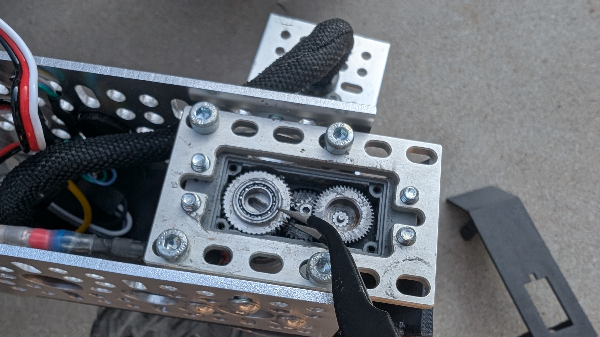

5) Remove the top bearing from the output gear and place it on the new output gear. This bearing is not on the output gear in the replacement gearset from GoBilda, so it's important not to lose the original.

  
    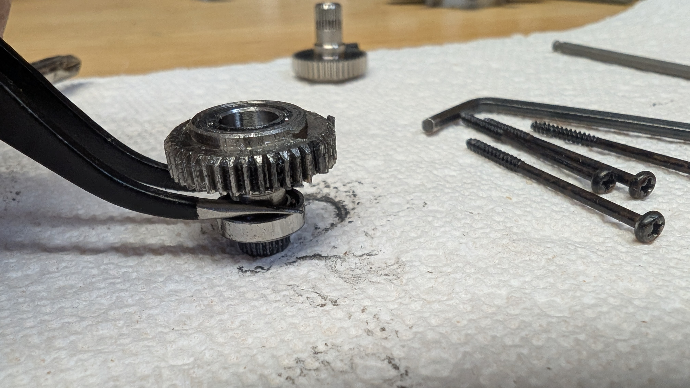

    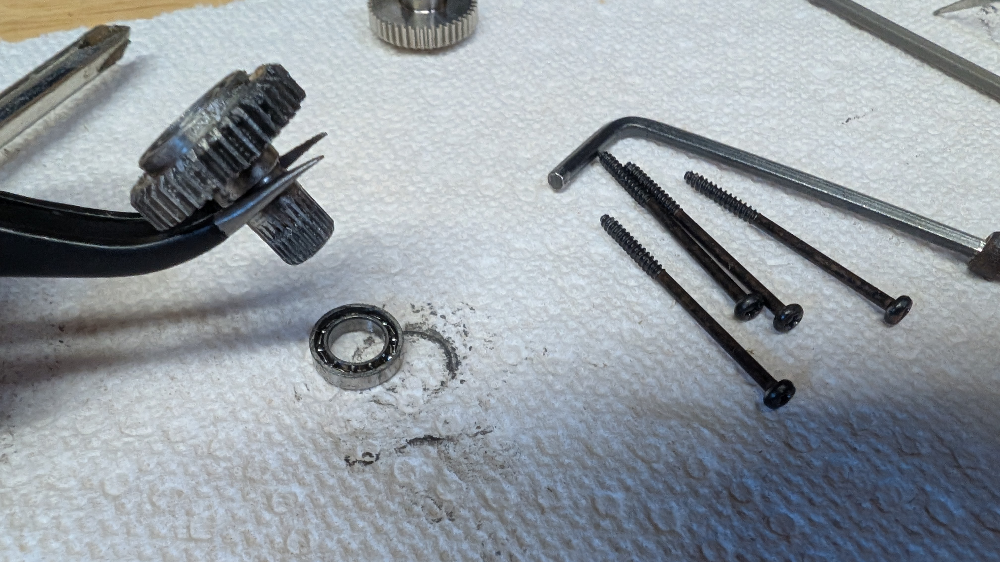

    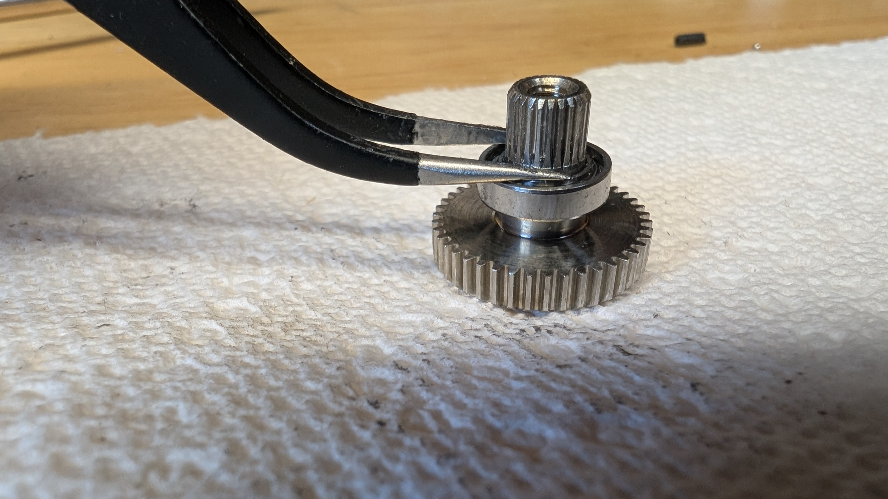

6) Place the output gear first, as the top bearing may interfere with placing the output gear later.

    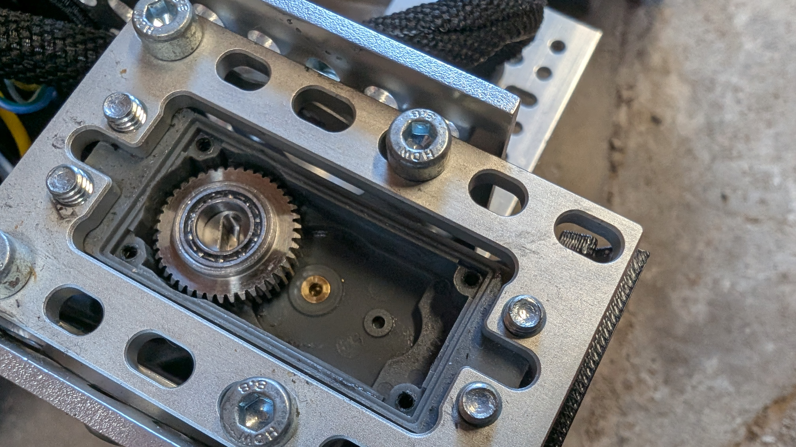

7) While the other gears are out, remove the broken central shaft from both the top and bottom middle gears. Place the new central shaft in the top middle gear and replace in the case.

    

    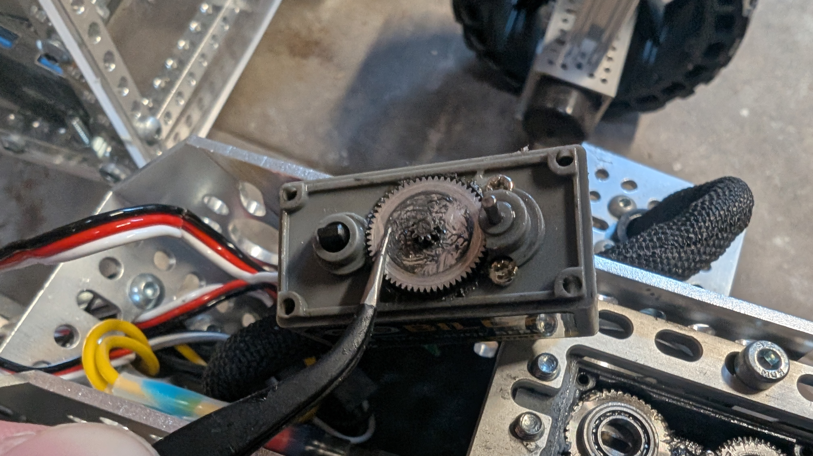

8) With the new shaft installed in the top middle gear, place the two top gears in the case again. Make sure all the gears are meshing correctly.

    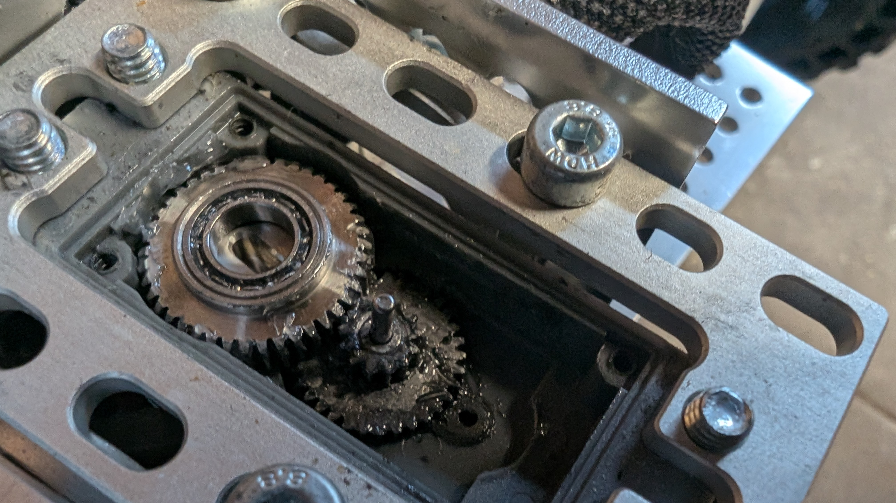

    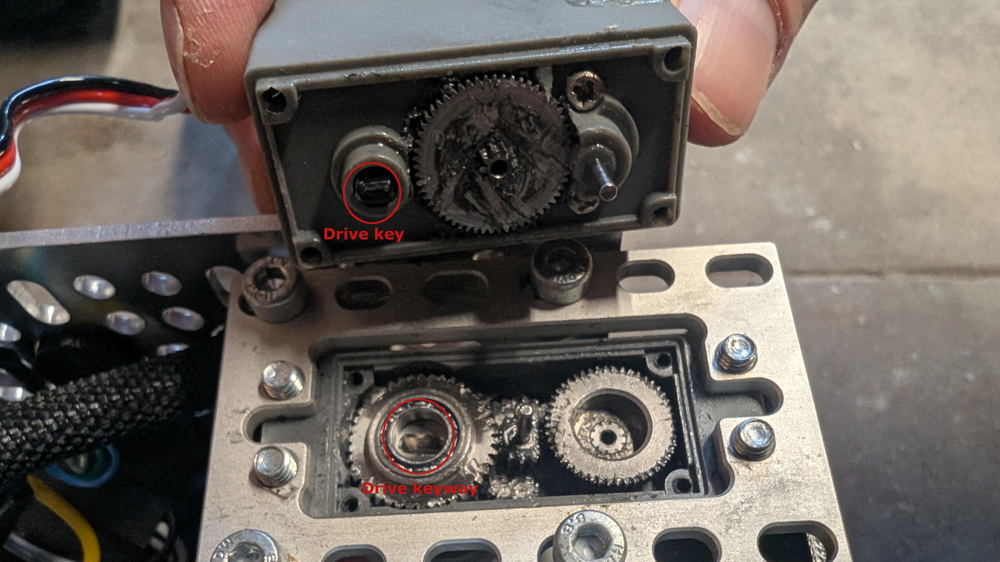

9) Place a healthy dose of grease in the gears to ensure smooth operation.

    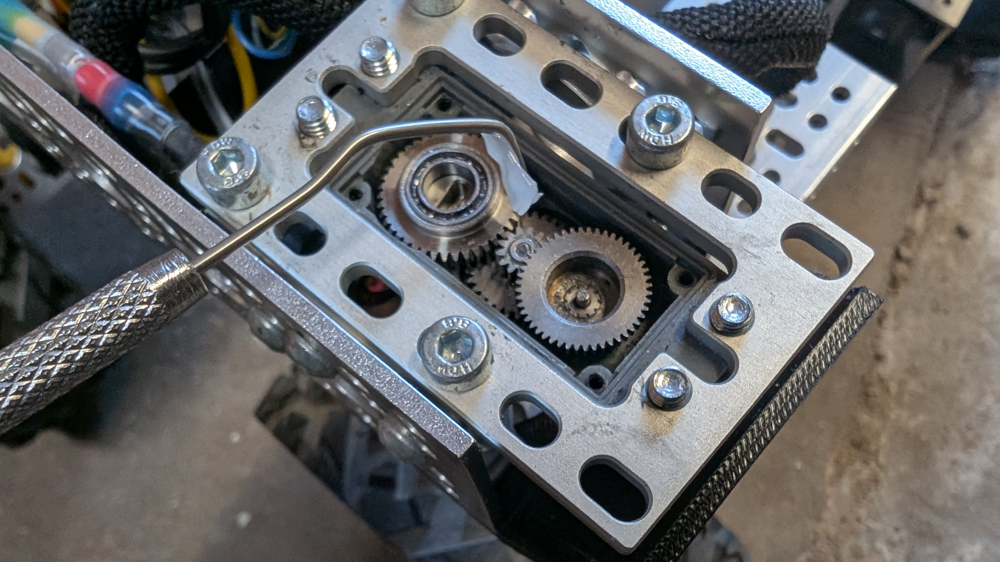

    

10) Reassemble the servo. Ensure that the black drive key is aligned with the keyway in the bottom of the output gear (see callouts in step 8).

    Close up the servo body and screw in the body screws.

    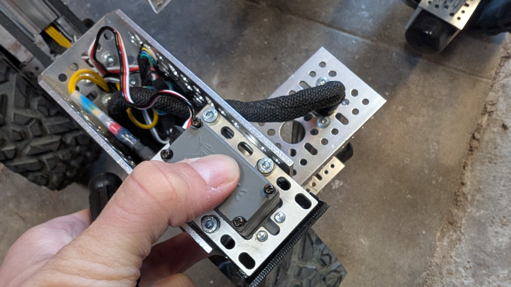

11) If you unmounted the servo, remount the servo on the rover. 

12) Recalibrate corner servo.