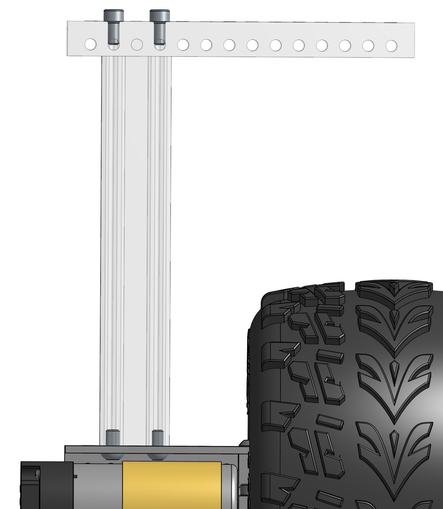
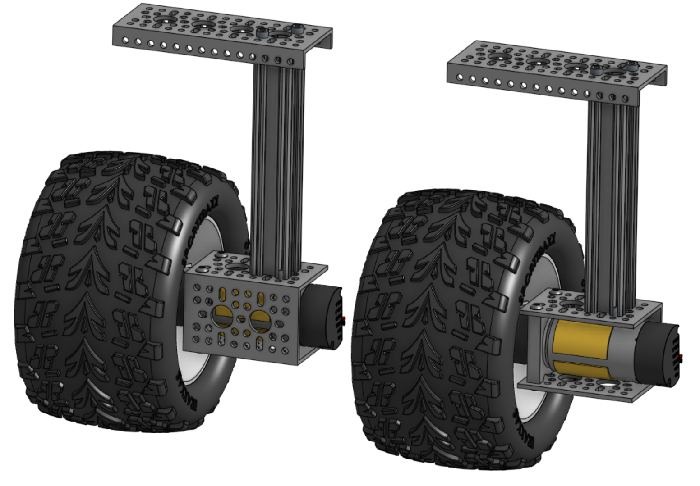

# Wheel Assembly

The wheel assembly attaches the wheels to the motors and mounts the motors to the rest of the rocker-bogie suspension system that makes up the robot chassis. These are relatively simple to assemble.

## [DollarHobbyz Traxxas Wheels only] Drilling the wheels

If you bought the DollarHobbyz Wheels, you will need to drill some holes through the plastic to allow attaching them to the hubs that fit onto the motor axes. If you have the smaller or bigger Wasteland Wheels from GoBilda, you can skip this step.

The wheel is normally meant to be mounted using one bolt through the middle of the rim. This will not work well in our case as the rover sees very high torque at the wheel and the one-bolt system would be difficult to attach to any part of our system without the wheel slipping. To attach more firmly, we will drill two holes on either side of the original hole where we will mount the motor hub clamp

Drill at least 2 holes in the wheels such that they can be mounted to the [Hyper Hub](https://www.gobilda.com/1310-series-hyper-hub-8mm-rex-bore/) that attaches to the motor shaft. You'll want to make sure the holes you drill are centered, otherwise the wheel will wobble while driving. Once you've found where to drill the holes, consider using a center punch or small drill bit first before drilling to ensure your drill bit doesn't start 'wandering' before it locks into position. The distance from each hole center to the center of the wheel is  
$$\sqrt(8^2 + 8^2) \approx 11.3mm$$

## Assembly

You will need all the parts in the [drive wheel assembly parts list](../../parts_list/README.md#Parts-for-drive-wheel-assembly).

### Assembling the base wheel mounts

Next, we will build the wheel assemblies which are divided into the middle wheels and corner wheel assemblies. We will build 6 identical base wheels and then add slightly more complexity onto 4 of those which will eventually become the corner wheels.

Attach the clamping mount and REX bore hub to the motor. We will adjust their positioning later.

## Four corner assemblies

4 of the 6 drive assemblies you just built will become the corner motors. That only requires two mechanical pieces along with some screws but we'll want to route the wiring through the extruded channel.

The result excluding wiring should look as follows:

| side view without wiring                       | one of two pairs of corner assemblies            |
| ---------------------------------------------- | ------------------------------------------------ |
|  |  |

Note that the sides of the rover are mirrored and so you'll be building 2 pairs of similar but not exactly the same subassemblies, as shown in the right image above.

Start by laying out the pieces for each corner so you end up with the 2 mirrored pairs. Take the DuPont to 4-pin JST encoder pins you created in [wiring](../electrical/wiring/README.md) and route them through the top low-profile U-channel, the extruded aluminum, and finally through the motor bracket. The DuPont connector should be at the top with the 4-pin JST connector at the bottom, ready to be connected to the motor encoder pins. Route the two motor power cables through the same parts in the opposite direction. Finally, screw the parts together using 3 or 4 button screws inside the U-channel and using 3 or 4 socket screws at the top. Don't tighten the screws too much yet as this will allow you to adjust wiring.

Adjust the wiring so there is minimal wiring inside the channel. Make sure to protect your wiring from chafing or cutting from the sharp aluminum edges! Be careful when adjusting wires so to not damage the plastic shielding and potentially create shorts.

Repeat this for the 3 other corner assemblies.
