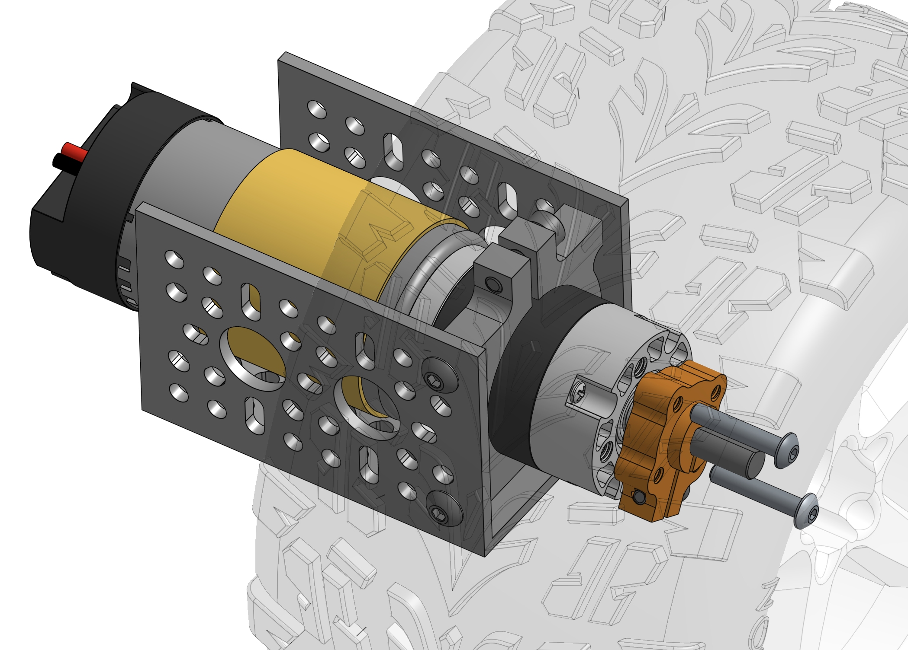

# Wheel Assembly

**IN PROGRESS**

The wheel assembly attaches the wheels to the motors and mounts the motors to the rest of the rocker-bogie suspension system that makes up the robot chassis.

## Features

* The flexible wheels allow for high traction as they deform around objects, improving climbing performance
* Drive motors chosen to handle the high torque that the system sees, achieving both speed and climbing performance

### Mechanical Interface/Attachments to Rover

* The 4 corner assemblies connect directly to the servo blocks on the rocker-bogies.
* The 2 middle drive wheels attach directly to the rocker bogie

## Machining/Fabrication

**NOTE:** While the following approach is valid for v2, it is not ideal as it requires drilling. There may be better ways to attach to these wheels (or other wheels) without drilling. The only requirement is that the middle of the corner wheels aligns with the axis of rotation of the servo output shaft.

| item                              | ref | qty |                                                                 img |
| --------------------------------- | --- | --- | ------------------------------------------------------------------: |
| wheels                            | S30 | 6   |  |
| hand drill or drill press         | D3  |     |        |
| center punch or starter drill bit | D7  |     |       |
| drill bit #23                     | D6  |     |       |

Drill holes in the wheels as shown in Figure 1 using the center drill and drill \#23.

> The wheel is normally meant to be mounted using one bolt through the middle of the rim. This will not work well in our case as the rover sees very high torque at the wheel and the one-bolt system would be difficult to attach to any part of our system without the wheel slipping. To attach more firmly, we will drill two holes on either side of the original hole where we will mount the motor hub clamp as shown in Figure 1

|   |
|:-:|
| Figure 1: Drilling the wheels |

The important dimension is that the two holes are as close to 0.770 inches apart as possible while remaining centered about the center of the wheel. We found that the geometry shown in Figure 1 allowed us to get the holes most easily. Normally for these through holes you would use drill \#25, but in order to give a little extra tolerance we recommend a few steps up from that, something around drill \#23. Test the holes with the 4mm Clamping Hub **S14** to make sure the holes align as shown in Figure 1. If the holes do not align, you can file them out slightly or even attempt to re-drill them depending on how close you are. Repeat this drilling process for all 6 of the wheels.

## Assembly

### Assembling the base wheel mounts

Next, we will build the wheel assemblies which are divided into the middle wheels and corner wheel assemblies. We will build 6 identical base wheels and then add slightly more complexity onto 4 of those which will eventually become the corner wheels.

| item           | ref  | qty | img                                                                   |     | item               | ref | qty | img                                                                   |
| -------------- | ---- | --- | --------------------------------------------------------------------- | --- | ------------------ | --- | --- | --------------------------------------------------------------------- |
| channel        | S45  | 6   | <image src="../../images/components/structural/S45.png" width="100"> |     | drive motor        | E49 | 6   | <image src="../../images/components/electronics/E49.png" width="100"> |
| 6mm D-hub      | S49  | 6   | <image src="../../images/components/structural/S49.png" width="100"> |     | M4 screws          | B15 | 48  | <image src="../../images/components/screws/B15.png" width="100">     |
| clamping mount | S47  | 6   | <image src="../../images/components/structural/S47.png" width="100"> |     | allen key set      | D2  |     | <image src="../../images/components/tools/D2.png" width="100">       |

Repeat this assembly 5 more times.

## Four corner assemblies

4 of the 6 drive assemblies you just built will become the corner motors. Each of these assemblies is identical.

TODO: recommend routing encoder and motor wiring through before finalizing assembly.

The result should look as follows:

