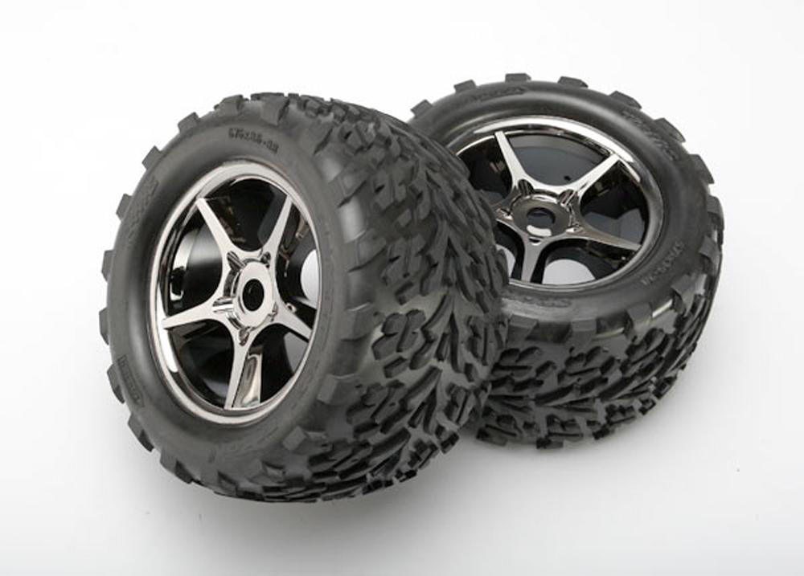
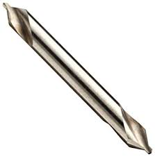
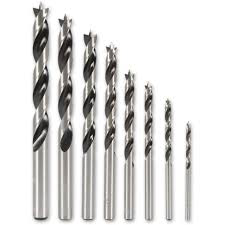

#  Wheel Assembly

The wheel assembly attaches the wheels to the motors and mounts the motors to the rest of the rocker-bogie suspension system that makes up the robot chassis.

Final result.

## 1. Features

* The flexible wheels allow for high traction as they deform around objects, improving climbing performance
* Drive motors chosen to handle the high torque that the system sees, achieving both speed and climbing performance

## 2. Information about module 

### 2.1 Skills

* Drill Press/Hand drill

### 2.2 Tools

* Drill Press or hand drill
* Allen Key set
* Imperial Wrench Set
* Optional: 3D printer

### 2.3 Dependencies on Other Modules

None

### 2.4 Mechanical Interface/Attachments to Rover

* Corner wheels: 1/4 clamping hub to 1/4 inch stainless steel shaft on corner steering
* Actobotics + GoBilda channels and channel connectors to rocker-bogie

## 3. Machining/Fabrication

| item                              | ref | qty |                                                                 img |
| --------------------------------- | --- | --- | ------------------------------------------------------------------: |
| wheels                            | S30 | 6   |  |
| hand drill or drill press         | D3  |     |        |
| center punch or starter drill bit | D7  |     |       |
| drill bit #23                     | D6  |     |       |

Drill holes in the wheels as shown in Figure 1 using the center drill and drill \#23.

> The wheel is normally meant to be mounted using one bolt through the middle of the rim. This will not work well in our case as the rover sees very high torque at the wheel and the one-bolt system would be difficult to attach to any part of our system without the wheel slipping. To attach more firmly, we will drill two holes on either side of the original hole where we will mount the motor hub clamp as shown in Figure 1

|   |
|:-:|
| Figure 1: Drilling the wheels |

The important dimension is that the two holes are as close to 0.770 inches apart as possible while remaining centered about the center of the wheel. We found that the geometry shown in Figure 1 allowed us to get the holes most easily. Normally for these through holes you would use drill \#25, but in order to give a little extra tolerance we recommend a few steps up from that, something around drill \#23. Test the holes with the 4mm Clamping Hub **S14** to make sure the holes align as shown in Figure 1. If the holes do not align, you can file them out slightly or even attempt to re-drill them depending on how close you are. Repeat this drilling process for all 6 of the wheels.

## 4. Assembly

### 4.1 Assembling the base wheel mounts

Next, we will build the wheel assemblies which are divided into the middle wheels and corner wheel assemblies. We will build 6 identical base wheels and then add slightly more complexity onto 4 of those which will eventually become the corner wheels.

| item           | ref  | qty | img                                                                   |     | item               | ref | qty | img                                                                   |
| -------------- | ---- | --- | --------------------------------------------------------------------- | --- | ------------------ | --- | --- | --------------------------------------------------------------------- |
| channel        | S45  | 6   | <image src="../../images/components/structural/S45.png" width="100"> |     | drive motor        | E49 | 6   | <image src="../../images/components/electronics/E49.png" width="100"> |
| 6mm D-hub      | S49  | 6   | <image src="../../images/components/structural/S49.png" width="100"> |     | M4 screws          | B15 | 48  | <image src="../../images/components/screws/B15.png" width="100">     |
| clamping mount | S47  | 6   | <image src="../../images/components/structural/S47.png" width="100"> |     | allen key set      | D2  |     | <image src="../../images/components/tools/D2.png" width="100">       |
| threaded plate | S46  |     | <image src="../../images/components/structural/S46.png" width="100"> |     | pattern adaptor    | S48 | 4   | <image src="../../images/components/structural/S48.png" width="100"> |

#### 4.1.1 Prepare the motor channel

We will start by attaching pattern adaptors to connect the Servocity brackets to the bigger GoBilda brackets. Connect the pattern adaptor **S48** to the threaded plate **S46** using the screws that came with the pattern adaptor, as shown in Figure 2, but don't tighten the screws yet to make the next step easier. Now use M4 screws **B15** to attach the threaded plates **S46** to the GoBilda motor channel **S45**. The threaded plate should be on the outside of the channel. Once all screws are in, tighten them and make sure there is no air gap between the parts. Now repeat the process on the other side of the U-channel.

| <image src="../../images/wheels/step_1a.png" height="150"> <image src="../../images/wheels/step_1b.png" height="150"> <image src="../../images/wheels/step_1c.png" height="150"> <image src="../../images/wheels/step_1d.png" height="150"> |
|:-:|
| Figure 2: Connecting the pattern adaptors. The tolerances might be tight, in which case it's best to connect the M4 screw to the threaded plate where the hole is elongated first, then loosely insert the larger screw into the channel adaptor before you attach the remaining two screws.

#### 4.1.2 Motor mount

Attach the motor into the GoBilda channel **S45** you just prepared using clamping mount **S47** and screws **B15** as shown in Figure 3. Don't tighten the clamping mount to the motor all the way so we can adjust the positioning later to make the wheel center align with the corner steering axis. Slide on the motor shaft D-hub all the way back and tighten the clamp screw.

<image src="../../images/wheels/step_2.png" height="250">

Figure 3: Attaching the motor to the lower bracket

With that the base wheel assembly is completed! We will attach the wheels after building the corner wheel assemblies. Repeat above steps for the remaining 5 wheels.

### 4.2 Assembling the corner mounts

Now, we need to create the four corner wheels. These build on what we made for the base wheel assemblies in the last step. For the corner motors, we will need to extend the attachment point upwards as it is important that the axes of the corner steering motors are directly above the middle of the wheels to enable smooth steering.

| item                           | ref  | qty | img                                                                   |     | item                          | ref | qty | img                                                                   |
| ------------------------------ | ---- | --- | --------------------------------------------------------------------  | --- | ----------------------------- | --- | --- | --------------------------------------------------------------------  |
| 3" channel                     | S2   | 4   | <image src="../../images/components/structural/S2.png" width="120">   |     | 48 Tooth Plain Bore Gear      | S26 | 4   | <image src="../../images/components/structural/S26.png" width="120">  |
| 4.5" channel                   | S4   | 4   | <image src="../../images/components/structural/S4.png" width="120">   |     | 6-32 x 1/2" Button Head Screw | B3  | 8   | <image src="../../images/components/screws/B3.png" width="120">       |
| Channel connector plate        | S6   | 12  | <image src="../../images/components/structural/S6.png" width="120">   |     | 6-32 x 1/4" screws            | B1  | 40  | <image src="../../images/components/screws/B1.png" width="120">       |
| 0.25" Face tapped clamping hub | S12  | 4   | <image src="../../images/components/structural/S12.png" width="120">  |     | allen key set                 | D2  |     | <image src="../../images/components/tools/D2.png" width="120">       |
| Loctite Threadlocker           | S34  |     | <image src="../../images/components/structural/S34.png" width="120">  |     | 6-32 x 3/4" Threaded Standoff | T3  | 4   | <image src="../../images/components/standoffs/T3.png" width="120">    |
| wheels                         | S30A | 6   | <image src="../../images/components/structural/S30.png" width="120">  |     | 6-32 x 5/8" screws            | B4  | 12  | <image src="../../images/components/screws/B4.png" width="120">       |

#### 4.2.1 Channel Attachments 1

Attach 3 inch channel **S2** to your base wheel assembly using 8 screws **B1** as shown in Figure 4.

| <image src="../../images/wheels/attach_3in_channel_isometric.png" height="250"> <image src="../../images/wheels/attach_3in_channel_inside.png" height="250"> |
|:-:|
| Figure 4: Attaching the 3in channel to the motor assembly. |

#### 4.2.2 Preparing the 4.5 inch Channels - D-Clamping Hub Attachment

Attach the 0.25in clamping hub **S12** and the plane bore gear **S26** to the channel using screws **B3** from the top and **B1** from the bottom as shown in Figure 5.

|   |
|:-:|
| Figure 5: Attaching the large encoder gear |

#### 4.2.3 Preparing the 4.5 inch Channels - Hard stop mount

In order to keep the wheels from spinning too far in either direction, we will install a physical hard stop in the system. Attach a standoff **T3** with screw **B1** and optionally Loctite Threadlocker **S34** to the channel as shown in Figure 6. This standoff will be our hard stop. Make sure that you use the correct mounting hole or the standoff will not line up with the hard stops on the encoder mount.

| <image src="../../images/wheels/step_4.png" height="250"> |
|:-:|
| Figure 6: Attaching the hard stop that prevents the corner motor from rotating too far |

#### 4.2.4 Attaching the 4.5 inch channel

Attach the 4.5in channel **S4** to the top of the 3in channel from the last step using two channel connectors **S6** and screws **B1** as shown in Figure 7.

|   |
|:-:|
| Figure 7: Attach the 4.5in channel you made in step 3 to the base wheel mount |

#### 4.2.5 Repeat for the other corner wheels

You should have 4 corner assemblies and 2 base wheel assemblies.

### 4.3 Mounting the wheels
   
For all 6 assemblies, use screws **B4** to mount the wheels to the shaft clamp on the motors.

| <image src="../../images/wheels/step_6.png" height="250"> |
|:-:|
| Figure 8: Attaching the wheels |

Congratulations, you finished another major assembly!
