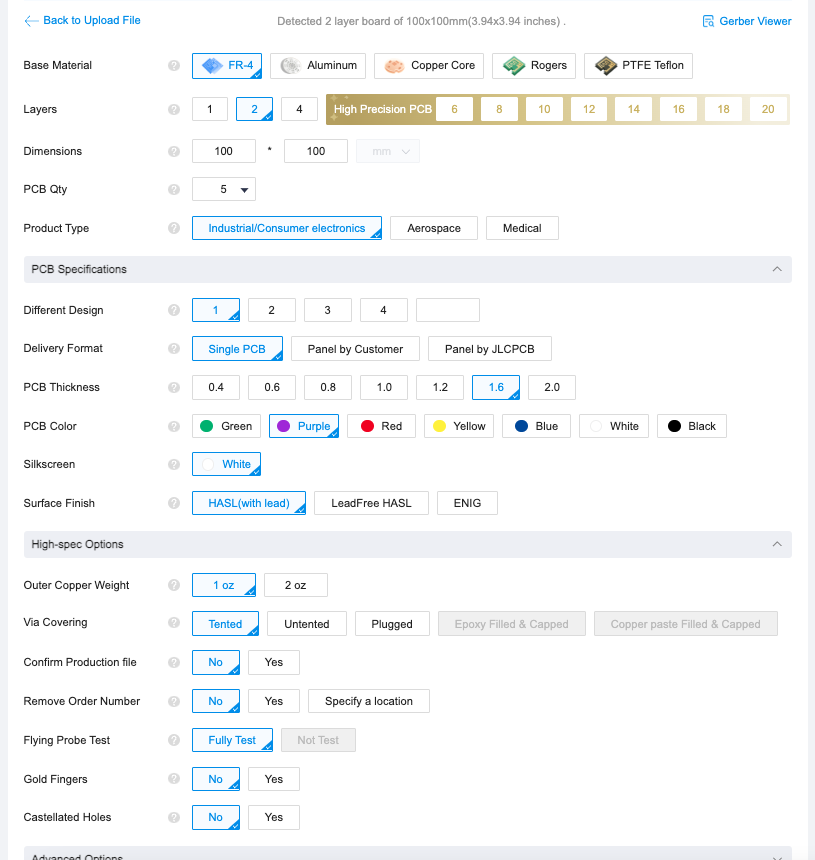
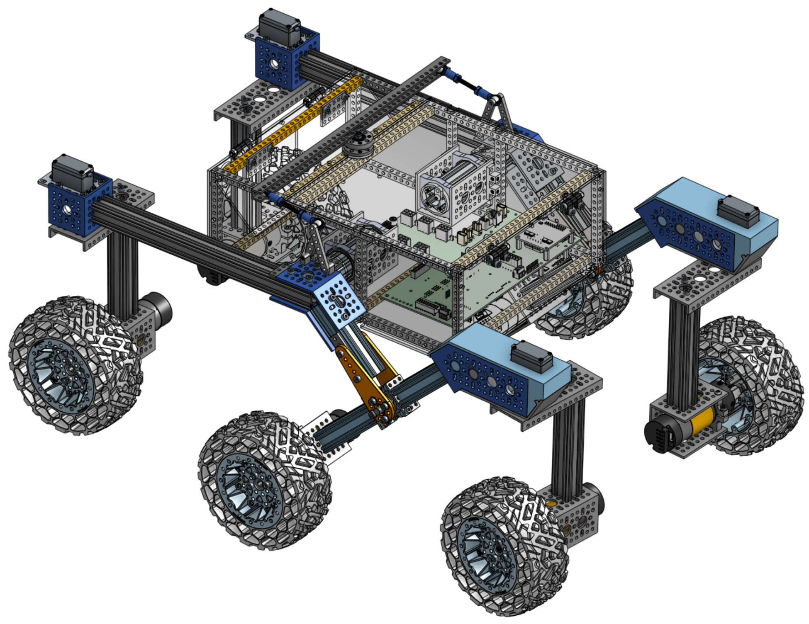
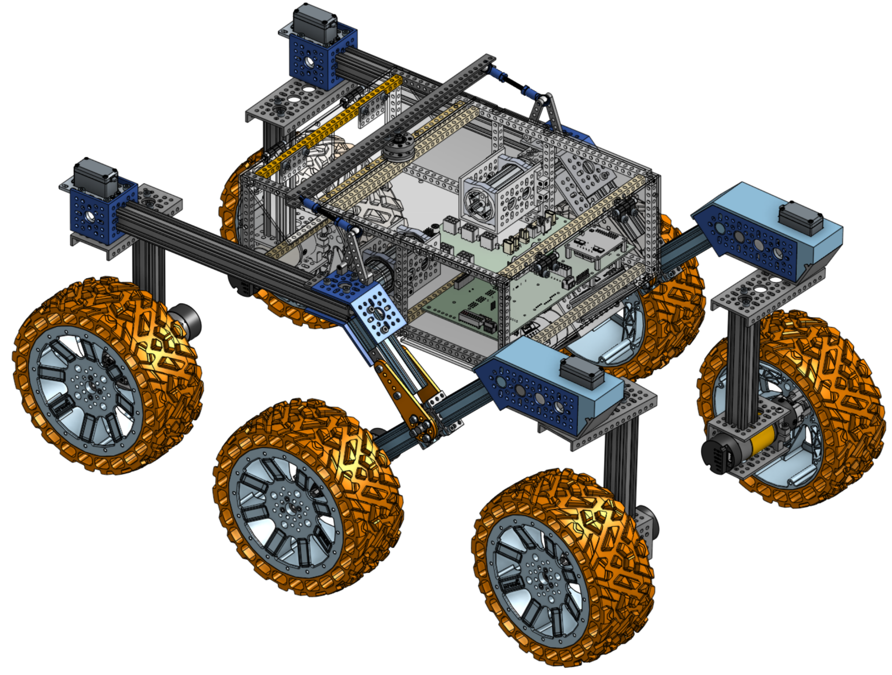

# Parts list

This file was autogenerated from the [mechanical parts list](parts_list.csv) and [digikey BOM](digikey_bom.csv)
and should consist of the same parts, just presented in a more readable format. The Digikey csv file can be uploaded
to Digikey.com directly to create a shopping cart.
Before you place an order, please double check that you have all parts in the right quantities.

The total cost comes out to be **$1391.55** without the GoBilda educational discount (15%) and excluding shipping. **note**: GoBilda may change its pricing without notice.

## Parts for drive wheel assembly

| short name | link | cost per part | total # req | total cost |
|---|---|---|---|---|
| wheel | [Wasteland Wheel (144mm Diameter, 52mm Width)](https://www.gobilda.com/wasteland-wheel-144mm-diameter-52mm-width/) | $24.99 | 6 | $149.94 |
| clamping mount | [1401 Series 2-Side, 2-Post Clamping Mount (43mm Width, 36mm Bore) - goBILDA](https://www.gobilda.com/1401-series-2-side-2-post-clamping-mount-43mm-width-36mm-bore/) | $6.99 | 6 | $41.94 |
| motor | [5203 Series Yellow Jacket Planetary Gear Motor (26.9:1 Ratio, 24mm Length 8mm REX™ Shaft, 223 RPM, 3.3 - 5V Encoder)](https://www.gobilda.com/5203-series-yellow-jacket-planetary-gear-motor-26-9-1-ratio-24mm-length-8mm-rex-shaft-223-rpm-3-3-5v-encoder/) | $42.99 | 6 | $257.94 |
| REX bore hub | [1310 Series Hyper Hub (8mm REX™ Bore)](https://www.gobilda.com/1310-series-hyper-hub-8mm-rex-bore/) | $7.99 | 6 | $47.94 |
| 2 Hole U channel | [1120 Series U-Channel (2 Hole, 72mm Length) - goBILDA](https://www.gobilda.com/1120-series-u-channel-2-hole-72mm-length/) | $4.99 | 6 | $29.94 |

Cost to build these assemblies: $87.95 * 6 assemblies = $527.7

## Parts for corner assembly

| short name | link | cost per part | total # req | total cost |
|---|---|---|---|---|
| 144mm goRail | [1109 Series goRAIL (144mm Length) - goBILDA](https://www.gobilda.com/1109-series-gorail-144mm-length/) | $5.49 | 4 | $21.96 |
| 4 Hole U channel | [1121 Series Low-Side U-Channel (4 Hole, 120mm Length) - goBILDA](https://www.gobilda.com/1121-series-low-side-u-channel-4-hole-120mm-length/) | $5.99 | 4 | $23.96 |

Cost to build these assemblies: $11.48 * 4 assemblies = $45.92

## Parts for rocker bogie assembly

| short name | link | cost per part | total # req | total cost |
|---|---|---|---|---|
| 1hole uchannel | [1120 Series U-Channel (1 Hole, 48mm Length) - goBILDA](https://www.gobilda.com/1120-series-u-channel-1-hole-48mm-length/) | $3.69 | 2 | $7.38 |
| servoblock | [ServoBlock™ (Standard Size, 25 Tooth Spline, Hub Shaft) - goBILDA](https://www.gobilda.com/servoblock-standard-size-25-tooth-spline-hub-shaft/) | $29.99 | 4 | $119.96 |
| servo | [2000 Series Dual Mode Servo (25-2, Torque) - goBILDA](https://www.gobilda.com/2000-series-dual-mode-servo-25-2-torque/) | $31.99 | 4 | $127.96 |
| 8mm Sonic Hub | [1309 Series Sonic Hub (8mm Bore) - goBILDA](https://www.gobilda.com/1309-series-sonic-hub-8mm-bore/) | $6.99 | 2 | $13.98 |
| flanged bearing 2pack | [1611 Series Flanged Ball Bearing (8mm ID x 14mm OD, 5mm Thickness) - 2 Pack - goBILDA](https://www.gobilda.com/1611-series-flanged-ball-bearing-8mm-id-x-14mm-od-5mm-thickness-2-pack/) | $3.99 | 2 | $7.98 |
| joint pattern spacer | [1504 Series 32mm OD Pattern Spacer (2mm Length) - goBILDA](https://www.gobilda.com/1504-series-32mm-od-pattern-spacer-2mm-length/) | $1.99 | 4 | $7.96 |
| joint 8mm shaft | [2100 Series Stainless Steel Round Shaft (8mm Diameter, 50mm Length)](https://www.gobilda.com/2100-series-stainless-steel-round-shaft-8mm-diameter-50mm-length/) | $1.49 | 2 | $2.98 |
| joint 3hole flat beam 2pack | [1102 Series Flat Beam (3 Hole, 24mm Length) - 2 Pack - goBILDA](https://www.gobilda.com/1102-series-flat-beam-3-hole-24mm-length-2-pack/) | $1.89 | 4 | $7.56 |
| joint pattern mount | [1221 Series 2-Side, 2-Post Pattern Mount (32-2) - goBILDA](https://www.gobilda.com/1221-series-2-side-2-post-pattern-mount-32-2/) | $4.99 | 4 | $19.96 |
| steel flat bracket | [1126 Series Steel Flat Bracket (1-1) - 2 Pack - goBILDA](https://www.gobilda.com/1126-series-steel-flat-bracket-1-1-2-pack/) | $2.49 | 2 | $4.98 |
| 3x5 grid plate | [1116 Series Grid Plate (3 x 5 Hole, 24 x 40mm) - goBILDA](https://www.gobilda.com/1116-series-grid-plate-3-x-5-hole-24-x-40mm/) | $1.29 | 4 | $5.16 |
| angle bracket | [1111 Series Angle Pattern Bracket (3-1) - goBILDA](https://www.gobilda.com/1111-series-angle-pattern-bracket-3-1/) | $5.99 | 2 | $11.98 |
| 96mm open goRail | [1118 Series Open goRAIL (96mm Length) - goBILDA](https://www.gobilda.com/1118-series-open-gorail-96mm-length/) | $3.39 | 6 | $20.34 |
| 288mm open goRail | [1118 Series Open goRAIL (288mm Length) - goBILDA](https://www.gobilda.com/1118-series-open-gorail-288mm-length/) | $5.89 | 2 | $11.78 |
| 45deg bracket | [1111 Series Angle Pattern Bracket (1-1) - goBILDA](https://www.gobilda.com/1111-series-angle-pattern-bracket-1-1/) | $2.99 | 4 | $11.96 |
| 90deg steel bracket 2pack | [1137 Series Steel Flat Grid Bracket (1-1) - 2 Pack - goBILDA](https://www.gobilda.com/1137-series-steel-flat-grid-bracket-1-1-2-pack/) | $3.49 | 1 | $3.49 |
| control arm | [Plastic Hub-Mount Control Arm (72mm Length) - goBILDA](https://www.gobilda.com/plastic-hub-mount-control-arm-72mm-length/) | $4.99 | 4 | $19.96 |
| 8mm ID Spacer (10mm OD, 6mm Length) | [1522 Series 8mm ID Spacer (10mm OD, 6mm Length) - 4 Pack - goBILDA](https://www.gobilda.com/1522-series-8mm-id-spacer-10mm-od-6mm-length-4-pack/) | $3.49 | 1 | $3.49 |
| 8mm ID Spacer (10mm OD, 4mm Length) | [1522 Series 8mm ID Spacer (10mm OD, 4mm Length) - 4 Pack - goBILDA](https://www.gobilda.com/1522-series-8mm-id-spacer-10mm-od-4mm-length-4-pack/) | $2.99 | 1 | $2.99 |

Cost to build these assemblies: $205.92 * 2 assemblies = $411.85

## Parts for body assembly

| short name | link | cost per part | total # req | total cost |
|---|---|---|---|---|
| 120mm open goRail | [1118 Series Open goRAIL (120mm Length) - goBILDA](https://www.gobilda.com/1118-series-open-gorail-120mm-length/) | $4.99 | 2 | $9.98 |
| 2 Hole U channel | [1120 Series U-Channel (2 Hole, 72mm Length) - goBILDA](https://www.gobilda.com/1120-series-u-channel-2-hole-72mm-length/) | $4.99 | 2 | $9.98 |
| 32mm bearing | [1604 Series 2-Side, 2-Post Pillow Block (32mm Bore) - goBILDA](https://www.gobilda.com/1604-series-2-side-2-post-pillow-block-32mm-bore/) | $12.99 | 4 | $51.96 |
| 32mm 6mm spacer 2 pack | [1506 Series 32mm ID Spacer (36mm OD, 6mm Length) - 2 Pack - goBILDA](https://www.gobilda.com/1506-series-32mm-id-spacer-36mm-od-6mm-length-2-pack/) | $3.49 | 3 | $10.47 |
| 29 hole beam | [1106 Series Square Beam (29 Hole, 232mm Length) - goBILDA](https://www.gobilda.com/1106-series-square-beam-29-hole-232mm-length/) | $5.09 | 5 | $25.45 |
| 41 hole beam | [1106 Series Square Beam (41 Hole, 328mm Length) - goBILDA](https://www.gobilda.com/1106-series-square-beam-41-hole-328mm-length/) | $6.99 | 4 | $27.96 |
| 12 hole beam | [1106 Series Square Beam (12 Hole, 96mm Length) - goBILDA](https://www.gobilda.com/1106-series-square-beam-12-hole-96mm-length/) | $2.99 | 8 | $23.92 |
| 41 hole u-beam beam | [1101 Series U-Beam (41 Hole, 328mm Length) - goBILDA](https://www.gobilda.com/1101-series-u-beam-41-hole-328mm-length/) | $3.89 | 1 | $3.89 |
| 7 hole flat beam 2pack | [1102 Series Flat Beam (7 Hole, 56mm Length) - 2 Pack - goBILDA](https://www.gobilda.com/1102-series-flat-beam-7-hole-56mm-length-2-pack/) | $2.49 | 2 | $4.98 |
| dual block mount | [1205 Series Dual Block Mount (1-4) - 2 Pack - goBILDA](https://www.gobilda.com/1205-series-dual-block-mount-1-4-2-pack/) | $5.99 | 2 | $11.98 |
| 90deg threaded gusset 4pack | [1203 Series Block Mount (1-1) - 4 Pack - goBILDA](https://www.gobilda.com/1203-series-block-mount-1-1-4-pack/) | $4.99 | 1 | $4.99 |
| 50mm threaded rod | [2808 Series Stainless Steel Threaded Rod (M4 x 0.7mm, 50mm Length) - 2 Pack - goBILDA](https://www.gobilda.com/2808-series-stainless-steel-threaded-rod-m4-x-0-7mm-50mm-length-2-pack/) | $1.49 | 1 | $1.49 |
| ball linkage 2pack | [2913 Series Steel Ball Linkage (Female M4 x 0.7mm, 24.1mm Length) - 2 Pack - goBILDA](https://www.gobilda.com/2913-series-steel-ball-linkage-female-m4-x-0-7mm-24-1mm-length-2-pack/) | $4.99 | 2 | $9.98 |
| Idler Bearing Hub | [Idler Bearing-Hub (32mm OD, 16mm Height) - goBILDA](https://www.gobilda.com/idler-bearing-hub-32mm-od-16mm-height/) | $12.99 | 1 | $12.99 |
| plastic hinges | [Plastic Hinge - 2 Pack - goBILDA](https://www.gobilda.com/plastic-hinge-2-pack/) | $4.99 | 2 | $9.98 |
| 8mm standoffs | [1501 Series M4 x 0.7mm Standoff (6mm OD, 8mm Length) - 4 Pack](https://www.gobilda.com/1501-series-m4-x-0-7mm-standoff-6mm-od-8mm-length-4-pack/) | $2.49 | 2 | $4.98 |
| 22mm standoffs | [1501 Series M4 x 0.7mm Standoff (6mm OD, 22mm Length) - 4 Pack](https://www.gobilda.com/1501-series-m4-x-0-7mm-standoff-6mm-od-22mm-length-4-pack/) | $3.49 | 2 | $6.98 |
| plastic spacer | [1500 Series Plastic Spacer (6mm ID x 8mm OD, 1mm Thickness) - 12 Pack](https://www.gobilda.com/1500-series-plastic-spacer-6mm-id-x-8mm-od-1mm-thickness-12-pack/) | $2.79 | 1 | $2.79 |
| 3x5 grid plate | [1116 Series Grid Plate (3 x 5 Hole, 24 x 40mm)](https://www.gobilda.com/1116-series-grid-plate-3-x-5-hole-24-x-40mm/) | $1.29 | 4 | $5.16 |
| 2 hole flat beam | [1102 Series Flat Beam (2 Hole, 16mm Length) - 2 Pack](https://www.gobilda.com/1102-series-flat-beam-2-hole-16mm-length-2-pack/) | $1.79 | 2 | $3.58 |

Cost to build this assembly: $243.49

## Parts for general assembly

| short name | link | cost per part | total # req | total cost |
|---|---|---|---|---|
| hurricane nuts | [Hurricane Nut for goRAIL - 25 Pack - goBILDA](https://www.gobilda.com/hurricane-nut-for-gorail-25-pack/) | $9.99 | 1 | $9.99 |
| wire grommets | [Plastic Grommet (14-1) - 12 Pack - goBILDA](https://www.gobilda.com/plastic-grommet-14-1-12-pack/) | $1.99 | 1 | $1.99 |
| M4 washers | [Zinc Plates Steel Washer (M4 x 8mm OD) - 25 Pack - goBILDA](https://www.gobilda.com/2801-series-zinc-plated-steel-washer-4mm-id-x-8mm-od-25-pack/) | $1.99 | 1 | $1.99 |
| M4 nuts | [Zinc Plates Steel Hex Nut (M4 x 7) - 25 Pack - goBILDA](https://www.gobilda.com/2811-series-zinc-plated-steel-hex-nut-m4-x-0-7mm-7mm-hex-25-pack/) | $2.49 | 1 | $2.49 |
| M4 locknuts | [Zinc Plates Steel Locknut (M4 x 7) - 25 Pack - goBILDA](https://www.gobilda.com/2812-series-zinc-plated-steel-nylon-insert-locknut-m4-x-0-7mm-7mm-hex-25-pack/) | $2.99 | 1 | $2.99 |
| M4x6 button screws | [M4x6 Button Screw 25-pack](https://www.gobilda.com/2802-series-zinc-plated-steel-button-head-screw-m4-x-0-7mm-6mm-length-25-pack/) | $2.99 | 2 | $5.98 |
| M4x10 button screws | [M4x10 Button Screw 25-pack](https://www.gobilda.com/2802-series-zinc-plated-steel-button-head-screw-m4-x-0-7mm-10mm-length-25-pack/) | $3.39 | 3 | $10.17 |
| M4x16 button screws | [M4x16 Button Screw 25-pack](https://www.gobilda.com/2802-series-zinc-plated-steel-button-head-screw-m4-x-0-7mm-16mm-length-25-pack/) | $3.79 | 2 | $7.58 |
| M4x8 socket screws | [M4x8 Socket Screw 25-pack](https://www.gobilda.com/2800-series-zinc-plated-steel-socket-head-screw-m4-x-0-7mm-8mm-length-25-pack/) | $3.19 | 2 | $6.38 |
| M4x10 socket screws | [M4x10 Socket Screw 25-pack](https://www.gobilda.com/2800-series-zinc-plated-steel-socket-head-screw-m4-x-0-7mm-10mm-length-25-pack/) | $3.19 | 3 | $9.57 |
| M4x1２ socket screws | [M4x12 Socket Screw 25-pack](https://www.gobilda.com/2800-series-zinc-plated-steel-socket-head-screw-m4-x-0-7mm-12mm-length-25-pack/) | $3.19 | 1 | $3.19 |
| M4x16 socket screws | [M4x16 Socket Screw 25-pack](https://www.gobilda.com/2800-series-zinc-plated-steel-socket-head-screw-m4-x-0-7mm-16mm-length-25-pack/) | $3.19 | 2 | $6.38 |
| M4x20 socket screws | [M4x20 Socket Screw 25-pack](https://www.gobilda.com/2800-series-zinc-plated-steel-socket-head-screw-m4-x-0-7mm-20mm-length-25-pack/) | $3.09 | 1 | $3.09 |

Cost to build this assembly: $71.79

## Parts for electrical assembly

| short name | link | cost per part | total # req | total cost |
|---|---|---|---|---|
| A1: CAP CER 10000PF 50V X7R RADIAL | [399-9865-1-ND](https://www.digikey.com/en/products/result?keywords=399-9865-1-ND) | $0.164 | 20 | $3.28 |
| A2: CAP ALUM 100UF 20% 50V RADIAL | [399-18272-1-ND](https://www.digikey.com/en/products/result?keywords=399-18272-1-ND) | $0.248 | 10 | $2.48 |
| A3: CAP CER 0.1UF 50V X7R RADIAL | [399-14065-1-ND](https://www.digikey.com/en/products/result?keywords=399-14065-1-ND) | $0.211 | 10 | $2.11 |
| A4: CAP ALUM 10UF 20% 50V RADIAL | [399-ESK106M050AC3DACT-ND](https://www.digikey.com/en/products/result?keywords=399-ESK106M050AC3DACT-ND) | $0.162 | 10 | $1.62 |
| A5: DIODE SCHOTTKY 25V 10A TO220AC | [497-2738-5-ND](https://www.digikey.com/en/products/result?keywords=497-2738-5-ND) | $1.93 | 2 | $3.86 |
| A6: DIODE GEN PURP 75V 300MA DO35 | [1655-1N4148CT-ND](https://www.digikey.com/en/products/result?keywords=1655-1N4148CT-ND) | $0.108 | 10 | $1.08 |
| A7: FUSEHOLDER BLOCKS - PCB - CLIP C | [732-11376-ND](https://www.digikey.com/en/products/result?keywords=732-11376-ND) | $0.68 | 1 | $0.68 |
| A10: CONN HEADER VERT 12POS 2.54MM | [TSW-104-07-F-T-ND](https://www.digikey.com/en/products/result?keywords=TSW-104-07-F-T-ND) | $1.5 | 4 | $6.0 |
| A11: CONN HEADER VERT 8POS 2.54MM | [S1012E-08-ND](https://www.digikey.com/en/products/result?keywords=S1012E-08-ND) | $0.47 | 4 | $1.88 |
| A12: CONN HDR 20POS 0.1 TIN PCB | [S7078-ND](https://www.digikey.com/en/products/result?keywords=S7078-ND) | $1.3 | 1 | $1.3 |
| A13: CONN HEADER VERT 40POS 2.54MM | [S9175-ND](https://www.digikey.com/en/products/result?keywords=S9175-ND) | $0.73 | 2 | $1.46 |
| A14: CONN HEADER VERT 6POS 2MM | [455-1708-ND](https://www.digikey.com/en/products/result?keywords=455-1708-ND) | $0.36 | 2 | $0.72 |
| A16: CONN HEADER VERT 20POS 2.54MM | [WM6548-ND](https://www.digikey.com/en/products/result?keywords=WM6548-ND) | $2.52 | 1 | $2.52 |
| A17: CONN HDR 2POS 0.1 TIN PCB | [S7000-ND](https://www.digikey.com/en/products/result?keywords=S7000-ND) | $0.32 | 5 | $1.6 |
| A19: TERM BLK 2P SIDE ENT 5.08MM PCB | [ED2580-ND](https://www.digikey.com/en/products/result?keywords=ED2580-ND) | $0.73 | 2 | $1.46 |
| A20: CONN HEADER VERT 6POS 4.2MM | [1726750613-ND](https://www.digikey.com/en/products/result?keywords=1726750613-ND) | $2.27 | 6 | $13.62 |
| A21: TRANS PNP 40V 0.2A TO92-3 | [2N3906TAFSCT-ND](https://www.digikey.com/en/products/result?keywords=2N3906TAFSCT-ND) | $0.285 | 10 | $2.85 |
| A22: RES 100 OHM 5% 1/4W AXIAL | [CF14JT100RCT-ND](https://www.digikey.com/en/products/result?keywords=CF14JT100RCT-ND) | $0.056 | 10 | $0.56 |
| A23: RES 10K OHM 5% 1/4W AXIAL | [CF14JT10K0CT-ND](https://www.digikey.com/en/products/result?keywords=CF14JT10K0CT-ND) | $0.056 | 10 | $0.56 |
| A24: RES 4.7K OHM 5% 1/4W AXIAL | [CF14JT4K70CT-ND](https://www.digikey.com/en/products/result?keywords=CF14JT4K70CT-ND) | $0.0404 | 25 | $1.01 |
| A25: RES 0 OHM JUMPER 1/4W AXIAL | [CD14ZT0R00CT-ND](https://www.digikey.com/en/products/result?keywords=CD14ZT0R00CT-ND) | $0.079 | 10 | $0.79 |
| A26: RES 68 OHM 5% 1/8W AXIAL | [CF18JT68R0CT-ND](https://www.digikey.com/en/products/result?keywords=CF18JT68R0CT-ND) | $0.045 | 10 | $0.45 |
| A27: RES 82 OHM 5% 1/4W AXIAL | [CF14JT82R0CT-ND](https://www.digikey.com/en/products/result?keywords=CF14JT82R0CT-ND) | $0.056 | 10 | $0.56 |
| A28: RES 1K OHM 5% 1/4W AXIAL | [CF14JT1K00CT-ND](https://www.digikey.com/en/products/result?keywords=CF14JT1K00CT-ND) | $0.056 | 10 | $0.56 |
| A29: RES 680 OHM 5% 1/4W AXIAL | [CF14JT680RCT-ND](https://www.digikey.com/en/products/result?keywords=CF14JT680RCT-ND) | $0.056 | 10 | $0.56 |
| A30: RES 220 OHM 5% 1/4W AXIAL | [CF14JT220RCT-ND](https://www.digikey.com/en/products/result?keywords=CF14JT220RCT-ND) | $0.056 | 10 | $0.56 |
| A32: SWITCH SLIDE DIP SPDT 50MA 24V | [CT206124-ND](https://www.digikey.com/en/products/result?keywords=CT206124-ND) | $1.25 | 1 | $1.25 |
| A37: LED BAR GRAPH 10SEG 570NM GRN | [754-2186-ND](https://www.digikey.com/en/products/result?keywords=754-2186-ND) | $3.26 | 2 | $6.52 |
| A38: IC REG LINEAR 3.3V 750MA TO220-3 | [576-2235-ND](https://www.digikey.com/en/products/result?keywords=576-2235-ND) | $3.02 | 2 | $6.04 |
| B1: FUSE GLASS 10A 125VAC 5X20MM | [F3631-ND](https://www.digikey.com/en/products/result?keywords=F3631-ND) | $1.21 | 2 | $2.42 |
| B9: SWITCH TOGGLE ON-OFF-ON | [708-3060-ND](https://www.digikey.com/en/products/result?keywords=708-3060-ND) | $3.28 | 1 | $3.28 |
| B11: TERM BLOCK HDR 24POS VERT 5MM | [ED1682-24-ND](https://www.digikey.com/en/products/result?keywords=ED1682-24-ND) | $3.33 | 1 | $3.33 |
| A9: TERM BLOCK HDR 6POS VERT 3.5MM | [WM25701-ND](https://www.digikey.com/en/products/result?keywords=WM25701-ND) | $2.02 | 3 | $6.06 |
| B2: TERM BLOCK PLUG 6POS STR 3.5MM | [WM13033-ND](https://www.digikey.com/en/products/result?keywords=WM13033-ND) | $2.59 | 3 | $7.77 |

Cost to build this assembly: $90.8

## Extra Parts

These parts you may either already have, depend on where you're located for a good deal, depend on personal preference, or are optional. As a result they are not accounted for in the total price.

**Note**: Make sure to go through the list below to make sure you have everything you need.

### The PCBs

The electronics of the rover consist of two boards: the brain board and the motor board. To order these boards we suggest that you order from [JLCPCB](https://jlcpcb.com/), this PCB fabrication company is quite inexpensive for this board size and has good turnaround time. You'll either have to order the required minimum of 10 pieces or you can ask on the Slack group whether someone wants to put in a group order or already has some extras.
Upload the [.zip files](../electrical/pcb/control_board/gerbers/v2.0.2/) individually and make sure the following settings are set:

### The body plates

The body plates that attach to all sides of the body are designed to be made from laser cut acrylic, MDF, hardwood, or similar. The 2D cutout files are the `.dxf` files in the [laser cut parts folder](mechanical/body/laser_cut_parts/README.md). They were designed to be around 3mm thick (1/8"). You can choose a material and cut them at your local makerspace's laser cutter or order them from an online service like [Sculpteo](https://www.sculpteo.com) or [SendCutSend](https://sendcutsend.com/). Check the README in that folder for more details.

### A gamepad or remote controller

This is technically not a requirement, especially if you're planning on making the rover autonomous, but is highly recommended. Any USB based option should work here.

Some options are getting an XBox controller with a usb dongle or for longer range; the pricier [Spektrum WS2000](https://www.spektrumrc.com/product/ws2000-wireless-simulator-usb-dongle/SPMWS2000.html) with [Spektrum DXs](https://www.spektrumrc.com/product/dxs-transmitter-only/SPMR1010.html) transmitter. Many alternatives exist and will work ok.

## Standoff kit for the boards

You'll want these to mount the PCBs to the rover body. Many options exist here, for example [this kit](https://www.amazon.com/HELIFOUNER-Spacers-Standoffs-Assortment-Tweezers/dp/B0B25BKNKK/ref=sr_1_8?crid=368EQQU16L7YW&keywords=m2.5+spacer+standoff+kit&qid=1679272746&sprefix=m2.5+spacer+standoff+kit%2Caps%2C159&sr=8-8).

## Wiring

We recommend getting spools of 18AWG (red and black), 20AWG (white, red, black) and 22AWG wire (4 colors). The wire has to be stranded and not solid core as it will bend during operation. For each wire type, if possible, get ribbon cable where each wire is attached to another one which will help with keeping wiring clean and manageable.

To protect the cables from chafing against the sharp aluminum parts, we recommend [cable sleeves](https://www.amazon.com/Best-Sellers-Cable-Sleeves/zgbs/electronics/6577542011).
You can also use [grommets](https://www.gobilda.com/plastic-grommet-14-1-12-pack/), filing down the sharp edges or burs, applying tape to the edges, or using expandable wire sleeving.

Heat shrink is a must have for keeping cables nice and snug.

Take a look at the [wiring overview](../electrical/wiring/README.md#overview) to get an idea of what you will be building. You'll need crimps and connectors for DuPont, Bullet, XT30, JST, and Molex styles. Crimping doesn't have a 100% success rate, so we recommend getting extras or buying a kit if you're planning on using them for other projects as well. Here are some options for each set you need:

* A Raspberry Pi ribbon cable, e.g. from [Adafruit](https://www.adafruit.com/product/1988) but available in many places. While you could use header pins for this connection, the cable is the cleanest solution
* XT30 connectors for the power connections on the motor PCB.
  * DIY options, either:
    * [5 pairs M/F from Gobilda](https://www.gobilda.com/xt30-connector-pack-fh-mc-x-5-mh-fc-x-5/)
    * [20 pairs M/F from Amazon](https://www.amazon.com/gp/product/B0875MBLNH/ref=ppx_yo_dt_b_search_asin_title?ie=UTF8&psc=1)
    * [1 pair M/F from Digikey](https://www.digikey.com/en/products/detail/dfrobot/FIT0586/9559255)
  * premade from GoBilda: 2x [male leads](https://www.gobilda.com/xt30-lead-fh-mc-300mm-length/), 2x [female leads](https://www.gobilda.com/xt30-lead-mh-fc-300mm-length/)
* 6 4-pin JST connections:
  * 6x [premade JST to jumper wires from GoBilda](https://www.gobilda.com/encoder-breakout-cable-4-pos-jst-xh-mh-fc-to-4-x-1-pos-tjc8-mh-fc-300mm-length/)
  * [JST connector kit](https://www.amazon.com/460PCS-XH2-54-Connector-Terminal-Connectors/dp/B09DBGVX5C/ref=sr_1_1_sspa?crid=2NX4ZXCFZGOCK&keywords=jst+connector+kit+4+pin&qid=1690482910&sprefix=jst+connector+kit+4+pin%2Caps%2C140&sr=8-1-spons&sp_csd=d2lkZ2V0TmFtZT1zcF9hdGY&psc=1)
* 6 6-pin Molex PCI-E connections. Digikey carries a couple options. In either case, be sure to get enough for 6 connectors.
  * [housings](https://www.digikey.com/en/products/detail/molex/0469920610/5116009) and [pins](https://www.digikey.com/en/products/detail/molex/0039000077/1643440)
  * [assemblies](https://www.digikey.com/en/products/detail/molex/2153261063/13883006) are sometimes available but the 16 AWG wire may be difficult to work with
* 4 3-pin DuPont and 8 4-pin DuPont connectors
  * [DuPont connector kit](https://www.amazon.com/Twidec-Connector-Terminals-Crimping-Connectors/dp/B0B152WRSW/ref=sr_1_1_sspa?keywords=dupont+connector+kit&qid=1690482984&sprefix=DUPont%2Caps%2C190&sr=8-1-spons&sp_csd=d2lkZ2V0TmFtZT1zcF9hdGY&psc=1)
  * Buy precrimped wires+connectors from various sources
* 12 female 3.5mm Bullet connectors. Make sure you're getting the right size connectors and ones that come insulated.
  * GoBilda has [various combinations](https://www.gobilda.com/connector-style-3-5mm-bullet/) available that you can cut/solder/crimp. They use 16AWG wire which is on the thicker side. Make sure you're getting the Female connector type.
  * Buy a DIY kit
    * The GoBilda [connector pack](https://www.gobilda.com/3-5mm-bullet-connector-pack-mh-fc-x-5-fh-mc-x-5/) is good quality but only has 5 female connectors so you would need 3 of them.
    * [from Amazon](https://www.amazon.com/Davitu-Electrical-Equipments-Supplies-Transparent/dp/B089W96QW1/ref=sr_1_6?keywords=3.5mm+bullet+connector+kit&qid=1690483474&sprefix=bullet+connector+kit%2Caps%2C152&sr=8-6) (insulators are flimsy but ok)

## Threadlocker

You will want threadlocker for several screws so that they don't unscrew themselves while driving. You can find this everywhere, for example at [Gobilda](https://www.gobilda.com/loctite-threadlocker-blue-242-6ml/). Make sure you get blue as opposed to red so it's not permanent.

## Tools

* A [combination nut driver](https://www.gobilda.com/7mm-combination-nut-driver/) will save you time screwing and unscrewing (lock)nuts inside the body.
* You'll need 2.5mm and 3mm hex keys for the button and socket M4 screws respectively. For example [Gobilda 2.5](https://www.gobilda.com/wera-tools-2-5mm-ball-end-hex-plus-l-key/) and [Gobilda 3](https://www.gobilda.com/wera-tools-3mm-ball-end-hex-plus-l-key/).
* A crimping tool for Molex, JST, DuPont connectors. A regular crimping tool should be able to handle all of these without issue. While you can technically complete a crimp without a crimping tool, it often won't be as consistent or strong as with a proper crimper. Various connector sets come with a decent crimper.

## Electrical

* Voltage Regulators:
  * **1 X** 5V Regulator: [Pololu](https://www.pololu.com/product/2881)
  * **1 X** 12V Regulator: [Pololu](https://www.pololu.com/product/2855)
* **1 X** PCA9685 corner: [Mouser](https://www.mouser.com/ProductDetail/Adafruit/815?qs=GURawfaeGuCGKbWyy9179Q%3D%3D)
* **3 X** Roboclaw 2x7A Motor Controller [Basic Micro](https://www.basicmicro.com/Roboclaw-2x7A-Motor-Controller_p_55.html)
* **1 X** Power Measurement Unit INA260: Sold out on DigiKey, possible replacements are on [Adafruit](https://www.adafruit.com/product/4226?gclid=CjwKCAjw5dqgBhBNEiwA7PryaLOm_zC9GhlzRH1NwN4bSRwDg84sIhSh3LEqTOrIvQ3j_kRBscTAYhoCBOQQAvD_BwE)
* **1 X** PCA9685 corner motor driver [Mouser](https://www.mouser.com/ProductDetail/Adafruit/815?qs=GURawfaeGuCGKbWyy9179Q%3D%3D)
* DC power meter: [Amazon](https://www.amazon.com/gp/product/B017FSED9I/). This LCD display reads out current, voltage, power, and energy, and can be put on the back where the rectangular hole is in the laser cut cover.
* batteries: many options available here. We recommend getting LiPo batteries. You'll need a battery that can provide over 14V(*), so a 4s battery works well. You can get batteries with various mAh ratings (how many milliAmperes the battery can output for 1 hour). We recommend any option over 4000mAh. Higher capacity comes at a higher cost. You can also get more than one battery and swap them out. The rover can carry them as well.
  * Zeee sells many options [on Amazon](https://www.amazon.com/stores/page/25B7018D-26CC-4E43-BC6D-EFAF737D8F5E?ingress=2&visitId=1b4115fa-2240-424d-a0e6-a466830819ce&ref_=ast_bln)
  * You'll also need a charger for the battery. Make sure it can support the battery you bought. For the Zeee options, [this model from Amazon](https://www.amazon.com/Hobby-Fans-Professional-Balance-Discharger/dp/B09XC91BWJ/ref=sr_1_6?keywords=LiPo+charger&qid=1690484744&sr=8-6) will work.
  * Consider getting a fireproof battery bag. LiPo batteries are extremely flammable/explosive and a fire caused by a battery is extremely difficult to put out.
  * You'll also need a way to connect your battery to the PCB via a XT30 connector (MH-FC) which depends on the battery you get. Often these come with the charger for the battery
* A Raspberry Pi 3 or 4. Other options may work as well, but we recommend starting here.

> (*) The reason you need 14V is that the 12V regulator needs a [dropout voltage](https://www.pololu.com/product/2855#dropout) on top of the output voltage in order to provide 12V. A 12V battery will not work adequately.

## Different wheels

* The wheels we previously included as the default from [DollarHobbyz](https://www.dollarhobbyz.com/collections/all/products/traxxas-2-talon-tires-gemini-black-chrome-wheels-5374x) are $34.95 per pair of two for a total of $104.85 (excl. shipping), saving ~$135 compared to the default Wasteland wheels. They are a perfectly fine choice but require some drilling to fit to the motor hubs.
* Gobilda also sells a larger version of the [Wasteland Wheel at 192mm diameter](https://www.gobilda.com/wasteland-wheel-192mm-diameter-72mm-width/). This adds $90 total compared to the default Wasteland wheels. No drilling is required. Those wheels are bigger and wider and look like this:

| smaller Wasteland wheels | bigger Wasteland wheels |
| --- | --- |
|  |  |

There is a software parameter where you can easily modify the size of the wheels to account for speed differences.

# Maintaining the Parts List

Parts can become out of stock or discontinued in the future. In this case, the part list can be modified by editing `parts_list.csv`, which covers all the mechanical parts, `digikey_bom.csv`, which covers most of the electrical part, and `extra_parts.md` to cover the rest. After doing so, you can compile to update the `README.md` file using `csv_to_md.py` (The compilation will also happen automatically with a merge). **Do not** edit `README.md` directly, as it will be overwritten by the compilation process. 
