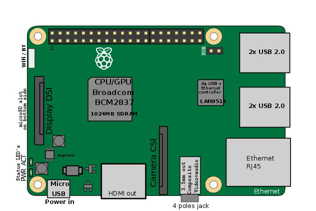

# Software Subsystem
This section of the repository details how to get all the software that is necessary for driving the rover up and running. See the project's main [roadmap](https://github.com/nasa-jpl/open-source-rover/blob/master/images/roadmap.png) for information on when you should be creating your software and how to integrate it with the rest of the rover.

# Disclaimer
**By downloading, cloning, or otherwise using the contents of this repository, you agree to the terms specified in the attached [DISCLAIMER.txt file](/DISCLAIMER.txt).**

# Getting Started with the Software Build
The [Rover Code repo](https://github.com/nasa-jpl/osr-rover-code)'s README files will walk you through all necessary steps for getting the rover software up and running on the Raspberry Pi. These steps can be completed at any point during the project, all the way up to when all the electronics and mechanical parts are completed and you are ready to start driving and controlling the robot.

Note the [Software Controls.pdf](Software%20Controls.pdf) doc is out-of-date and should be ignored for now.
